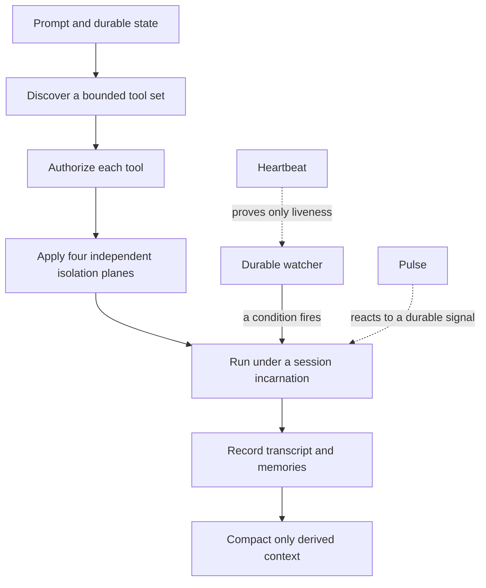
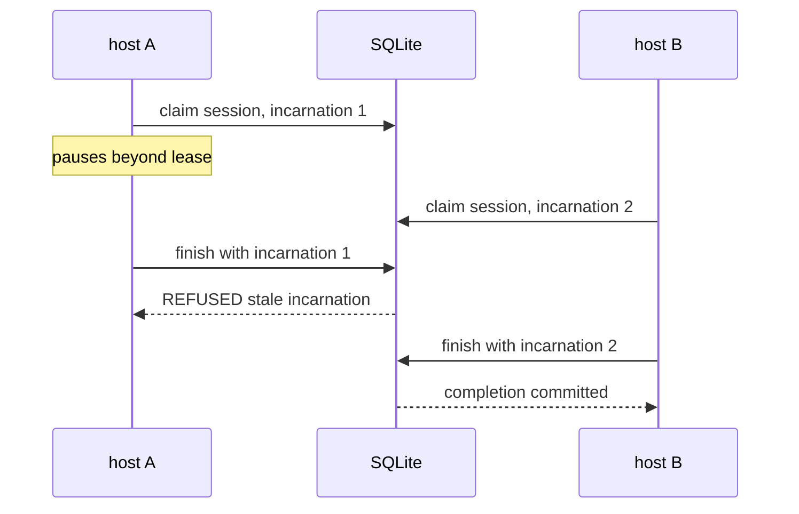

# Advanced mechanisms: when the agent keeps running

The first thirteen chapters build a governed organization from outcomes,
evidence, boundaries, leases, recovery, and proactive signals. This companion
lesson asks what happens when the same organization runs for weeks, moves
between hosts, accumulates context, and receives unattended authority.

Run the complete scenario from an empty directory:

```console
uv run sovereign-agent mechanisms --root /tmp/sovereign-agent-mechanisms
```

The output is deliberately a list of qualified claims. In particular,
`process=UNAVAILABLE` is a successful observation: the package did not find a
proved operating-system sandbox and refused to turn an application allowlist
into an isolation claim.

## The six questions



This is not one feature. It is six contracts that compose without borrowing
one another's claims.

## 1. Isolation is four controls

A path check cannot block a socket. A network allowlist cannot stop a process
from reading a credential already placed in its environment. A container does
not decide whether `delete_inventory` was authorized. Treating “sandboxed” as
one Boolean hides all four mistakes.

| Plane | This implementation enforces | It does not claim |
| --- | --- | --- |
| Filesystem | resolved paths stay below explicit roots | kernel prevention of arbitrary syscalls |
| Network | application code admits exact hostnames | an operating-system egress firewall |
| Credentials | callers request an allowed credential name | that secret values live in policy or prompts |
| Tools | deny rules win over an explicit allowlist | that a permitted shell has harmless sub-effects |
| Process | only a caller-supplied behavioral probe can report `ENFORCED` | presence of a binary or configuration key |

The important experiment is the negative one. Create a symlink inside an
allowed workspace that points outside it. `IsolationPolicy.authorize_path`
resolves the target before checking ancestry and refuses the escape. Then call
`explain()` without a process probe. The filesystem policy still reports its
narrow enforcement while process isolation remains `UNAVAILABLE`.

Production map: `sovereign_agent.isolation.IsolationPolicy` and
`tests/test_advanced_mechanisms.py::test_isolation_resolves_symlinks_before_authorizing`.

## 2. An unattended watcher is not a heartbeat or a Pulse

A heartbeat answers “could this process reach the ledger at time T?” Pulse
answers “did this durable domain signal qualify to create governed work?” A
watcher answers a third question: “did a time or condition become due?”

The scheduler stores the definition, next due time, condition state, failure
count, and run history in SQLite. Its condition is a pure function from previous
state to `WatchDecision(fire, message, state)`.

There are three transitions worth distinguishing:

1. `fire=False`: save the observation state and next due time, but create no
   run row. An evaluation is not work.
2. `fire=True`, payload succeeds: claim the due slot, give the payload the
   durable run id as its idempotency key, then commit the returned state.
3. `fire=True`, payload fails: record failure, retain the previous condition
   state, and eventually disable after a bounded number of failures.

That last rule prevents a false checkpoint. If a watcher records “supplier
notified” before the notification succeeds, the next evaluation suppresses the
retry and turns an outage into silent data loss.

Production map: `sovereign_agent.automation.run_due` and
`tests/test_advanced_mechanisms.py::test_failed_payload_keeps_condition_state_retryable_and_auto_disables`.

## 3. Context is a governed cache

The transcript is source. A summary is a derived view. The source table is
append-only, and every compaction appends a new marker containing a cumulative
summary and a cursor. It never deletes or edits the messages it summarizes.

The rendering policy keeps four regions:

- founding head messages;
- every system and user message;
- the latest derived summary of old assistant and tool output;
- a recent tail in full.

Only a complete assistant/tool exchange becomes eligible. An empty or failed
summarizer creates no marker, so the next attempt still sees the original
exchange. Because the durable marker contains `through_seq`, a new process can
recover without an in-memory cursor.

This design does not certify that a generated summary is true. It makes the
summary's derivation visible and keeps the evidence needed to regenerate or
audit it.

Production map: `sovereign_agent.context.compact_one`,
`sovereign_agent.context.render_context`, and
`tests/test_advanced_mechanisms.py::test_compaction_appends_a_view_and_preserves_every_source_byte`.

## 4. A session needs an incarnation

An actor id describes organizational identity. A host id describes one runtime
holder. A session incarnation describes one continuous claim. Collapsing those
three names allows an old callback to look current after another machine has
taken over.



The compare-and-set happens under `BEGIN IMMEDIATE`. A live foreign holder is
refused. Takeover after expiry increments the incarnation. Completion checks
both host and incarnation in the same transaction as the canonical write.

Delivery attempts use the same durability lesson: the attempt count and next
retry time live in SQLite, so restarting the process cannot turn attempt two
back into attempt one.

Production map: `sovereign_agent.coordination.claim_session`,
`sovereign_agent.coordination.finish_session`, and
`tests/test_advanced_mechanisms.py::test_session_takeover_increments_incarnation_and_fences_stale_finish`.

## 5. Discovery is not authorization

Large tool schemas consume context even when only one tool matters. The catalog
therefore ranks names, descriptions, and keywords, returns at most ten results,
and says when matches were omitted. This is prompt-surface management, not a
security boundary.

Authorization is a separate call against the tool policy. A denied tool can be
the best discovery result and must still be refused. Keeping the calls separate
makes a dangerous shortcut visible in code review: code that invokes a search
result without `ToolCatalog.authorize` skipped a distinct step.

Try searching a catalog containing `read_inventory` and `delete_inventory` for
“delete stock.” Then configure both as allowed but place deletion in the deny
set. Discovery returns it; authorization refuses it. That is not contradictory.
Each mechanism answered a different question correctly.

Production map: `sovereign_agent.tools.ToolCatalog` and
`tests/test_advanced_mechanisms.py::test_discovery_does_not_authorize_a_matching_tool`.

## 6. Memory retrieval is policy

The memory table stores content, an optional numeric embedding, visibility,
importance, and time. Retrieval filters visibility in SQL before calculating a
score. An unauthorized row therefore never becomes a candidate that is merely
hidden at display time.

Every returned hit exposes its components:

`score = 0.35 lexical + 0.35 semantic + 0.15 recency + 0.15 importance`

Lexical evidence is token-set overlap. Semantic evidence is cosine similarity
over caller-supplied vectors. Recency decays smoothly, importance is an explicit
stored judgment, and a final maximal-marginal-relevance pass penalizes near
duplicates. These small native functions are inspectable; a learner can change
a weight and predict what will move.

When no embedding exists, the hit reports `semantic_status=unavailable` and a
zero semantic component. It does not silently call lexical search “semantic.”
For a production-scale corpus one might replace the candidate generator with
SQLite FTS5 and an embedding index, but the policy and provenance contract
should remain.

Production map: `sovereign_agent.memory.recall` and
`tests/test_advanced_mechanisms.py::test_memory_filters_access_before_ranking_and_exposes_score_components`.

## Break the system deliberately

Run the focused proof pack:

```console
uv run pytest -q tests/test_advanced_mechanisms.py
```

Then make one mutation at a time:

1. Check a filesystem path before resolving symlinks.
2. Insert a run row for `fire=False`.
3. Delete compacted transcript rows.
4. Remove `incarnation` from the completion predicate.
5. Return a discovered tool without authorization.
6. Filter memory visibility after ranking.

Each mutation should make a named test fail. If it does not, the test suite has
found a blind spot rather than the implementation having earned a pass.

## Explain it back

1. Why can filesystem enforcement be green while process isolation remains
   unavailable?
2. Why does a non-firing watcher persist state without creating run history?
3. Why retain transcript source after a summary exists?
4. What new fact does an incarnation add beyond a host id and actor id?
5. Why is progressive discovery mainly a context optimization?
6. Why must access filtering happen before memory ranking?

The shared answer is the book's central discipline: name exactly which claim a
mechanism earns, store the evidence that survives restart, and refuse to borrow
a stronger claim from a neighboring mechanism.
