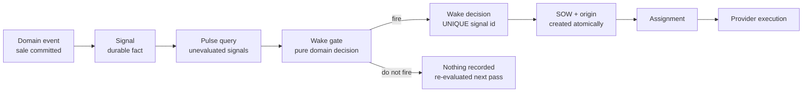
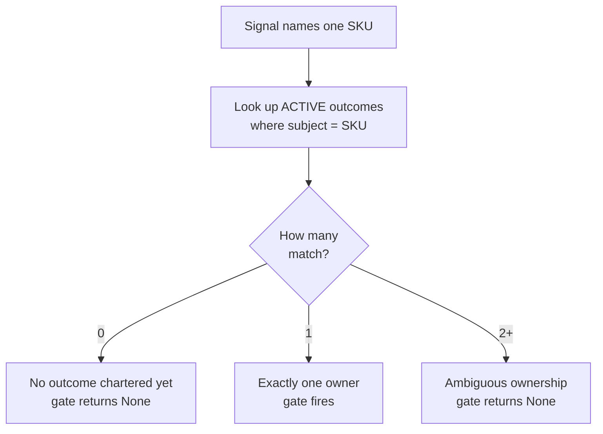

# Chapter 7 — The organization wakes itself

Every chapter so far began the same way: a human *dispatched* the work — wrote the
statement of work, made the assignment. Lucy wants something narrower but
important: when a sale drops the freezer below its line, she wants the reorder
*work itself* to be created from that signal, without her writing the dispatch by
hand each time.

Be precise about the claim, because most systems overstate exactly this. This
chapter builds three separable things and is careful not to confuse them: (1) a
**signal-driven decision** — a durable low-stock fact turned into a wake
decision; (2) **one Pulse tick** — a single call that derives governed work from
that decision; and (3) an **external scheduler or daemon** that would run ticks
unattended on a timer. This chapter builds and proves (1) and (2). It does **not**
build (3): *you* invoke the tick. "The organization wakes itself" means it creates
its own work from its own signals — not that it runs forever on its own. And when
it does create work, it leaves a durable, traceable record you can walk backward
from the finished work all the way to the sale that woke it. No record, no claim.

## Learning objective

Watch the organization create governed work **without a human prompt**, and
learn what makes that claim honest rather than theater: a durable
`pulse.work_created` event and a structured origin row, both produced by the
real mechanism, both checkable after the fact — never a status string, never
an inference from "nobody typed a command."

Chapter 0 ended by telling you the truth: you started everything; the
organization had no heartbeat. That remains true here. What changes is that one
manually invoked Pulse tick can derive work from a durable signal without a
human authoring that work. A scheduler, daemon, or future heartbeat may invoke
ticks unattended; none is smuggled into the claim this chapter proves.

## Vocabulary this chapter adds

| Term | What it is |
| --- | --- |
| **Signal** | A durable, append-only "something needs attention" fact — e.g. inventory falling below the reorder point after a sale. |
| **Wake gate** | A deterministic callback that decides whether a signal fires, and what governed work it should create if it does. The Store's own gate lives outside `sovereign_agent`'s budget: it is domain logic about SKUs and reorder points, not a general Pulse mechanism. |
| **Wake decision** | The durable, `UNIQUE(source_signal_id)` claim that one signal fired — the SQLite-boundary enforcement of "exactly one canonical decision per signal," not a preflight check a race can slip past. |
| **Pulse origin** | The structured, queryable answer to "manual or Pulse, and from what?" — every SOW, manual or Pulse-created, has exactly one row. Absence of a row is never the definition of manual. |

## Separate trigger, decision, and execution

"Autonomous" is too vague to test. Pulse splits it into explicit stages:



The signal is not a task. It records that the world crossed a meaningful
boundary. The gate is not a worker. It decides whether that signal still merits
work and specifies the governed work shape. Pulse is not a scheduler. One call
scans eligible signals and invokes the gate; only a firing decision is durable.
The provider is not the decider. It executes only after ordinary governance
creates an assignment.

This decomposition gives each race one database invariant. Two Pulse processes
may evaluate the same signal concurrently, but `UNIQUE(source_signal_id)` allows
only one canonical wake decision. The winner creates the SOW and its
`pulse_origins` row in the same transaction. The loser observes the existing
decision instead of manufacturing duplicate work. "Exactly once" here means
one canonical decision in the ledger—not that a function is physically invoked
only once.

### Four clocks that should not share one name

| Mechanism | What advances it? | What it proves |
| --- | --- | --- |
| Signal | Domain transaction | A relevant fact occurred. |
| Pulse tick | Caller invocation | Eligible signals were evaluated once. |
| Supervisor tick | Loop or caller | Expired claims/attempts were reconciled. |
| Heartbeat | Explicit `record_heartbeat` call | The runtime was alive at that moment; never that work happened, never a Pulse trigger. |

Keeping these clocks distinct prevents an operational command loop from being
mistaken for a liveness protocol, or a liveness protocol from being mistaken for
business decision-making.

## Build the tick yourself, then double-order the cones

Before running the real mechanism, build a pulse tick small enough to watch
it make the one mistake every naive version makes.

The scene: a sale dropped vanilla to 2 against a reorder point of 3, and the
sale committed a durable **signal** — a fact, not a task:

```python
import sqlite3

db = sqlite3.connect(":memory:")
db.executescript("""
    CREATE TABLE inventory (sku TEXT PRIMARY KEY, on_hand INT NOT NULL, reorder INT NOT NULL);
    CREATE TABLE signals (id TEXT PRIMARY KEY, sku TEXT, kind TEXT);
    CREATE TABLE wake_decisions (id INTEGER PRIMARY KEY, source_signal_id TEXT UNIQUE,
                                 sow_id TEXT);
    CREATE TABLE sows (id TEXT PRIMARY KEY, title TEXT, state TEXT);
""")
db.execute("INSERT INTO inventory VALUES ('SKU-VANILLA', 2, 3)")
db.execute("INSERT INTO signals VALUES ('sig-1', 'SKU-VANILLA', 'low_stock')")
db.commit()
```

Note the `UNIQUE` on `wake_decisions.source_signal_id`. It looks like a
detail. It is the entire chapter.

### The gate decides WHAT — and nothing else

```python
def wake_gate(db, signal_sku):
    on_hand, reorder = db.execute(
        "SELECT on_hand, reorder FROM inventory WHERE sku = ?", (signal_sku,)
    ).fetchone()
    if on_hand < reorder:
        return f"Replenish {signal_sku} to {reorder}"
    return None


print(wake_gate(db, "SKU-VANILLA"))
```

```text
Replenish SKU-VANILLA to 3
```

The gate is a pure read: world in, decision out, no writes. That split is
deliberate and mirrored in production — the gate decides *what* should
happen (domain logic about SKUs and reorder points, owned by the Store, not
by the Pulse mechanism), while the tick alone decides *how* work gets
created. Keep the gate pure and every hard question in this chapter lands in
one place.

### The tick that creates work every time you ask

```python
def tick_naive(db, signal_id):
    sku = db.execute("SELECT sku FROM signals WHERE id = ?", (signal_id,)).fetchone()[0]
    scope = wake_gate(db, sku)
    if scope is None:
        return "signal does not qualify"
    count = db.execute("SELECT COUNT(*) FROM sows").fetchone()[0]
    sow_id = f"sow-for-{signal_id}-{count}"
    db.execute("INSERT INTO sows VALUES (?, ?, 'READY')", (sow_id, scope))
    db.commit()
    return f"created {sow_id}"


print(tick_naive(db, "sig-1"))
print(tick_naive(db, "sig-1"))  # a retry, a second runner, a crash-and-rerun...
print("SOWs on the ledger:", db.execute("SELECT COUNT(*) FROM sows").fetchone()[0])
```

```text
created sow-for-sig-1-0
created sow-for-sig-1-1
SOWs on the ledger: 2
```

One sale, one signal, **two** replenishment jobs — and nothing about the
second call was unreasonable. Ticks get retried; supervisors get restarted;
a crash right after a tick makes rerunning it the obviously safe move. Every
one of those ordinary events is now a duplicate freezer order. The naive
tick's flaw is structural: nothing durable records that *this signal was
already decided*, so every evaluation decides it again.

### The tick that claims the decision, atomically

The repair binds three things into **one transaction**: re-checking the
world, claiming the decision, and creating the work. The claim is the
`UNIQUE(source_signal_id)` insert — enforced by the database at the moment
of writing, not by a Python check a race can slip past — and a loser does
not fail: it returns the **winner's canonical identifiers**.

```python
db.execute("DELETE FROM sows")
db.commit()


def tick(db, signal_id):
    sku = db.execute("SELECT sku FROM signals WHERE id = ?", (signal_id,)).fetchone()[0]
    try:
        db.execute("BEGIN IMMEDIATE")
        scope = wake_gate(db, sku)  # REVALIDATED inside the transaction
        if scope is None:
            db.execute("ROLLBACK")
            return "signal no longer qualifies"
        cursor = db.execute(
            "INSERT INTO wake_decisions(source_signal_id, sow_id) VALUES (?, ?)",
            (signal_id, f"sow-{signal_id}"),
        )
        db.execute("INSERT INTO sows VALUES (?, ?, 'READY')", (f"sow-{signal_id}", scope))
        db.execute("COMMIT")
        return f"created sow-{signal_id} (decision {cursor.lastrowid})"
    except sqlite3.IntegrityError:
        db.execute("ROLLBACK")
        winner = db.execute(
            "SELECT sow_id FROM wake_decisions WHERE source_signal_id = ?", (signal_id,)
        ).fetchone()[0]
        return f"already decided: canonical work is {winner}"


print(tick(db, "sig-1"))
print(tick(db, "sig-1"))
print("SOWs on the ledger:", db.execute("SELECT COUNT(*) FROM sows").fetchone()[0])
```

```text
created sow-sig-1 (decision 1)
already decided: canonical work is sow-sig-1
SOWs on the ledger: 1
```

Run it a hundred more times: one SOW, forever. And look at what the loser
got back — not an error, but the canonical answer. A contender that loses
the race learns *which* work is the real one, which is exactly what a
restarted runner needs in order to carry on. This is also the crash-window
resume in miniature: a tick that finds the decision already committed but
the work not yet run doesn't create anything — it picks up the canonical
identifiers and resumes from there, which is precisely `run_pulse_once`'s
step one in production.

### The fault that leaves nothing behind

The claim and the work must commit **together**, or a crash between them
strands a decided-but-workless signal forever:

```python
db.execute("INSERT INTO signals VALUES ('sig-2', 'SKU-VANILLA', 'low_stock')")
db.commit()


def tick_with_fault(db, signal_id):
    sku = db.execute("SELECT sku FROM signals WHERE id = ?", (signal_id,)).fetchone()[0]
    try:
        db.execute("BEGIN IMMEDIATE")
        wake_gate(db, sku)
        db.execute(
            "INSERT INTO wake_decisions(source_signal_id, sow_id) VALUES (?, ?)",
            (signal_id, f"sow-{signal_id}"),
        )
        raise RuntimeError("power cut before the SOW was written")
    except RuntimeError as error:
        db.execute("ROLLBACK")
        return f"fault: {error}"


print(tick_with_fault(db, "sig-2"))
count = db.execute(
    "SELECT COUNT(*) FROM wake_decisions WHERE source_signal_id = 'sig-2'"
).fetchone()[0]
print("half-made decisions left behind:", count)
print(tick(db, "sig-2"))  # the next tick simply tries again, cleanly
```

```text
fault: power cut before the SOW was written
half-made decisions left behind: 0
created sow-sig-2 (decision 2)
```

Chapter 1's migration lesson, at the work-creation layer: a failure at *any*
boundary rolls the whole creation back, so recovery is never a repair — it
is just the next tick doing its ordinary job.

### The world moved; the signal did not

A signal records that something *was* true. Between the sale and the tick, a
manual restock can land — and the tick must ask the world again, inside its
own transaction, rather than trust the signal's snapshot:

```python
db.execute("INSERT INTO signals VALUES ('sig-3', 'SKU-VANILLA', 'low_stock')")
db.execute("UPDATE inventory SET on_hand = 9")  # a manual restock landed first
db.commit()
print(tick(db, "sig-3"))
print("SOWs on the ledger:", db.execute("SELECT COUNT(*) FROM sows").fetchone()[0])
```

```text
signal no longer qualifies
SOWs on the ledger: 2
```

This is Chapter 2's deepest rule — *re-read the world at the moment of the
act* — applied at the moment work is **born** instead of the moment it is
accepted. The signal was honest when written; the gate is honest now; no
work is created for a freezer that is already full.

The production mechanism, `run_pulse_once` in `src/sovereign_agent/pulse.py`,
is everything you just built plus the integration your toy elides: it resumes
already-fired signals whose canonical assignment never ran (the crash
window), asks the caller-supplied gate exactly as yours did, creates the
canonical SOW *and* assignment *and* origin rows through
`Organization.create_pulse_work` in one transaction, and then runs the
assignment through the very same fenced `run_assignment` path as Chapter 5 —
no Pulse-only bypass. One boundary is load-bearing enough to be a ruling:
the supervisor from Chapter 6 **never calls this**, and this module never
calls the supervisor — the two compose only through a foreground caller
running each as its own separate operation. Recovery reconciles work that
exists; Pulse creates work that should; a mechanism that did both would be a
process nobody could reason about when it failed halfway through either job.

### The real gate refuses a question your toy never had to ask

Your `wake_gate` only checked one thing: is `on_hand` still below `reorder`.
The Store's own production gate, `store_wake_gate` in
`src/reference_organizations/store/pulse_gate.py`, checks that and something
your toy never modeled, because your toy never had more than one outcome to
choose between. This is quoted verbatim from `pulse_gate.py` — an excerpt to
read, not a standalone block to run (`org` and `sku` are the surrounding
function's real arguments, not names this page defines):

```text
rows = org.db.connection.execute("SELECT record FROM outcomes").fetchall()
matching = []
for row in rows:
    record = json.loads(row["record"])
    if record.get("subject") == sku and record.get("state") == OutcomeState.ACTIVE.value:
        matching.append(record)
if len(matching) != 1:
    return None  # zero or ambiguous -- no durable rule disambiguates more than one
```

A signal names a SKU. It does not name which governed outcome the
replenishment work belongs to — that has to be looked up, and the lookup can
fail two different ways. Zero matching active outcomes means nobody has
chartered replenishment for this SKU yet, so there is no outcome to attach
the work to. More than one matching active outcome is worse: two different
principals could both plausibly own "keep `SKU-TEA` stocked," and the gate
has no rule for picking between them. Both cases return `None` — the same
signal the gate returns for "stock is fine now." A learner reading only the
JSON report cannot tell "already resolved" from "ambiguous ownership" apart;
that distinction lives in `pulse_gate.py`'s own source, not in the report.



*Figure — the Store's outcome-disambiguation check inside `store_wake_gate`.
The stock-level check from the section above narrows signals to real
candidates; this second, independent check narrows candidates to signals
with exactly one unambiguous owner. Either failure mode returns the same
`None` a caller cannot distinguish from "already resolved" without reading
the source.*

Two tests in `tests/test_pulse.py` prove both halves fail closed rather than
guessing:
`test_no_active_outcome_matching_the_subject_creates_no_work` seeds a sale
with no outcome created for that SKU at all and asserts `report.created ==
()`; `test_more_than_one_matching_active_outcome_creates_no_work` activates
a *second* outcome naming the same SKU alongside the first and asserts the
identical empty result. Neither test asserts an error — a gate that raised
on ambiguity would turn an ordinary chartering mistake (two principals both
opening an outcome for the same SKU) into a crash instead of a quiet,
re-evaluable no-op. The signal is not consumed either way: it still has no
`pulse_wake_decisions` row, so a later Pulse pass — after someone closes the
duplicate outcome — evaluates it again and can still fire.

**Prove the ambiguous case yourself.** Chapter 0 seeded exactly one outcome
per SKU, so every earlier chapter's exercises never exercised this branch.
Run `solution.py` once normally, then run this against the same database to
force the ambiguity and watch the gate refuse where it previously fired:

```python
from pathlib import Path
from sovereign_agent.organization import Organization
from sovereign_agent.pulse import run_pulse_once
from reference_organizations.store import record_sale
from reference_organizations.store.pulse_gate import store_wake_gate

root = Path("/tmp/lucy-ch07-ambiguous")
org = Organization.init(root)
from reference_organizations.store import seed
seed(org.db)
first = org.create_outcome(
    "Keep the tea jar stocked", "On-hand tea is at or above reorder.",
    ["inventory_at_or_above_reorder_point"], "principal-human", "SKU-TEA",
)
org.activate(first.id, "master-course")
second = org.create_outcome(
    "A second outcome about the same SKU", "Also tea.",
    ["inventory_at_or_above_reorder_point"], "principal-human", "SKU-TEA",
)
org.activate(second.id, "master-course")  # two ACTIVE outcomes now name SKU-TEA

signal = record_sale(org.db, "SKU-TEA", 2, 400)
report = run_pulse_once(org, store_wake_gate)
print("created:", report.created)          # () -- refused, not fired
print("signal still has no decision:", org.db.connection.execute(
    "SELECT COUNT(*) FROM pulse_wake_decisions WHERE source_signal_id = ?",
    (signal.id,),
).fetchone()[0] == 0)
```

```text
created: ()
signal still has no decision: True
```

The mutation: delete the `if len(matching) != 1: return None` guard from
your own local copy of `pulse_gate.py`'s `store_wake_gate` (leave everything
else unchanged — do not touch `matching = []` above it) and rerun the same
script. The gate now has no rule for the two-owner case, so it falls
through to `matching[0]` — a real `IndexError`-free but silently wrong
pick, arbitrary Python dict ordering deciding which of two legitimate
principals' outcomes gets the replenishment work with no record of why
that one won. `report.created` becomes a one-item tuple instead of `()`:
the mutated gate fires exactly where the real one must refuse, which is the
provable, falsifiable failure this exercise is built to expose — not an
assertion that the guard matters, but the guard's absence producing a
different, wrong, observable result on the same input.

## The exercise

```bash
uv run python book/ch07_the_organization_wakes_itself/solution.py --root /tmp/lucy-ch07
```

Read the file before you run it. Notice what is missing: no `create_sow`, no
`ready_sow`, no `assign`. A sale is committed — the same everyday act Chapter
0's exercise triggered by hand — and then exactly one call,
`run_pulse_once(org, store_wake_gate)`, is what turns that sale into governed,
executed, accepted work.

## Expected observations

```json
{
  "sale_committed_no_human_dispatch": {
    "signal_id": "sig_...",
    "below_reorder_after_sale": true
  },
  "pulse_report": {
    "status": "created",
    "sow_id": "sow_...",
    "assignment_id": "asg_...",
    "assignment_state": "COMPLETED"
  },
  "durable_pulse_event": {
    "new_event_kinds_this_run": [
      "assignment.created",
      "assignment.finished",
      "assignment.running",
      "assignment.workspace_boundary_checked",
      "pulse.work_created",
      "sow.created",
      "sow.ready"
    ],
    "pulse_work_created_present": true
  },
  "structured_origin": {
    "origin_kind": "pulse",
    "sow_id": "sow_...",
    "assignment_id": "asg_...",
    "wake_decision_id": "pdec_...",
    "pulse_event_id": "evt_...",
    "wake_decision_source_signal_id": "sig_...",
    "wake_decision_source_event_id": "evt_...",
    "wake_decision_traces_back_to_this_signal": true
  }
}
```

This is the whole chapter, in four facts:

1. **`pulse_work_created_present: true`.** A genuine `pulse.work_created`
   event landed in the append-only event log during this run — not asserted
   in prose, read back from the ledger after the fact, the same way Chapter
   0 taught you to check every other claim in this book.
2. **`origin_kind: "pulse"`.** Not inferred from the absence of a manual
   dispatch call — a column, read directly. This is a deliberate design
   principle: the absence of a CLI invocation, of process logs, or of a
   manual-origin row is *not* proof that work was self-generated. Only a
   positive, recorded origin is.
3. **`wake_decision_traces_back_to_this_signal: true`.** The full chain —
   signal → wake decision → Pulse event → SOW → assignment — is walkable,
   not merely claimed. The wake decision's own `source_signal_id` matches
   the exact signal this sale produced.
4. **`assignment_state: "COMPLETED"`.** The work Pulse created ran through
   the *exact same* `run_assignment` path a human-dispatched assignment
   uses — the same actor-lease and execution-attempt fencing from Chapter 5
   apply here with no exception, no Pulse-only bypass.

Confirm it yourself, independent of this exercise's own summary:

```bash
sqlite3 /tmp/lucy-ch07/.sovereign/organization.db <<'SQL'
SELECT po.origin_kind, po.sow_id, po.assignment_id,
       wd.source_signal_id, wd.source_event_id
FROM pulse_origins po
LEFT JOIN pulse_wake_decisions wd ON wd.id = po.wake_decision_id
ORDER BY po.created_at;
SQL
```

Expected: one row, `origin_kind = pulse`, naming a real signal and a real
source event.

## Why this Pulse claim is allowed here and nowhere else in this book

No chapter before this one calls `run_pulse_once`, and this project's own
curriculum checker refuses an earlier chapter from claiming that its exercise
did. Chapter 0 shows a ledger with no `pulse.*` event because that demo takes the
manual path. This chapter invokes Pulse for the first time in the learning
sequence and produces the durable origin chain. Pulse remains separate from a
heartbeat and from scheduling: this exercise calls it explicitly once.

The same curriculum checker that refuses an early chapter's Pulse claim
holds THIS chapter to a stricter standard than "the words are true": it
actually runs this exercise and inspects the resulting database for a real
`pulse.*` event and a real, traceable `pulse_origins` row before it will
accept this chapter's own prose claiming Pulse fired. A chapter that
fabricated a `pulse.work_created` event directly — bypassing
`run_pulse_once` entirely — would fail that check even though the *word*
"pulse" appeared nowhere suspicious in its prose. The claim has to be earned
by the mechanism, not merely phrased carefully.

## Learner verification command

```bash
uv run python -m pytest tests/test_pulse.py -k \
  "full_teaching_slice or attribution or does_not_bypass"
uv run python scripts/verify_curriculum.py
```

Expected: all pass. The pytest selection proves the full sale-to-accepted
slice through the real mechanism, the source-event-to-SOW attribution chain,
and that Pulse-created work is not exempt from Chapter 5's fencing.
`verify_curriculum.py` proves this chapter's own claim is backed by durable
evidence, not merely present in the prose — the mechanical guard this
project's own curriculum checker enforces specifically for Chapter 7.

## Summary

This chapter built `run_pulse_once`'s wake gate and wake decision: a pure
gate that decides what work a signal warrants, and a `UNIQUE(source_signal_id)`
claim, made inside one transaction with the SOW and origin rows it creates,
that lets exactly one canonical decision exist per signal.

The invariant it establishes is that self-generated work is provable only
positively — a real `pulse.work_created` event and a `pulse_origins` row
naming a real signal — never inferred from the absence of a manual
dispatch call, which this chapter's own curriculum checker enforces by
re-deriving the claim from the database rather than trusting the prose.

The failure it prevents is the naive tick's double-order: retried or
re-run against the same signal, it created two replenishment SOWs from one
sale, and nothing about that retry was unreasonable — ticks get retried
constantly. The claimed decision closes it structurally, at the database.

Back at Lucy's shop: this is the freezer alarm that fires exactly once per
low-stock sale, however many times the alarm system itself gets restarted
or double-checks its own work.

## Explain it back

1. This file never calls `create_sow`, `ready_sow`, or `assign`. What
   function call is doing the work those three calls did in every earlier
   chapter, and what does it do differently?
2. `pulse_wake_decisions.source_signal_id` is `UNIQUE`. What real problem
   does that one constraint prevent, at the database level, that a
   Python-level "check first, then insert" could not?
3. "Absence of a manual-origin row is not proof of Pulse origin." Why is
   that distinction worth a dedicated table rather than just checking
   whether any human-facing CLI command was invoked?
4. The assignment Pulse created ran through the exact same `run_assignment`
   path Chapter 5 fenced. Why does that matter for trusting this chapter's
   own `COMPLETED` result?
5. What specifically would make this chapter's own Pulse claim FALSE — name
   at least two different ways the underlying ledger could fail to back up
   the prose above, and explain how you would notice.
6. `tick_naive` was defeated by perfectly reasonable behavior — retries and
   restarts, not attacks. Why is "just don't call it twice" not an
   acceptable fix, and what does the UNIQUE claim change structurally?
7. The losing contender returns the winner's canonical identifiers instead
   of an error. Name the caller that specifically needs that behavior, and
   what it would wrongly do if it got an exception instead.
8. `sig-3` was honest when recorded, yet created no work. Reconcile "signals
   are durable append-only facts" with "this signal produced nothing" —
   which of the two would it be dishonest to change?

## Where to look next

- `src/sovereign_agent/pulse.py` — `run_pulse_once`, the whole mechanism
- `src/reference_organizations/store/pulse_gate.py` — the Store's own wake
  gate, deliberately outside `sovereign_agent`'s own module budget
- `tests/test_pulse.py` — the full proof matrix, including that the canonical
  creation transaction (signal → wake decision → SOW → assignment) is genuinely
  atomic, so a crash mid-creation cannot strand a half-woken piece of work

`solution.py` imports the production package rather than copying it.

You have now built the whole spine of a governed organization: memory,
judgement, bounded work, fenced authority, recovery, and signal-driven work
creation. Chapters 8 through 12 turn from the machinery to the shop itself—
Lucy's catalog grows, and you watch every guarantee you built hold up as it
scales. Heartbeat-based liveness remains a separate, unimplemented lesson.

Next: [Chapter 8 — The Store becomes a catalog](../ch08_the_store_becomes_a_catalog/README.md)
