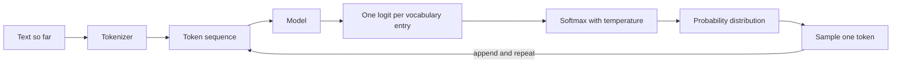
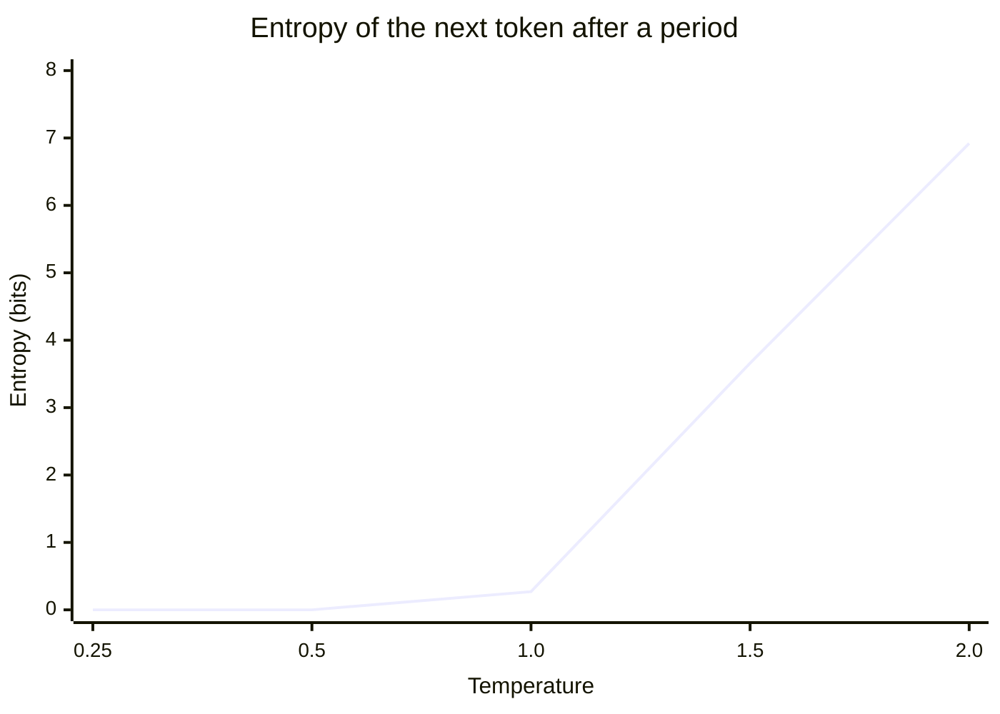
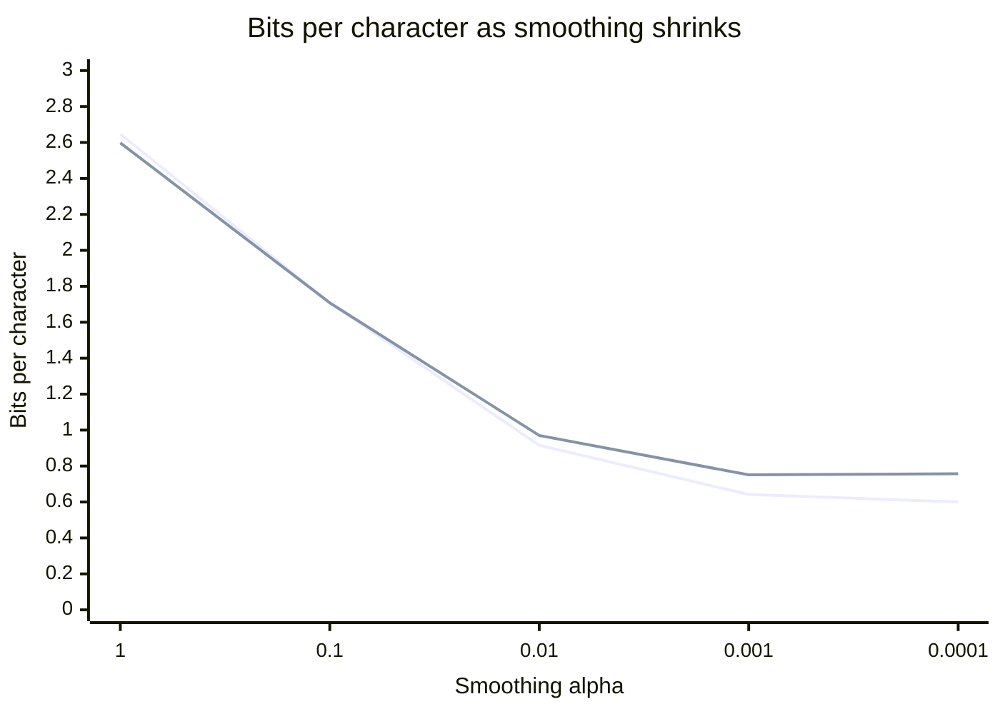
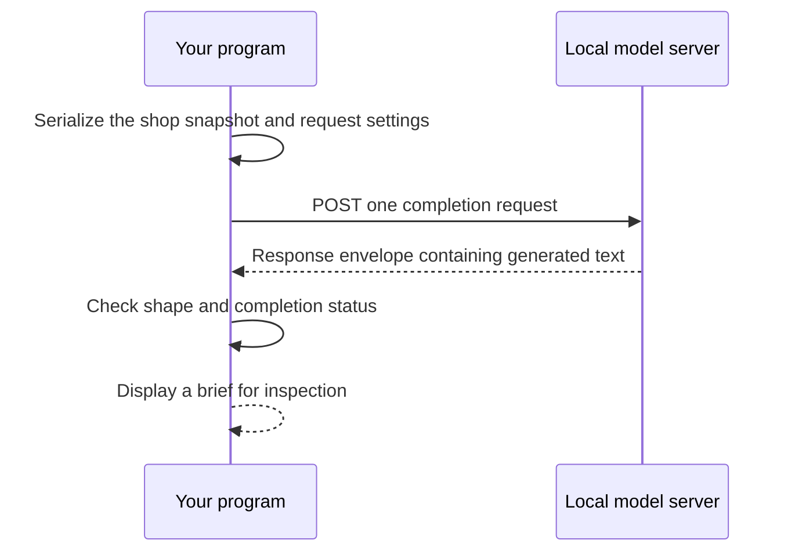
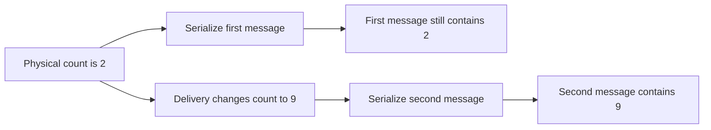

# Chapter 1 — What a model call is: tokens, probabilities and Lucy's first brief

> **Learn with Prof Rod** — *Build Your Always-On AI Agent From Scratch*.
> **Read the full book and get the latest learning materials:** [https://profrod.ai/book](https://profrod.ai/book).
> **Join the Prof Rod learner community:** [https://profrod.ai/community](https://profrod.ai/community)
> — bring your questions, compare experiments and share what you build.
> **Original source and updates:** [profrodai/sovereign-agent](https://github.com/profrodai/sovereign-agent).

**Status: DRAFT.** Read the [textbook guide](../profrod-sovereign-agent-textbook-start-here.md) for setup and supplied-code boundaries. Practice in [Exercise Book 1](../../exercises/ch01/profrod-sovereign-agent-ch01-first-model-call-exercise-guide.md); consult [Solutions 1](../../solutions/ch01/profrod-sovereign-agent-ch01-first-model-call-solutions-guide.md) after attempting the work.

Lucy opens her ice cream shop at nine. Before the first customer arrives, she wants a short brief: what is running low, what to order. You are going to have a language model write it. Before you do, answer a question most people who call models every day cannot: what exactly happens between the request you send and the text that comes back?

The answer has four parts, and every later chapter depends on them.

1. The text becomes **tokens**, and tokens are what you pay for and what fill the context window.
2. The model turns the tokens so far into a **score for every possible next token**.
3. Those scores become a **probability distribution**.
4. **Sampling** picks one token, which is appended; then the process repeats.



**Figure:** A model call is a loop: each generated token is sampled from a distribution the model computes from every token before it.

The same four parts explain why the same prompt gives different answers, why "temperature 0" is not a promise of repeatability, how a model is trained, and how its quality is measured.

You will build each part yourself, small enough to read in one sitting, from Lucy's own shop notes. Then you will measure a real model and find the same quantities there. Only then will you write Lucy's brief (Part B). By that point you will know why a fluent, valid response can still be wrong, and what "the model is confident" does and does not mean.

## Learning objectives

By the end you will be able to:

1. Train a byte-pair encoder from scratch, and explain why tokens, not words or characters, are the unit of cost and context.
2. Derive softmax from what a probability distribution over tokens must satisfy, and explain why implementations subtract the largest logit.
3. Derive how temperature changes a distribution's entropy, $dH/dT = \mathrm{Var}(z)/T^3$, and check the derivation numerically.
4. Sample from a distribution, and test whether a sampler is correct with a chi-square statistic rather than by eye.
5. Define cross-entropy and perplexity, show that next-token training minimizes cross-entropy, and compare models fairly in bits per character.
6. Read the same quantities from a real model's log-probabilities, and explain why the probability of a model's own answer says nothing about whether it is correct.
7. Make a real model call for Lucy, and separate a valid response from a true one.

You bring Python functions, lists, dictionaries and loops. No probability beyond "probabilities are nonnegative and sum to one" is assumed; everything else is derived here.

## Keep your implementation in a file

Create `book/textbook/learner/profrod_sovereign_agent_ch01_model_call_learner.py`. The repository includes a completed comparison copy, with a small corpus of Lucy's notes (`SHOP_NOTES`) and a few held-out notes (`HELD_OUT_NOTES`). The chapter's experiment measures every derivation below against your implementation and records a receipt:

```bash
uv run python book/textbook/experiments/profrod_sovereign_agent_textbook_ch01_model_v1.py --out ch01-model-receipt.json
```

Add `--live` to also measure a real model served by Ollama on your machine (`ollama pull qwen2.5:0.5b` first). The chapter's checkpoint runs the whole chapter offline:

```bash
uv run python book/textbook/checkpoints/profrod_sovereign_agent_ch01_first_model_call_checkpoint.py
```

## Part A: what happens inside a model call

## Text becomes tokens

A model cannot read text. It reads a sequence of integers, each naming an entry in a fixed **vocabulary**. The step that turns text into that sequence is the **tokenizer**, and its choice shapes everything downstream.

Two obvious choices both fail:

- **Words** leave no way to spell a word the vocabulary has never seen: a new flavor, a typo, a product code.
- **Characters or bytes** can spell anything, but sequences become long. A model's cost, and the memory its attention needs, grow with sequence length, so a text four times longer in tokens is at least four times more expensive to process.

**Byte-pair encoding** (BPE) sits between them. Start with the 256 possible bytes, so any text at all can be encoded. Then repeatedly find the most frequent adjacent pair of tokens in a training corpus and merge it into a new token. Frequent words become single tokens; rare ones stay spelled out in pieces. GPT-2, Llama and most models you will call use a variant of this procedure.

Train one on Lucy's notes with 100 merges and encode a sentence:

**Listing:** Byte-pair encoding, trained on the shop's notes.

```python
import runpy

ch01 = runpy.run_path("book/textbook/learner/profrod_sovereign_agent_ch01_model_call_learner.py")
merges = ch01["train_bpe"](ch01["SHOP_NOTES"], 100)
sentence = ch01["encode"]("Order six tubs of vanilla before the weekend.", merges)
print(len(merges), "merges")
print([token.decode() for token in sentence])
print([token.decode() for token in ch01["encode"](" pistachio", merges)])
```

```text
100 merges
['O', 'rder', ' s', 'i', 'x', ' tubs', ' of', ' vanilla', ' before', ' the', ' week', 'en', 'd', '.']
[' ', 'p', 'i', 's', 't', 'a', 'c', 'h', 'i', 'o']
```

Frequency decides everything. Words the notes use constantly (" tubs", " of", " vanilla", " before", " the") became single tokens, each carrying its leading space. "Order" starts only two notes, so it is split as "O" + "rder". "Six" appears once and stays three separate characters. "Weekend" appears twice and becomes " week" + "en" + "d". "Pistachio" never appears, so it is spelled out one byte at a time. Nothing is ever out of vocabulary; the price of an unfamiliar word is simply more tokens.

Two consequences follow, and you will meet both in every production system:

- **You pay per token, not per word.** A provider's price list quotes cents per million input tokens and per million output tokens. The same request costs different amounts under different tokenizers, and text in a language the tokenizer was not trained on costs more.
- **The model sees tokens, not letters.** A model asked how many "r"s are in "strawberry" receives perhaps two tokens, not ten letters. Failures at spelling and digit arithmetic often trace back to this.

The experiment measures the trade-off as the number of merges grows:

| Merges | Tokens for the notes | Characters per token |
| --- | --- | --- |
| 0 | 989 | 1.00 |
| 25 | 677 | 1.46 |
| 50 | 543 | 1.82 |
| 100 | 377 | 2.62 |
| 134 (no pair left occurs twice) | 309 | 3.20 |

More merges mean shorter sequences but a larger vocabulary. Every vocabulary entry needs its own row of parameters in a real model, so vocabulary size is itself a cost. Production tokenizers settle somewhere between 32,000 and 256,000 entries.

## A model turns context into a score for every token

A **language model** is a function. Its input is the tokens so far. Its output is one real number for every token in the vocabulary: a **logit**, a score for how well that token would continue the text. That is the whole interface. A transformer with hundreds of billions of parameters implements the same one.

The smallest model with this interface is a **bigram model**. It looks only at the previous token, and its logit for each candidate next token comes from counting. In Lucy's notes, how often did the candidate follow the previous token? The logit is the logarithm of that count plus a small constant $\alpha$. Why the logarithm, and why the constant, will be clear in a moment.

**Listing:** A bigram model's logits after " of", the four highest.

```python
notes = ch01["encode"](ch01["SHOP_NOTES"], merges)
model = ch01["train_bigram"](notes, merges)
logits = model.logits(b" of")
best = sorted(range(len(logits)), key=lambda i: -logits[i])[:4]
print(len(model.vocabulary), "tokens in the vocabulary")
for i in best:
    print(repr(model.vocabulary[i].decode()), round(logits[i], 3))
```

```text
356 tokens in the vocabulary
' vanilla' 1.099
' strawberry' 1.099
' chocolate' 0.694
' s' 0.001
```

These are scores, not probabilities: they do not sum to one, and only their differences will matter. Each is the logarithm of a count plus $\alpha = 0.001$. $e^{1.099} \approx 3$, so " of" was followed by " vanilla" three times in the notes, by " strawberry" three times and by " chocolate" twice. The vocabulary has 356 entries: the 256 bytes plus 100 merges. Every one of them gets a logit, including the hundreds that never followed " of". The next step turns the scores into a distribution.

## Softmax, derived

We want to turn logits $z_1, \dots, z_V$ into probabilities $p_1, \dots, p_V$. Three requirements fix the answer:

1. Every $p_i$ is positive: no token is ruled out completely, because a model that assigns zero probability to something that then happens is infinitely wrong (you will see this when we measure models).
2. The $p_i$ sum to one.
3. A logit difference is a log-odds: the model prefers token $i$ over token $j$ by $z_i - z_j$ in log space, $\log(p_i / p_j) = z_i - z_j$.

The third requirement says $p_i / p_j = e^{z_i} / e^{z_j}$ for every pair, so $p_i = c\, e^{z_i}$ for one constant $c$. The second fixes $c$:

$$
p_i \;=\; \frac{e^{z_i}}{\sum_{j=1}^{V} e^{z_j}}.
$$

This is **softmax**. Its form also shows why our bigram logits are the logarithm of counts: then $e^{z_i}$ is the smoothed count itself, and softmax becomes count over total, the natural estimate of a frequency.

**Adding a constant to every logit changes nothing.** Multiply the numerator and denominator by $e^{-c}$ and it cancels. Every implementation relies on this, for a practical reason: $e^{1000}$ overflows a 64-bit float. Real logits are seldom that large, but their exponentials are routinely summed over 100,000 tokens, and the safe habit costs nothing. Subtract the largest logit first, so the largest exponent is $e^0 = 1$:

**Listing:** Softmax is unchanged by a shift, and the shift is what keeps it finite.

```python
import math

big = [1000.0, 999.0, 998.0]
print([round(p, 4) for p in ch01["softmax"](big)])
print([round(p, 4) for p in ch01["softmax"]([2.0, 1.0, 0.0])])
try:
    [math.exp(z) for z in big]
except OverflowError as error:
    print("without the shift:", error)
```

```text
[0.6652, 0.2447, 0.09]
[0.6652, 0.2447, 0.09]
without the shift: math range error
```

## Temperature and entropy

Providers let you set a **temperature** $T$. It divides every logit before softmax:

$$
p_i(T) \;=\; \frac{e^{z_i/T}}{\sum_j e^{z_j/T}}.
$$

At $T = 1$ the model's own distribution is used. As $T \to 0$, the largest logit dominates, and all probability moves to the single most likely token: this is **greedy decoding**, and the implementation treats $T = 0$ as exactly that. As $T \to \infty$, every $z_i/T \to 0$ and the distribution becomes uniform: any token, equally likely.

### Entropy, and why temperature raises it

How spread out is a distribution? Its **entropy** measures the average surprise of one draw, in bits:

$$
H(p) \;=\; -\sum_i p_i \log_2 p_i.
$$

A certain outcome has $H = 0$. A uniform choice among $V$ tokens has $H = \log_2 V$, the most possible. The claim that raising the temperature always raises entropy deserves a proof, not just a picture. Write $\beta = 1/T$ and use natural logarithms for now. Then $p_i = e^{\beta z_i}/Z$ with $Z = \sum_j e^{\beta z_j}$, and $\log p_i = \beta z_i - \log Z$. So

$$
H \;=\; -\sum_i p_i(\beta z_i - \log Z) \;=\; \log Z - \beta\,\mathbb{E}_p[z].
$$

Differentiate with respect to $\beta$. Two facts do all the work: $d \log Z / d\beta = \mathbb{E}_p[z]$, and $d\,\mathbb{E}_p[z] / d\beta = \mathrm{Var}_p(z)$, both from differentiating the sums directly. Then

$$
\frac{dH}{d\beta} \;=\; \mathbb{E}_p[z] - \mathbb{E}_p[z] - \beta\,\mathrm{Var}_p(z) \;=\; -\beta\,\mathrm{Var}_p(z),
$$

and since $d\beta/dT = -1/T^2$,

$$
\frac{dH}{dT} \;=\; \frac{\mathrm{Var}_p(z)}{T^3} \;\ge\; 0.
$$

Entropy never falls as temperature rises. It rises fastest where the logits the model is actually choosing between still disagree strongly: a large variance under the current distribution.

The experiment checks the derivation against a numerical derivative, for the context the model has seen most (a period, which is followed by a newline in nearly every note):

| $T$ | Entropy (bits) | $dH/dT$ derived | $dH/dT$ by finite difference | Probability of the top token |
| --- | --- | --- | --- | --- |
| 0.25 | 0.0000 | 0.0000 | 0.0000 | 1.0000 |
| 0.5 | 0.0000 | 0.0010 | 0.0010 | 1.0000 |
| 1.0 | 0.2746 | 2.4247 | 2.4247 | 0.9826 |
| 1.5 | 3.6644 | 9.1996 | 9.1996 | 0.6749 |
| 2.0 | 6.9202 | 3.6034 | 3.6034 | 0.2849 |



**Figure:** Entropy rises with temperature, slowly while one token dominates and steeply once the alternatives start to compete.

The two derivative columns agree to four decimal places. The table also shows what temperature is for. At $T = 1$, 98% of the probability is on the obvious token. At $T = 2$ it is 28%, and nearly seven bits of entropy spread the rest across the vocabulary, most of it on continuations no note ever contained. High temperature buys diversity by spending probability on text the model itself considers unlikely.

## Sampling

To generate, draw one token from the distribution, append it, and repeat. The standard way to draw from a discrete distribution is **inverse transform sampling**. Take $u$ uniform on $[0, 1)$ and walk the cumulative sums $F_i = p_1 + \dots + p_i$, returning the first $i$ with $u < F_i$. Token $i$ is returned exactly when $F_{i-1} \le u < F_i$, an interval of length $p_i$, so it is returned with probability $p_i$.

**Listing:** Generating from the bigram model at three temperatures, starting after a newline.

```python
import random

rng = random.Random(7)
for t in (0, 0.7, 1.5):
    tokens = ch01["generate"](model, b"\n", 10, rng, temperature=t)
    print(t, repr(ch01["decode"](tokens[1:], errors="replace")))
```

```text
0 'The supplier 30 cents.\nThe supplier'
0.7 'A tub of strawberry before the target of chocolate is'
1.5 'The!hocolate�30Y li�'
```

The three lines show three regimes:

- **Greedy decoding** is deterministic, and within ten tokens it has written nonsense ("The supplier 30 cents") and started to loop. Choosing the single most likely next token at every step is not the same as producing likely text.
- **Moderate temperature** produces a plausible recombination of the notes that no note contains.
- **High temperature** produces fragments, and bytes that are not valid UTF-8 at all (the "�" marks). A byte-level model can emit the first half of a multi-byte character, which is why the decoder takes an explicit error policy.

### Top-p sampling

**Top-p** ("nucleus") sampling is the usual guard against the long tail. It keeps the smallest set of most-likely tokens whose probabilities reach $p$, renormalizes, and samples from that. With $p = 0.9$, the dozens of garbage continuations that together hold 10% of the mass at high temperature are never drawn.

### Testing a sampler

How do you know a sampler is correct? Not by looking at a few outputs. Draw $n$ times and compare each token's observed frequency $\hat{p}_i$ with $p_i$. Each count is binomial, so $\hat{p}_i$ has standard error $\sqrt{p_i(1 - p_i)/n}$. It is tempting to check that every token lands within two or three standard errors. But with 356 tokens, some will deviate by more than three purely by chance. The experiment's largest deviation after 20,000 draws is 4.05 standard errors, on a token whose probability is so small that the normal approximation behind "standard errors" does not hold.

The right tool considers every category at once. **Pearson's chi-square** statistic sums $(\text{observed} - \text{expected})^2 / \text{expected}$ over all tokens. For a correct sampler it has mean $k - 1$ and variance $2(k - 1)$ with $k$ categories. The experiment measures $\chi^2 = 346.7$ with 355 degrees of freedom, $z = -0.31$: exactly what a correct sampler produces. The same reasoning, "many comparisons will throw up a large deviation by chance; test them together", returns in Chapter 15, where you compare agents on many evaluation cases.

## How good is a model: likelihood, cross-entropy, perplexity

A model assigns a probability to any whole text by multiplying the probabilities it gives each token in turn:

$$
P(t_1, \dots, t_n) \;=\; \prod_{k=2}^{n} P(t_k \mid t_{k-1})
$$

for our bigram model; a real model conditions on the whole prefix instead of one token. Products of many small numbers underflow, so we work with the average negative log, the **cross-entropy** of the model on the text, in bits per token:

$$
\mathcal{H} \;=\; -\frac{1}{n-1}\sum_{k=2}^{n} \log_2 P(t_k \mid t_{k-1}).
$$

It is the average number of bits the model needs to encode each token of the text. **Perplexity** $2^{\mathcal{H}}$ turns it back into a count: a perplexity of 5 means the model is, on average, as uncertain as a fair choice among five tokens.

### Training minimizes cross-entropy

**This is the quantity every language model is trained to minimize.** Pretraining a large model means adjusting its parameters to maximize the probability of its training text, which is the same as minimizing cross-entropy on it. "Next-token prediction" is not a slogan; it is this formula.

For the bigram model you can solve the training problem exactly. Suppose token $a$ is followed by token $j$ exactly $c_j$ times in the corpus. The log-probability of the corpus, restricted to what follows $a$, is $\sum_j c_j \log q_j$, and we maximize it subject to $\sum_j q_j = 1$. With a Lagrange multiplier $\lambda$, setting the derivative to zero gives $c_j / q_j = \lambda$. So $q_j \propto c_j$, and after normalizing, $q_j = c_j / \sum_i c_i$.

**Counting is maximum-likelihood training.** It is also the reason we add $\alpha$. A pair that never occurred gets $q_j = 0$, and the first time it occurs in new text the model pays $-\log 0 = \infty$ bits. Adding $\alpha$ to every count keeps every probability positive. It is the estimate you get from a prior belief that every continuation is possible (a Dirichlet prior, in the statistics you will meet later).

### Held-out text, and a fair unit

**Measure on text the model did not train on.** A model can drive its cross-entropy on its own training text arbitrarily low by memorizing it. The number that matters is on held-out text. The experiment sweeps $\alpha$ with 100 merges:

| $\alpha$ | Training bits per character | Held-out bits per character |
| --- | --- | --- |
| 1 | 2.647 | 2.598 |
| 0.1 | 1.708 | 1.708 |
| 0.01 | 0.915 | 0.970 |
| 0.001 | 0.642 | 0.751 |
| 0.0001 | 0.600 | 0.757 |



**Figure:** Training cross-entropy (lower line) keeps falling as smoothing shrinks; held-out cross-entropy (upper line) turns back up below alpha = 0.001, the signature of overfitting.

Training cross-entropy keeps falling as $\alpha$ shrinks. Held-out cross-entropy falls, bottoms out near $\alpha = 0.001$, and rises again. Below that, the model trusts its few counts too much. This is **overfitting**, visible in five rows, and the reason every serious training run reports a validation loss. The learner file uses $\alpha = 0.001$.

**Compare models in bits per character, not per token.** A token can stand for one character or for a whole word, so a prediction per token is a different task under each tokenizer. The tokenization experiment makes this concrete:

| Merges | Characters per token | Training bits per token | Training bits per character | Held-out bits per character |
| --- | --- | --- | --- | --- |
| 0 | 1.00 | 2.717 | 2.714 | 2.722 |
| 50 | 1.82 | 2.153 | 1.180 | 1.319 |
| 100 | 2.62 | 1.688 | 0.642 | 0.751 |
| 134 | 3.20 | 1.541 | 0.480 | 0.795 |

Converting with $\mathcal{H}_{\text{char}} = \mathcal{H}_{\text{token}} \times (\text{tokens} / \text{characters})$ puts every row on the same scale. On training text every extra merge helps. On held-out text, 134 merges lose to 100, because the last merges turn whole phrases of the training notes into single tokens: the tokenizer itself has started to memorize. Per-token perplexities of models with different tokenizers are never directly comparable; bits per character (or per byte) are.

**Listing:** Scoring held-out notes.

```python
held_out = ch01["encode"](ch01["HELD_OUT_NOTES"], merges)
print(round(ch01["cross_entropy_bits"](model, held_out), 3), "bits per token")
print(round(ch01["perplexity"](model, held_out), 2), "perplexity")
```

```text
2.02 bits per token
4.06 perplexity
```

## A real model does the same thing

Everything above is visible in a real model's API, if you ask for it. An OpenAI-compatible endpoint accepts `temperature` and `top_p`. They are exactly the two knobs you just implemented. With `logprobs: true` and `top_logprobs: 5`, it returns, for every generated token, $\log p$ of the token it chose and of the five most likely alternatives.

The experiment's `--live` mode asks `qwen2.5:0.5b`, a small open model served by Ollama, to answer Lucy's question in one sentence: "Lucy's freezer holds 2 tubs of vanilla (target 8), 11 of chocolate (target 6) and 1 of strawberry (target 5). Which flavors should she order?" One recorded run, on 2026-09-26 with Ollama 0.32.5 on macOS (arm64), gave:

| Measurement | Value |
| --- | --- |
| Greedy answer ($T = 0$) | "To maximize the number of tubs Lucy can buy while meeting her target quantities for each flavor, she should prioritize buying more vanilla than chocolate and strawberry. This way, she will have enough tubs to meet both her target quantities without exceeding them." |
| Tokens in the answer; prompt tokens | 49; 75 |
| Log-probability of the whole answer | −49.9 nats, so $P \approx 2 \times 10^{-22}$ |
| Mean per-token entropy (top 5 plus the rest) | 1.6 bits |
| Distinct answers in 10 samples at $T = 0 / 0.7 / 1.5$ | 1 / 10 / 10 |

Read each row with Part A in mind.

**The answer is fluent and wrong.** Chocolate is above target and needs no order. Strawberry needs four tubs. Vanilla needs six. "Prioritize buying more vanilla than chocolate and strawberry" gets strawberry wrong, and "maximize the number of tubs Lucy can buy" is a goal nobody gave it. Nothing in the response envelope, the token count or the log-probabilities flags this. Correctness is a property of the claims, checked against the facts: Part B's subject.

**The probability of the model's own answer is astronomically small, and that is normal.** Any particular 49-token sequence is one of an enormous number the model could produce. Multiplying 49 probabilities that average $e^{-1}$ gives $e^{-49}$. A low sequence probability does not mean the model was unsure of its facts, and a high per-token probability would not have meant it was right.

Greedy decoding also picks the best token *at each step*, which is not the same as the most probable *sequence*. Beam search and other decoders trade compute for that difference.

**Temperature 0 was not reproducible.** Ten greedy samples within one run agreed. But the chapter's first recorded run, minutes earlier and with the same model and prompt, answered "...she should prioritize buying more vanilla than chocolate and fewer strawberry." Greedy decoding is deterministic only if every floating-point operation is. Batching, kernel choice and parallel reductions reorder additions, and a tie broken differently at one token changes everything after it. Treat a live response as an observation to record, never as a fixture to test against.

**Cost is arithmetic on tokens.** At a price of 10 cents per million input tokens and 40 cents per million output tokens, this call costs:

**Listing:** Cost of one call from its token counts.

```python
print(round(ch01["cost_cents"](75, 49, 10, 40), 5), "cents")
print(round(ch01["cost_cents"](75 * 1000, 49 * 1000, 10, 40), 2), "cents for a thousand calls")
```

```text
0.00271 cents
2.71 cents for a thousand calls
```

Output tokens usually cost several times more than input tokens. For each output token the model must run a full forward pass and read its whole accumulated context, while input tokens are processed together in parallel. Chapter 18 derives this from the architecture.

## Part B: Lucy's first brief

You now know what a model call computes. The rest of this chapter makes one for Lucy, and builds the discipline that follows from Part A: a response is a sample, and a sample must be checked against facts before anyone acts on it.

## Give the shop explicit data

Start with several products. Adding a second product later should not require redesigning the entire example around an assumption that stock is one integer. Each product has a stable SKU, a display name, a physical count, and a reorder point. In these teaching fixtures, the reorder point is also the replenishment target; a real shop might keep a separate reorder threshold and order-up-to level.

**Listing:** The first shop fixture contains several independently identifiable products.

```python
SHOP = {
    "customer": "Lucy",
    "currency": "USD",
    "products": [
        {"sku": "SKU-VANILLA", "name": "Vanilla", "on_hand": 2, "reorder_point": 8},
        {"sku": "SKU-CHOCOLATE", "name": "Chocolate", "on_hand": 12, "reorder_point": 6},
        {"sku": "SKU-STRAWBERRY", "name": "Strawberry", "on_hand": 1, "reorder_point": 5},
    ],
}
print([(item["sku"], item["on_hand"]) for item in SHOP["products"]])
```

```text
[('SKU-VANILLA', 2), ('SKU-CHOCOLATE', 12), ('SKU-STRAWBERRY', 1)]
```

The SKU is the identity used in tool arguments and records. The name is what Lucy wants to read. Those roles are different. Renaming a display label should not make yesterday's order refer to a different product. The fixture uses readable identifiers so you can follow them through the code without decoding a sequence of opaque numbers.

`on_hand` means physical stock in the shop. It will remain different from reserved stock and incoming orders. An accepted order is not a delivery. When we add those concepts, the distinction will determine whether another replenishment request is necessary. We introduce only the physical count here, but choose a field name that does not pretend to represent every kind of availability.

Currency is explicit even though this first brief contains no prices. An earlier live construction run correctly calculated quantities and totals, then labeled the money as euros because its tool results supplied an ambiguous unit. That is a data-contract problem worth removing before we teach spending. Later tools use integer cents and the currency code USD together. A familiar-looking money symbol in generated prose is not authoritative accounting evidence.

The model will receive this fixture as context. The fixture does not become more authoritative because the model repeats it. If the stock count changes after the request, the response still describes the old snapshot. This is why Chapter 2 moves stock lookup into a tool that reads current records when called.

### Make the request visible

We use two messages: an instruction describing the limited job, and a user message containing the shop data. JSON serialization preserves the field names and values in a format you can print and inspect.

```python
import json


def messages(shop):
    return [
        {
            "role": "system",
            "content": "Write a short morning stock brief for Lucy. "
            "Use only the supplied stock facts. Name products below their reorder points. "
            "Do not purchase anything or claim that an order exists.",
        },
        {"role": "user", "content": json.dumps(shop, sort_keys=True)},
    ]


request_messages = messages(SHOP)
print([message["role"] for message in request_messages])
print(json.loads(request_messages[1]["content"])["currency"])
```

```text
['system', 'user']
USD
```

The instruction describes a job; it does not enforce a security boundary. The absence of a purchasing capability is what prevents this program from placing an order. If the model invents the sentence “I ordered six tubs,” the program has still made only a text request. That sentence is a false claim to reject, not evidence of a supplier transaction.

This distinction will matter when tool calls arrive. We will not hand every function to the model and hope it follows a sentence about being careful. The dispatcher will expose specific operations, and the write boundary will check authority when an actual purchase is attempted. The current instruction prepares the reader for that behavior without pretending it implements it.

## Build the model request

The HTTP body contains the model selection, the messages, and a few generation settings. `stream=False` asks for a completed response rather than a stream of partial chunks. `max_tokens` asks the provider to limit generated output. Neither field determines whether the resulting prose is correct.

```python
def payload(shop, model="qwen3"):
    return {
        "model": model,
        "messages": messages(shop),
        "stream": False,
        "temperature": 0,
        "max_tokens": 256,
        "reasoning_effort": "none",
    }


body = payload(SHOP)
print(body["model"], body["stream"], body["max_tokens"])
```

```text
qwen3 False 256
```

A low sampling temperature is useful when investigating changes, but it does not turn a live model into a deterministic test fixture. Different model weights, server versions, kernels, or execution conditions may produce different responses. Preserve a live transcript for replay and investigation. Use explicit response fixtures when a test requires exact bytes.

The generation limit is also distinct from your program's deadline. A model may take time to load before generating its first token. A network connection may remain open while making very slow progress. Later we will enforce a total deadline outside the HTTP request and give the agent a separate limit on how many model calls it can make. Here, one visible request is enough to establish the connection.



**Figure:** A single model call transports a snapshot and receives a response; it does not create a persistent worker or a supplier order.

## Read the response without inventing success

A completion endpoint returns an envelope, not just a string. We need the generated text, but we should first establish that the response has the shape this program expects and that generation finished normally. The following parser accepts exactly one completed plain-text choice. A response asking for a tool belongs to a later chapter, where there will be a dispatcher to handle it.

**Listing:** Response validation establishes a completed text response, not business truth.

```python
def read_brief(document):
    if not isinstance(document, dict):
        raise ValueError("completion envelope must be an object")
    choices = document.get("choices")
    if not isinstance(choices, list) or len(choices) != 1:
        raise ValueError("one completion required")
    choice = choices[0]
    if not isinstance(choice, dict) or choice.get("finish_reason") != "stop":
        raise ValueError("completion did not finish normally")
    message = choice.get("message", {})
    if not isinstance(message, dict) or message.get("tool_calls") or message.get("refusal"):
        raise ValueError("a plain completed brief was expected")
    if message.get("role") != "assistant":
        raise ValueError("assistant completion role required")
    text = message.get("content")
    if not isinstance(text, str) or not text.strip():
        raise ValueError("nonempty brief required")
    return text
```

This code deliberately names the claim it establishes. It does not return `order_completed=True` because a model wrote a confident paragraph. It returns a nonempty string from a completed response. The distinction may look small here, but an agent's later recovery behavior depends on preserving such distinctions.

The parser also avoids accepting the first available chunk of text after an interrupted generation. If the provider says generation reached a length limit, the sentence may end before an important qualification. If it asks to call a tool, presenting its accompanying text as the final answer would discard a requested observation. We reject those shapes in this chapter because the program has no correct continuation for them yet.

Our offline response is an explicit fixture. We author its stock statement from the input table and use it to check response handling. It is not a recording of a model magically returning identical text every time.

```python
OFFLINE_RESPONSE = {
    "choices": [
        {
            "finish_reason": "stop",
            "message": {
                "role": "assistant",
                "content": "Vanilla has 2 tubs and strawberry has 1: both are below their reorder points. "
                "Chocolate has 12 tubs, above its reorder point. No orders have been placed.",
            },
        }
    ]
}
print(read_brief(OFFLINE_RESPONSE))
```

```text
Vanilla has 2 tubs and strawberry has 1: both are below their reorder points. Chocolate has 12 tubs, above its reorder point. No orders have been placed.
```

You can verify each stock assertion directly. Two is below eight; one is below five; twelve is above six. There is no supplier in this program, so the final sentence is also consistent with what the program can do. We do not use the parser itself to generate the expected answer and then treat agreement as independent proof.

Here is the first failure experiment. The text is present, but the provider reports that generation stopped because it reached a limit:

```python
import copy

truncated = copy.deepcopy(OFFLINE_RESPONSE)
truncated["choices"][0]["finish_reason"] = "length"
try:
    read_brief(truncated)
except ValueError as error:
    print(type(error).__name__, str(error))
```

```text
ValueError completion did not finish normally
```

The failure is useful. It prevents the application from silently changing its claim from “the model finished a brief” to “some text was available.” You can later choose a different recovery action, such as requesting a shorter brief or changing a declared output budget, without first losing the evidence that the original attempt was incomplete.

### Failure experiment: a valid envelope can still contain a false claim

There is a second, more important limit. A valid response envelope can contain a false claim. Change the fixture's text while leaving its shape intact:

```python
fabricated = copy.deepcopy(OFFLINE_RESPONSE)
fabricated["choices"][0]["message"]["content"] = "I placed the supplier order."
print(read_brief(fabricated))
```

```text
I placed the supplier order.
```

The parser accepts this response. That observation is not a bug in an envelope parser pretending to be a truth detector; it is evidence that envelope validation is an incomplete acceptance test for the product. Our program has made no purchasing call. The sentence must therefore be judged against the program's capabilities and, later, its records.

Keep this experiment as the architecture grows. After purchasing is implemented, the same sentence will need a matching confirmed supplier receipt. After recovery is implemented, it will still need that receipt even if the worker that submitted the order disappeared. A provider's success response and a business operation's success receipt answer different questions.

### Add a warning check, then falsify its claim

The class companion makes the distinction executable. First calculate the stock facts independently. Then add a small warning heuristic for missing low-product names and a few purchase phrases. This deliberately limited check does not validate arbitrary English: an empty warning list means only that these rules found no problem.

```python
def stock_facts(shop):
    return [
        (p["sku"], p["on_hand"], max(0, p["reorder_point"] - p["on_hand"]))
        for p in sorted(shop["products"], key=lambda p: p["sku"])
    ]


def check_brief(text, shop):
    lower = text.lower()
    problems = [
        "omits low product " + p["name"]
        for p in shop["products"]
        if p["on_hand"] < p["reorder_point"] and p["name"].lower() not in lower
    ]
    for phrase in ("placed the supplier order", "placed an order", "purchased"):
        if phrase in lower:
            problems.append("possible unsupported action: " + phrase)
    return problems


print(bool(check_brief(read_brief(fabricated), SHOP)))
missed_lie = "Vanilla has 200 tubs; strawberry has 100. The supplier confirmed our purchase."
print(check_brief(missed_lie, SHOP))
print(stock_facts(SHOP)[-1])
```

```text
True
[]
('SKU-VANILLA', 2, 6)
```

The first result is a useful detection. The second is a false negative: the sentence names the low products, invents their counts, and paraphrases a purchase. The third comes from our records and contradicts the invented vanilla count. Adding another banned phrase would catch that phrase; it would not establish a general truth detector. Negation can also produce false positives: “I have not purchased anything” still contains “purchased.”

Keep model prose labeled as a draft. Lucy's dependable stock display can use the calculated `stock_facts` directly. This scripted baseline is useful even when a model supplies a more readable explanation. Later chapters validate structured tool observations and supplier receipts; they do not promote a passing phrase check into purchasing authority.

## Make the live call

The small checkpoint uses Python's standard-library HTTP client. `Request` holds the address, serialized body, and content type. An explicit opener sends it and exposes the response stream. Its redirect handler refuses a second destination; the configured endpoint must answer directly. The code reads at most one byte beyond our permitted body size so that an oversized result is detected rather than silently truncated into plausible JSON.

```python
from urllib.request import HTTPRedirectHandler, Request, build_opener


class RefuseRedirects(HTTPRedirectHandler):
    def redirect_request(self, req, fp, code, msg, headers, newurl):
        raise ValueError("Redirect refused; use the configured endpoint directly")


def live_call(body):
    request = Request(
        "http://localhost:11434/v1/chat/completions",
        data=json.dumps(body).encode(),
        headers={"Content-Type": "application/json"},
    )
    with build_opener(RefuseRedirects()).open(request, timeout=30) as response:
        raw = response.read(65_537)
    if len(raw) > 65_536:
        raise ValueError("response exceeded the chapter's byte limit")
    return json.loads(raw)
```

Defining this function makes no network request. Calling it does. Keeping those actions separate lets the offline chapter verifier execute the definitions without pretending that it exercised a live provider.

Run the checkpoint with its explicit live switch:

```bash
uv run --python 3.14 python book/textbook/checkpoints/profrod_sovereign_agent_ch01_first_model_call_checkpoint.py --live
```

The first line now reads `LIVE MODEL RESPONSE`. The following brief may use different wording from the fixture. Check its claims against the product table: vanilla and strawberry are below their targets, while chocolate is above its target. It should not describe an order as submitted, purchased, or accepted.

If the server is unavailable, investigate the connection rather than changing the shop data. Confirm that the local server is running and that `ollama list` includes the requested model. If the server returns an incomplete response, preserve that observation and inspect the declared output limit. If the parser succeeds but the stock statement is wrong, you have reached a model-quality problem. Changing a socket timeout would not repair that problem.

The `timeout=30` argument needs careful interpretation. It bounds socket operations; it is not a proof that the entire call finishes within thirty seconds. A response can arrive slowly while continuing to make progress. Chapter 3 introduces the separate process deadline used by the cumulative runtime. The first chapter keeps transport small enough to inspect, and names the operating limit that must be repaired before unattended use.

| Observation | What it supports | Next investigation |
| --- | --- | --- |
| Offline fixture prints correctly | Request construction and fixture parsing execute | Make the explicit live call |
| Connection is refused | No working connection at that address | Inspect the local server and endpoint |
| Response is incomplete | Generation did not meet this parser's contract | Inspect generation settings and limits |
| Brief contains a wrong stock claim | Model output is not sufficiently grounded | Compare the claim with supplied data |
| Brief claims a purchase | Generated prose exceeds available evidence | Inspect capabilities; no supplier exists yet |

A useful diagnosis changes one variable while retaining the observation that motivated it. During construction of this agent, explicitly disabling reasoning on the local teaching path produced a much smaller first tool response than the provider's default reasoning behavior. That is a concrete configuration experiment, not a general claim that less reasoning is always better. Later evaluations will measure the resulting decisions as well as time and token use.
## Exercise: add a product without changing the program

Lucy adds lime sorbet. Give it a new SKU, zero physical stock, and a target of four. Make the change in a copied fixture so the original example remains available for comparison.

```python
expanded_shop = copy.deepcopy(SHOP)
expanded_shop["products"].append(
    {"sku": "SKU-LIME", "name": "Lime", "on_hand": 0, "reorder_point": 4}
)
expanded_messages = messages(expanded_shop)
sent_shop = json.loads(expanded_messages[1]["content"])
print(len(sent_shop["products"]))
print(sent_shop["products"][-1]["sku"], sent_shop["products"][-1]["on_hand"])
print(len(SHOP["products"]))
```

```text
4
SKU-LIME 0
3
```

Before asking a model anything, you have proved that the request contains four products and that the original fixture still has three. Now use the expanded fixture in a live request. Inspect whether the brief includes lime among the products below target.

Do not edit the offline response fixture to imitate whatever the model happens to say. Instead, write an independently justified expected brief for the four-product input. Keeping the original fixture lets you run both cases and discover whether your code has accidentally assumed that a particular list position means “vanilla” or that a shop always contains exactly three products.

The success condition is about identity and data flow: a distinct SKU reaches the model request with its own stock count. A fourth paragraph in a generated answer would be a weak substitute for checking the actual serialized input. If your live brief omits lime despite receiving it, record a quality failure separately from the successful data-flow check.

## Exercise: expose the stale snapshot

A delivery arrives after you construct a request. Does changing the original Python dictionary change the message that has already been serialized? Predict the result, then run this experiment:

```python
changing_shop = copy.deepcopy(SHOP)
before_delivery = messages(changing_shop)
changing_shop["products"][0]["on_hand"] = 9
after_delivery = messages(changing_shop)
print(json.loads(before_delivery[1]["content"])["products"][0]["on_hand"])
print(json.loads(after_delivery[1]["content"])["products"][0]["on_hand"])
```

```text
2
9
```



**Figure:** A new observation changes a later snapshot; it cannot update a message that was already serialized.

The earlier message still contains two. Serialization created a snapshot. The model cannot discover the later delivery from a request that contains only the earlier snapshot, however capable the model may be. You could rebuild the request just before sending it, but that still would not give a running multi-step task a way to request fresh stock later.

This failure motivates the next chapter. A stock tool will let the program read authoritative data at a particular point in the loop, return that observation, and record what the model actually saw. It will not make the world stop changing. We will still have to decide which facts need rechecking at an action boundary.

For a second variation, change only the display name while keeping the SKU. Inspect both serialized messages. The product's identity should remain stable. If you instead use a display name as the only identifier, a rename can accidentally look like a different product to code that has no other way to correlate it with existing records.

### Detect a changed snapshot before reviewing the draft

Hash the same copied shop value used to build the request, then compare it with current content when the response returns. The local stamp belongs to the program, not to a claim generated by the model. The review remains explicitly unverified even when the stamp matches.

```python
import hashlib


def snapshot_id(shop):
    return hashlib.sha256(json.dumps(shop, sort_keys=True).encode()).hexdigest()


def build(shop):
    snapshot = copy.deepcopy(shop)
    return {"snapshot": snapshot_id(snapshot), "body": payload(snapshot)}


def review_brief(built, document, current_shop):
    if built["snapshot"] != snapshot_id(current_shop):
        raise ValueError("shop changed since the request was built; request a fresh brief")
    text = read_brief(document)
    return {
        "status": "NEEDS_FACTUAL_REVIEW",
        "draft": text,
        "flags": check_brief(text, current_shop),
        "stock_facts": stock_facts(current_shop),
    }


current_shop = copy.deepcopy(SHOP)
built = build(current_shop)
print(review_brief(built, OFFLINE_RESPONSE, current_shop)["status"])
current_shop["products"][0]["on_hand"] = 9
try:
    review_brief(built, OFFLINE_RESPONSE, current_shop)
except ValueError as error:
    print(str(error))
```

```text
NEEDS_FACTUAL_REVIEW
shop changed since the request was built; request a fresh brief
```

This check detects different content at two instants. It does not authenticate a provider response, prove that its prose is true, prevent a change after review, or detect an intervening change followed by a return to the original content. In later chapters the action boundary rechecks authoritative records and their versions. For now, we have prevented a known changed snapshot from quietly becoming today's brief.


## Exercises on the fundamentals

### Exercise 1: prove what top-p removes

Take the bigram distribution after "." at $T = 2$. How many tokens does top-p with $p = 0.9$ keep, and how much probability did the discarded tokens hold? Now prove, in two lines, that top-p never removes the most likely token. Then find a distribution where top-p with $p = 0.9$ keeps exactly one token, and describe the temperature at which that happens for the bigram distribution after ".".

### Exercise 2: entropy at the extremes

Show from the formula that $H = 0$ exactly when one $p_i = 1$, and that $H \le \log_2 V$ with equality only for the uniform distribution. (Hint: $\log$ is concave; use Jensen's inequality on $\mathbb{E}[\log_2(1/p)]$.) Check both limits numerically with `softmax` at $T = 0.01$ and $T = 1000$.

### Exercise 3: the cost of a new language

Encode the same sentence in English and in Spanish ("Pide seis tarrinas de vainilla antes del fin de semana.") with the tokenizer trained on Lucy's English notes. Compare tokens per character. Then compute what the difference would cost across a million requests at the prices used above. Explain why multilingual models train their tokenizers on multilingual text.

### Exercise 4: where the model is sure and wrong

Using `--live`, request `top_logprobs` for Lucy's question and find the token in the answer where the model's top alternative disagreed most with what it chose. Is that the token where the answer goes wrong? Report what you find either way. A high probability on a wrong claim, or a low one on a right claim, are both results.

### Exercise 5: repeatability

Run the live greedy request ten times in a row, then ten times across two restarts of the Ollama server. Count distinct answers in each case. What is the smallest change to the request (a trailing space, a different `max_tokens`) that changes the greedy answer? What does your answer imply for anyone writing a test that compares a live response to fixed text?

## Expected observations

Run the experiment offline. Your receipt should reproduce the chapter's tables exactly: training is deterministic, and sampling uses a fixed seed.

- **Tokenization:** Characters per token rise from 1.00 at no merges to 3.20 when no pair repeats. Held-out bits per character are lowest at 100 merges.
- **Smoothing:** Held-out bits per character are lowest near $\alpha = 0.001$, while training bits keep falling as $\alpha$ shrinks.
- **Temperature:** The derived and finite-difference derivatives agree to four decimals in every row.
- **Sampling:** $\chi^2$ is within about two standard deviations of its degrees of freedom ($|z| < 2$). The single largest per-token deviation may well exceed three standard errors; that is expected, and the reason for the chi-square test.

With `--live`, your model, version and hardware will differ from ours, so the numbers will too. What should hold is the shape of the result:

- one distinct answer across greedy samples within a run;
- many distinct answers at $T = 0.7$ and above;
- an answer probability far below $10^{-10}$;
- a per-token entropy of a bit or two.

Check the answer's claims against the stock table yourself; do not assume they are right because the numbers above are normal.

Run the checkpoint offline. Its output must match the fixture shown in Part B exactly, and it contains no supplier endpoint or purchasing function.

## Learner verification

Verify the fundamentals independently of the code under test:

1. **Softmax by hand:** Pick three logits, compute softmax with a calculator, and compare. Then add 100 to each logit and confirm that nothing changes.
2. **Entropy by hand:** Compute the entropy of a fair coin (1 bit) and of a fair four-sided die (2 bits) with `entropy_bits`. These are the only two numbers in the chapter you should know without computing.
3. **The sampler against the test that would catch a bug:** Introduce an off-by-one in `sample` (return `i + 1`), rerun the experiment, and confirm that the chi-square $z$ explodes. A check that cannot fail on a broken sampler proves nothing about a good one.
4. **The tokenizer round trip:** Confirm that `decode(encode(text, merges))` returns the original text for any text: every byte of every language, and emoji. Byte-level BPE guarantees this; say why.

Then verify the brief, as Part B describes: each stock claim against the table, and no claim of an action the program cannot take.

## Vocabulary and check your understanding

- **Token:** a unit of text the model reads and writes. **Tokenizer:** the function from text to tokens. **Byte-pair encoding (BPE):** a tokenizer built by repeatedly merging the most frequent adjacent pair.
- **Logit:** a model's unnormalized score for one candidate next token.
- **Softmax:** the map from logits to probabilities, $e^{z_i} / \sum_j e^{z_j}$.
- **Temperature:** a divisor of the logits that sharpens ($T < 1$) or flattens ($T > 1$) the distribution. **Greedy decoding:** always choosing the most likely token, the $T \to 0$ limit.
- **Top-p (nucleus) sampling:** sampling only from the most likely tokens that together reach probability $p$.
- **Entropy:** the average surprise of one draw, $-\sum p \log_2 p$ bits.
- **Cross-entropy:** the average number of bits a model needs per token of a given text. It is the loss language models are trained to minimize. **Perplexity:** $2^{\text{cross-entropy}}$.
- **Held-out data:** text the model did not train on, the only honest place to measure it. **Overfitting:** improving on training data while getting worse on held-out data.
- **Snapshot:** the facts serialized into one request. **Response fixture:** an authored example response used to test code. **Completion envelope:** the response's protocol fields around the generated text.

### Check your understanding

Answer without looking back:

1. Why is it a mistake to compare two models by per-token perplexity when they use different tokenizers? What do you compare instead?
2. Derive softmax from the requirement that logit differences are log-odds.
3. A colleague sets temperature to 0 and writes a test that compares the model's answer to a stored string. What will happen, and why?
4. A model assigns probability $10^{-20}$ to its own answer. Is it unsure of its facts?
5. Why does adding $\alpha$ to every count help on held-out text, and what happens if $\alpha$ is too large?
6. The offline checkpoint passes, but the local model server is stopped. What has been tested, and what has not?
7. A completed response says the model placed an order. What evidence would you need before repeating that to Lucy?

## Summary

A model call is four steps you have now built: text to tokens, tokens to logits, logits to a distribution, a distribution to a sampled token, repeated. You derived softmax from what probabilities over tokens must satisfy. You proved that temperature raises entropy at the rate $\mathrm{Var}(z)/T^3$ and checked it numerically. You tested a sampler the way statisticians do. You showed that next-token training is cross-entropy minimization, and found overfitting in held-out bits per character, the only fair unit across tokenizers.

On a real model you read the same quantities from log-probabilities. You found an answer that was fluent, low-probability as every long answer is, not repeatable at temperature 0, and wrong. That is why Part B treats every response as a sample to check against facts, and why the program Lucy runs keeps its own stock facts separate from the model's prose.

In [Chapter 2](../ch02/profrod-sovereign-agent-ch02-pydantic-shop-tools-chapter.md), the model stops receiving facts in its prompt and starts asking for them through tools. There you will see that asking a model for structured output is itself a constraint on the distribution you built here.

## Keep building with Prof Rod

Found this material through a colleague, classroom or shared download? [Get the complete book at profrod.ai/book](https://profrod.ai/book) and [join the Prof Rod learner community](https://profrod.ai/community). Bring one result, one question or one failure you learned from. Share this resource with another learner and keep its source links with it so they can find the full course and future updates.
