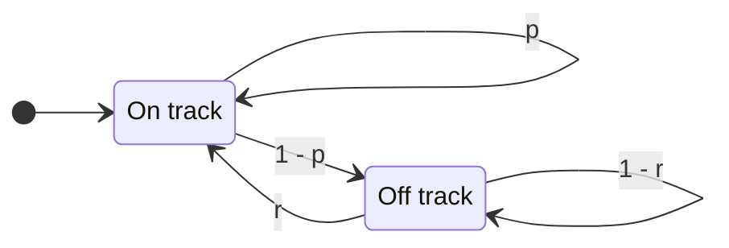
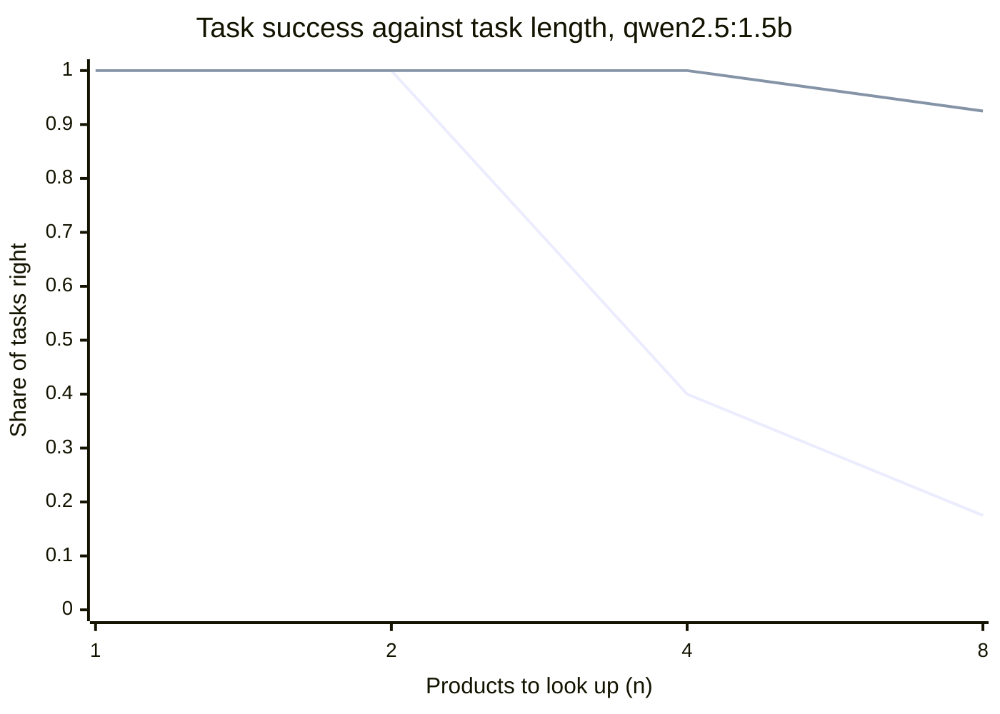
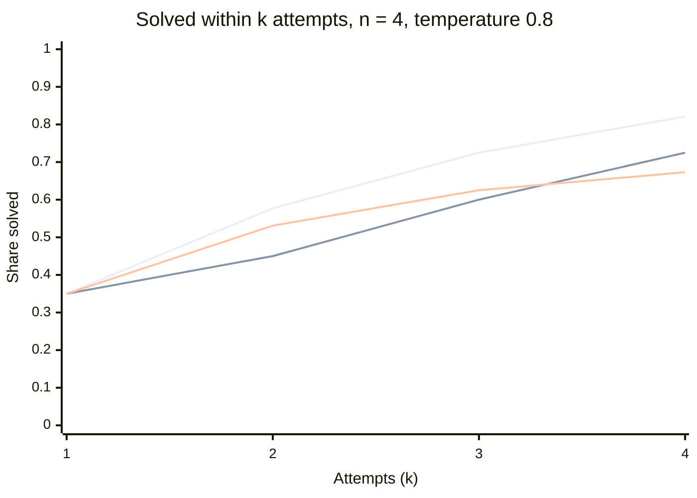
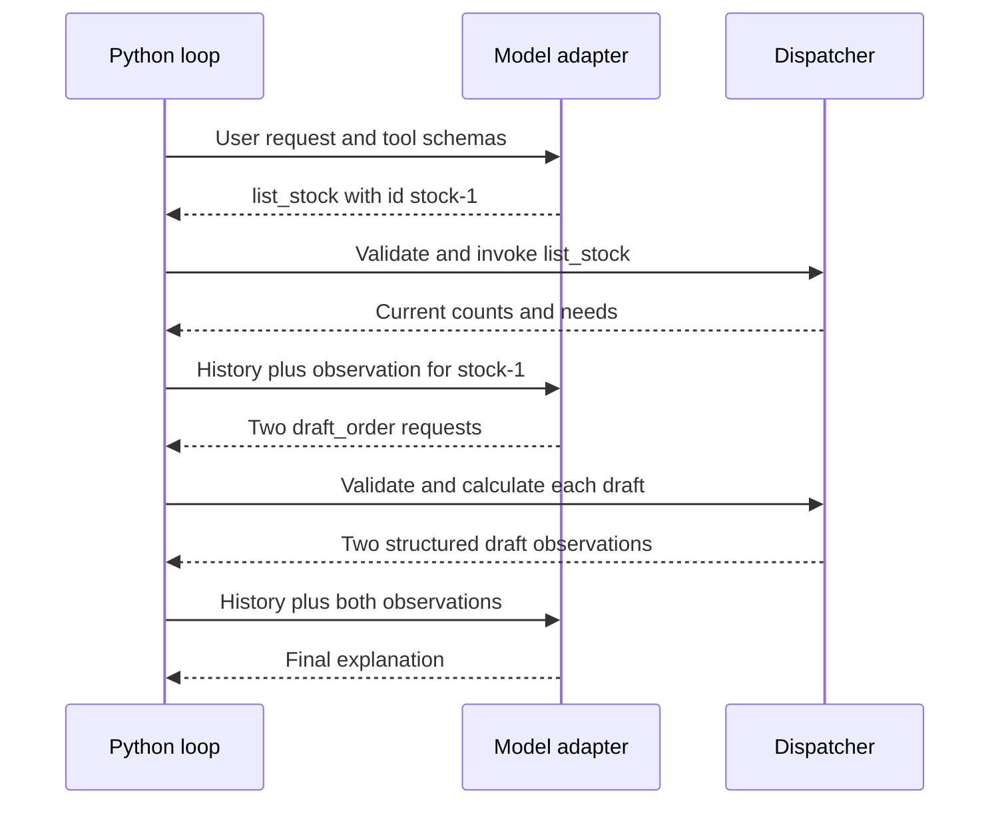
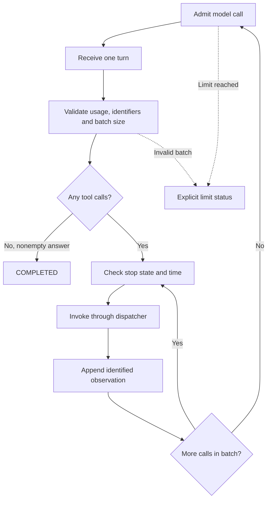
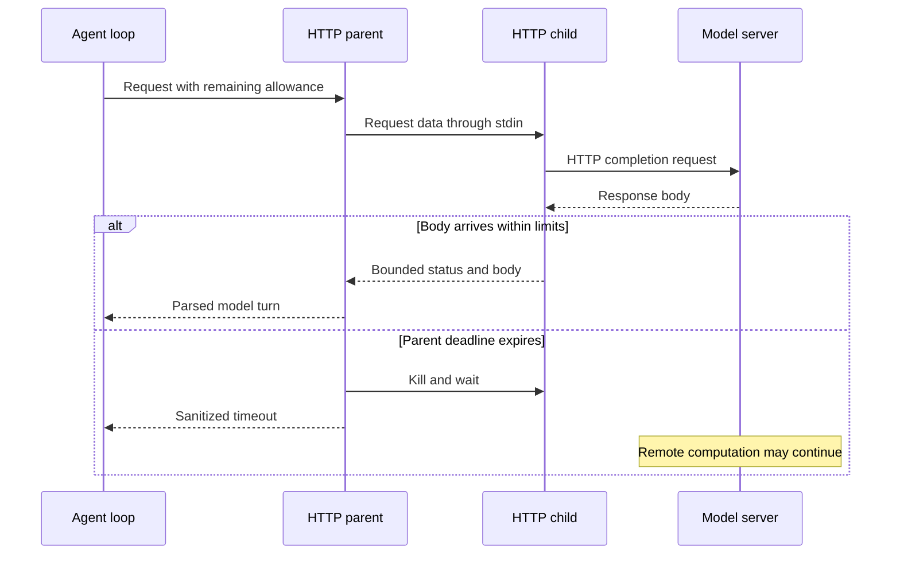

# Chapter 3 — The agent loop: why reliability compounds, and a loop that stops

> **Learn with Prof Rod** — *Build Your Always-On AI Agent From Scratch*.
> **Read the full book and get the latest learning materials:** [https://profrod.ai/book](https://profrod.ai/book).
> **Join the Prof Rod learner community:** [https://profrod.ai/community](https://profrod.ai/community)
> — bring your questions, compare experiments and share what you build.
> **Original source and updates:** [profrodai/sovereign-agent](https://github.com/profrodai/sovereign-agent).

**Status: DRAFT.** Read the [textbook guide](../profrod-sovereign-agent-textbook-start-here.md) for setup and supplied-code boundaries. Practice in [Exercise Book 3](../../exercises/ch03/profrod-sovereign-agent-ch03-agent-loop-exercise-guide.md); consult [Solutions 3](../../solutions/ch03/profrod-sovereign-agent-ch03-agent-loop-solutions-guide.md) after attempting the work.

Lucy asks, “What needs ordering this morning?” Answering well requires more than a single generated paragraph. The program must obtain current stock, calculate useful drafts, and explain the results. In Chapter 2 you called the tools yourself. Now the model will select requests, your dispatcher will execute permitted operations, and the model will receive the observations before deciding what to do next.

Practice this chapter with the [chapter 3 units](../../exercises/ch03/profrod-sovereign-agent-ch03-agent-loop-exercise-guide.md). Unit A connects a learner-owned admission decision to the model and tool loop. Unit B derives the reliability of a loop that recovers from errors, tests the formula against a simulated agent with a negative control, and measures from retry data whether retries are independent. Solutions and holdouts remain separate from the student notebooks.

That repeated exchange is the agent loop. It is small enough to write directly, but leaving it unbounded would create an expensive failure mode: the model could repeat a lookup indefinitely, request an oversized batch, or keep working after you asked the program to stop. The loop therefore needs an explicit result even when it does not produce a final answer.

This chapter starts with the arithmetic of that loop. Why do agents that handle short tasks fail on long ones? What do recovery and retries buy? How large must a budget be? You will derive each answer, then test it against a real model running your own loop. Then you will build the loop, in Part B.

We will first use authored model responses so that each failure can be reproduced. Then we will run the same interface against the local HTTP model. The authored responses prove how the runtime reacts; the live run investigates whether a model chooses useful requests. Neither kind of evidence substitutes for the other.

## Learning objectives

By the end you will be able to:

1. Derive why task success decays as $p^{n}$ over independent steps, and compute a loop's reliability half-life, $n_{1/2} \approx 0.69/(1-p)$.
2. Model recovery as a two-state Markov chain, derive its closed form, and explain why observable errors change the long-run outcome.
3. Derive what retries buy under independence and under a hard fraction, and test which one a real model follows.
4. Choose a loop budget from the tail of a geometric distribution.
5. Measure where a real loop's errors actually occur, and move a failing step out of the model when it can be computed.
6. Build the model–tool–observation cycle with an inspectable transcript, stopped by explicit limits on calls, output, context, estimated cost and time.

Your first successful loop run will make three model calls and three tool calls, producing vanilla and strawberry drafts totalling 2,600 cents. You will then provoke repeated identifiers, exhausted budgets and a model failure; each must end with a specific status instead of hanging or silently pretending to finish.

## Keep your implementation in a file

Continue from the repository root. Create `book/textbook/learner/profrod_sovereign_agent_ch03_agent_loop_learner.py` and save this chapter's imports, class and function definitions, plus the assignments to `shop_tools`, `ToolCall`, `first` and `messages`. Run the print statements and failure experiments separately. Chapter 2's learner file supplies the dispatcher and request type you constructed. The completed learner files are included for comparison, and the Chapter 3 checkpoint loads your learner file, so changing its loop changes both the offline and live commands.

The reliability functions (`chain_success`, `success_with_recovery`, `retry_success`, `finish_within`) are part of the same learner file. The chapter's experiment runs your loop against a real model and records a receipt:

```bash
uv run python book/textbook/experiments/profrod_sovereign_agent_textbook_ch03_reliability_v1.py --out ch03-reliability-receipt.json
```

The only supplied runtime component used by the live path is the bounded HTTP transport, identified and explained below. The loop, request parsing, tool schemas and tool dispatcher are all code you write in Chapters 2 and 3.

## Part A: why agent loops fail, in arithmetic

Before building the loop, understand what it does to reliability. This is the most important quantitative fact about agents, and most people who build them have never written it down.

### A loop is a sequence of decisions

An agent run alternates two kinds of step. The **model** reads everything so far (instructions, requests, tool results) and chooses an action: call a tool with some arguments, or answer. The **runtime** executes the action and appends the observation. The model is a **policy**: a function from history to a distribution over actions, sampled exactly as Chapter 1 sampled the next token. The loop ends when the model answers, or when a limit stops it.

Each step can go wrong in its own way:

- the wrong tool;
- a malformed argument;
- a correct call whose result is then misread;
- a lookup that is skipped entirely.

To reason about the whole run we need a model of how step errors combine.

### Reliability compounds

Suppose each step succeeds with probability $p$, independently of the others, and the task needs all $n$ steps to succeed. Then

$$
P(\text{task succeeds}) \;=\; p^{\,n}.
$$

The consequences are harsher than intuition suggests.

**Listing:** Per-step reliability against task length.

```python
import runpy

loop = runpy.run_path("book/textbook/learner/profrod_sovereign_agent_ch03_agent_loop_learner.py")
for p in (0.99, 0.95, 0.90):
    print(p, [round(loop["chain_success"](p, n), 3) for n in (1, 5, 10, 20, 50)])
```

```text
0.99 [0.99, 0.951, 0.904, 0.818, 0.605]
0.95 [0.95, 0.774, 0.599, 0.358, 0.077]
0.9 [0.9, 0.59, 0.349, 0.122, 0.005]
```

A step that works 95% of the time sounds dependable. Twenty of them in a row succeed barely a third of the time. It helps to know the **half-life**: the number of steps after which success has fallen to one half. Solving $p^{n} = \tfrac12$ gives $n_{1/2} = \ln 2 / (-\ln p)$. For $p$ close to 1, $-\ln p \approx 1 - p$, so

$$
n_{1/2} \;\approx\; \frac{0.69}{1 - p}.
$$

At 95% per step the half-life is about 14 steps; at 99%, about 69. **Halving the per-step error rate doubles the length of task an agent can do.** This is why the per-step error rate, not headline benchmark accuracy, decides whether an agent can do long work. It is also why this book keeps its loops short, and its steps checkable.

### Recovery changes the arithmetic

Independence is a pessimistic assumption in one direction. A good loop notices some errors and repairs them: a tool refuses a malformed request, the model sees the refusal, and it tries again. Model this with two states: **on track** and **off track**.

- From on track, a step stays on track with probability $p$ and goes off track with probability $1 - p$.
- From off track, a step recovers with probability $r$ and stays off track with probability $1 - r$.



**Figure:** A loop with recovery as a two-state chain: an error takes it off track, and an observed error lets it return.

This is a two-state **Markov chain**. Let $a_k$ be the probability of being on track after $k$ steps, starting on track ($a_0 = 1$). Then

$$
a_{k+1} \;=\; p\,a_k + r\,(1 - a_k) \;=\; r + (p - r)\,a_k.
$$

Its fixed point satisfies $\pi = r + (p - r)\pi$, so $\pi = r / (1 - p + r)$. The distance from the fixed point shrinks by a factor $p - r$ each step: $a_k - \pi = (p - r)(a_{k-1} - \pi)$. Therefore

$$
a_n \;=\; \pi + (1 - \pi)(p - r)^{n}, \qquad \pi = \frac{r}{1 - p + r}.
$$

With no recovery ($r = 0$) this is $p^n$ again. With any recovery at all, success no longer decays to zero. It settles at $\pi$, the long-run share of time spent on track.

**Listing:** Success after n steps, with and without recovery.

```python
for r in (0.0, 0.3, 0.8):
    print(r, [round(loop["success_with_recovery"](0.95, r, n), 3) for n in (1, 10, 20, 50)])
```

```text
0.0 [0.95, 0.599, 0.358, 0.077]
0.3 [0.95, 0.859, 0.857, 0.857]
0.8 [0.95, 0.941, 0.941, 0.941]
```

With $p = 0.95$ and a 30% chance of recovering from each error, a 50-step task succeeds about 86% of the time, instead of 8%. The engineering lesson is concrete. **Make errors observable and recoverable.** A tool that returns a clear refusal, and a loop that shows it to the model, raise $r$. A tool that fails silently, or an error the model never sees, keeps $r = 0$ and returns you to $p^n$. The validation in Chapter 2 and the explicit statuses in this chapter's loop are how $r$ gets above zero.

### What retries buy

When a whole run fails, the obvious fix is to run it again. If attempts are independent and each succeeds with probability $q$, then at least one of $k$ attempts succeeds with probability

$$
1 - (1 - q)^{k},
$$

which approaches 1 quickly: 90% per attempt becomes 99.9% in three attempts. But attempts at the *same task* are rarely independent. Some tasks are hard for this model in a way no amount of resampling fixes: an ambiguous instruction, a missing fact, a calculation it cannot do. Model a fraction $h$ of tasks as **hard** (never solved) and the rest as solved with probability $q$ per attempt:

$$
P(\text{solved within } k) \;=\; (1 - h)\bigl(1 - (1 - q)^{k}\bigr) \;\longrightarrow\; 1 - h.
$$

Retries converge to $1 - h$, not to 1. The first retry helps most; after that the curve flattens against the hard fraction. You can detect this in data: under independence, the chance that a failed attempt succeeds on retry equals the first-attempt success rate. When retries of failed instances succeed far less often than first attempts, a hard fraction is present, and more retries will not remove it.

### Budgets

Every loop in this chapter has a limit on model calls. How should you choose it? If a loop finishes on each step with probability $f$, independently, the number of steps is geometric: it has finished within $B$ steps with probability $1 - (1 - f)^{B}$, and it takes $1/f$ steps on average. To be $1 - \varepsilon$ sure it finishes, choose

$$
B \;\ge\; \frac{\ln \varepsilon}{\ln(1 - f)}.
$$

**Listing:** How large a budget must be.

```python
import math

for f in (0.5, 0.3):
    needed = math.ceil(math.log(0.01) / math.log(1 - f))
    print(f, needed, round(loop["finish_within"](needed, f), 4))
```

```text
0.5 7 0.9922
0.3 13 0.9903
```

A budget is a statement about the tail. It does not make a loop succeed; it makes a loop that is not finishing stop, and report that it stopped, so the failure is observable instead of expensive.

### Measured: where a real loop actually fails

Models are only useful if you test them. The chapter's experiment runs *this chapter's loop* (`run_loop` and `HTTPModel` from your learner file) with a real model, `qwen2.5:1.5b` served by Ollama. The task:

- **Instructions:** look up the stock of $n$ listed products with a `stock` tool, then reply with only the total number of tubs.
- **Instances:** each is a fresh random freezer and product list; forty instances at each length, at temperature 0.
- **Grading:** every step. Was each product looked up, and was the final total exactly right?

```bash
uv run python book/textbook/experiments/profrod_sovereign_agent_textbook_ch03_reliability_v1.py --out ch03-reliability-receipt.json --instances 40
```

One run, recorded on 2026-09-26 with Ollama 0.32.5 on macOS (arm64), took ten minutes:

| $n$ | Task success (95% interval) | Lookups made correctly | Total right, when every lookup was made |
| --- | --- | --- | --- |
| 1 | 1.000 (0.912–1.000) | 1.000 | 1.000 |
| 2 | 1.000 (0.912–1.000) | 1.000 | 1.000 |
| 4 | 0.400 (0.263–0.554) | 1.000 | 0.400 |
| 8 | 0.175 (0.087–0.320) | 0.947 | 0.189 |



**Figure:** The model adding the total itself (lower line) against the program adding the recorded lookups (upper line), on the same forty runs per length.

Task success falls with length, as the arithmetic predicts. But it does not fall the way $p^{n}$ does. A least-squares fit of $\log(\text{success}) = n \log p + \log a$ returns $p = 0.767$ and $a = 1.39$, and a probability above one is not a probability: the model of independent, identical steps is wrong for this task.

The step columns say why. The lookups hardly ever fail: every required product was looked up in all 120 runs up to $n = 4$, and 94.7% of the time at $n = 8$. What fails is the final step, adding $n$ numbers in the model's head. That step is right every time for two numbers, 40% of the time for four and 19% for eight. The errors are not spread evenly over the steps. They concentrate in the one step whose difficulty grows with $n$.

**Measure where the errors are before you model them.** $p^{n}$ is the right first approximation when steps are alike, and the wrong conclusion here. Here the fix is to remove one step, not to improve every step.

The experiment tried the obvious fix first: add an `add` tool that sums a list of integers exactly, and tell the model to use it for any arithmetic.

| $n$ | Task success with an `add` tool offered (95% interval) | Calls to `add` |
| --- | --- | --- |
| 4 | 0.325 (0.201–0.480) | 0 |
| 8 | 0.100 (0.040–0.231) | 0 |

The model never called it. **Offering a tool is not the same as the model using it**, and a system prompt is a request, not an enforcement. The reliable fix does not ask the model at all. The program already holds every stock observation it returned, so it can compute the total itself, and the model's job shrinks to choosing the lookups. Scored on the same recorded runs, that design is right whenever every lookup was made: 40 of 40 at $n = 4$, and 37 of 40 (0.925, interval 0.801–0.974) at $n = 8$. The remaining failures at $n = 8$ are the missed lookups.

This is the design rule the book follows from here on. **Whatever can be computed, the program computes, and the model chooses which computation to request.** Chapter 2's `draft_order` tool computes quantities and costs for exactly this reason.

Retries were measured the same way: forty instances at $n = 4$, temperature 0.8, up to four attempts each.

| Attempts | Solved (measured) | Independent retries predict | Hard-fraction model predicts |
| --- | --- | --- | --- |
| 1 | 0.350 | 0.350 | 0.350 |
| 2 | 0.450 | 0.577 | 0.531 |
| 3 | 0.600 | 0.725 | 0.625 |
| 4 | 0.725 | 0.821 | 0.673 |



**Figure:** Measured retries (middle line at four attempts) fall below the independent prediction (top) and above the naive hard-fraction prediction (bottom) by the fourth attempt.

Independence overpredicts from the first retry on. A failed instance succeeded on its second attempt only 15% of the time (10 points of the 65% that had failed), against 35% on first attempts, because the instances that fail are the ones that are harder for this model. The hard-fraction model, fitted naively (treating the 27.5% never solved in four attempts as permanently hard), is closer at two and three attempts but underpredicts at four. Some of the "hard" instances were merely unlucky, and a longer run would separate the two. Neither model is the truth; both are ways of asking the data a precise question. The one robust conclusion: **retries buy less than independence promises**, so budget for them from measurements, not from $1 - (1 - q)^k$.

## Part B: build the loop

With the arithmetic in hand, build the loop itself. Every limit below is a budget in the sense of Part A, and every explicit status is an error made observable.

## Give one model call a precise contract

A model call is one request to a provider. A model turn may contain an answer, one or more tool requests, or both explanatory text and requests. A whole agent run can contain several such turns. Keeping these units separate prevents a provider adapter from quietly taking control of the entire task.

Our main path owns the loop. We send messages and tool schemas to a raw HTTP model endpoint, parse its response, and decide which requests can execute. Some existing agents delegate this inner cycle to an agent SDK or command-line agent. That is a legitimate architectural choice, but it would teach a different construction exercise. Here you can replace the model adapter without replacing the loop you are about to write.

The loop needs a small provider-neutral representation. The `ToolCall` class from Chapter 2 already holds the identifier, name, and argument dictionary. A `ModelTurn` holds the calls, any text, and reported output usage. Its `message` method converts the record into the conversation format sent back to the provider.

**Listing:** Represent one model turn and preserve its tool-call identifiers.

```python
import copy
import json
import math
import runpy
import time
from dataclasses import dataclass

shop_tools = runpy.run_path(
    "book/textbook/learner/profrod_sovereign_agent_ch02_pydantic_shop_tools_learner.py"
)
ToolCall = shop_tools["ToolCall"]


class ModelError(RuntimeError):
    """A sanitized model transport or response failure."""


@dataclass(frozen=True)
class ModelTurn:
    content: str = ""
    calls: tuple[ToolCall, ...] = ()
    output_tokens: int = 0

    def message(self):
        result = {"role": "assistant", "content": self.content}
        if self.calls:
            result["tool_calls"] = [
                {
                    "id": call.id,
                    "type": "function",
                    "function": {"name": call.name, "arguments": json.dumps(call.arguments)},
                }
                for call in self.calls
            ]
        return result


first = ModelTurn(calls=(ToolCall(id="stock-1", name="list_stock", arguments={}),))
print(first.message()["tool_calls"][0]["function"])
```

```text
{'name': 'list_stock', 'arguments': '{}'}
```

Notice the two representations of arguments. Inside the program they are a dictionary, where validation can inspect their types. In this provider's message format they are a JSON string inside the function-call record. The adapter parses that string before constructing `ToolCall`; `message` serializes it when recording an assistant turn. Passing a dictionary where the endpoint expects a string is a protocol error, even if the nested fields look right to a human.

The adapter's `complete` method accepts messages, tool schemas, a remaining timeout, and an output-token allowance. It returns one `ModelTurn` or raises a sanitized `ModelError`. The loop does not ask the adapter to choose a workflow, execute tools, or purchase anything. The adapter translates a request and response at the network boundary.

Reported token usage is evidence supplied by that adapter. The loop checks its type and range, but cannot independently recount a provider's private tokenization or billing. A local model returning zero usage in an authored fixture is useful for control-flow tests; it says nothing about the consumption of a live request.

### Architectural comparison: who owns the inner cycle?

At commit `acc69a70962af6707aa8a6abba699bdaa7da95f8`, NanoClaw's authors describe its native use of Claude Code through the Claude Agent SDK and explain the choice in terms of access to Claude models and the existing toolset. They also describe alternative providers as configurable per agent group. This is documented project rationale, not a claim that every provider follows the same implementation. [Pinned NanoClaw README](https://github.com/nanocoai/nanoclaw/blob/acc69a70962af6707aa8a6abba699bdaa7da95f8/README.md)

Our interpretation of the teaching trade-off is that delegation can supply substantial existing agent behavior, while owning the cycle makes each admission and observation visible to the reader. This chapter chooses the latter. A useful comparison experiment would run the same stock task through a delegated provider and inspect which tool attempts, usage, and stopping reasons the surrounding program can actually observe. That evidence would determine whether the delegated boundary satisfies a particular operating requirement; a project's overall size would not answer it.

## Build the conversation as an evidence trail

The sequence has three distinct messages: an assistant request, a tool observation referring to its identifier, and a subsequent assistant turn. The tool observation's `tool_call_id` must match the request's `id`. When a turn asks for two tools, each gets a separate observation.



**Figure:** The model chooses requests, the dispatcher executes permitted code, and each result returns through an identified observation.

Keep the assistant's request in the transcript before adding its observations. A list containing only tool results loses the evidence of what was requested. It also fails the provider's expected conversation structure. Keeping both sides lets you diagnose whether a bad answer originated in a bad request, a refused tool, an incorrect result, or an explanation that ignored good evidence.

The initial context is short. It tells the model to use stock tools, select positive needs, request exact draft quantities, and describe amounts in USD cents. These instructions improve the chance of a useful sequence. The dispatcher remains responsible for enforcing allowed names and argument validity when the model disregards them.

```python
messages = [
    {
        "role": "system",
        "content": "Help Lucy prepare replenishment drafts. First call list_stock. "
        "For each product with needed > 0, call draft_order with exactly that quantity. "
        "Do not draft products with needed = 0. Summarize the tool results in USD cents. "
        "A verbal recommendation does not replace creating the draft through the tool. "
        "Drafts are proposals, never purchases.",
    },
    {
        "role": "user",
        "content": "Prepare replenishment drafts from current stock. State USD amounts.",
    },
]
dispatcher = shop_tools["build_tools"](shop_tools["SHOP"])
print(len(messages), len(dispatcher.schemas()))
```

```text
2 3
```

For now, the transcript lives in memory. We will copy it at the start of the run and copy it again before giving it to an adapter. That protects the caller's list from accidental mutation and prevents a poorly behaved adapter from editing the loop's existing history by ordinary reference assignment. It is a useful ownership convention, not isolation from hostile Python in the same process.

## Choose limits before writing the cycle

“Stop when the task is done” depends on model judgment. We also need limits enforced by the program. The model may finish earlier; it cannot grant itself another hundred calls after exhausting the configured allowance.

| Limit | What it bounds | Important qualification |
| --- | --- | --- |
| Model calls | Requests admitted during one run | Failed transmissions still count |
| Tool calls | Handler attempts admitted by the loop | A refused request still consumes an attempt |
| Elapsed seconds | Time available before another step | Trusted in-process handlers must be bounded themselves |
| Context bytes | Encoded messages and schemas before a model call | Bytes are not provider context tokens |
| Output tokens | Per-call and cumulative reported generation | Depends on honest provider reporting |
| Estimated cost | Local admission using an operator estimate | Not a guaranteed provider invoice cap |

Two token limits are useful. The per-call limit prevents one long completion from consuming the whole conversation budget. The total limit prevents a series of individually small responses from generating indefinitely. Before each call, the permitted output is the smaller of the per-call allowance and the remaining total.

**Listing:** Validate positive limits and keep estimated model spending explicit.

```python
@dataclass(frozen=True)
class Limits:
    model_calls: int = 8
    tool_calls: int = 16
    seconds: float = 60
    context_bytes: int = 32_768
    output_tokens: int = 1_024
    total_output_tokens: int = 4_096
    estimated_call_cents: int = 0
    model_budget_cents: int = 100

    def __post_init__(self):
        integers = (
            self.model_calls,
            self.tool_calls,
            self.context_bytes,
            self.output_tokens,
            self.total_output_tokens,
            self.model_budget_cents,
        )
        if any(type(value) is not int or value <= 0 for value in integers):
            raise ValueError("positive integral limits required")
        if not math.isfinite(self.seconds) or self.seconds <= 0:
            raise ValueError("positive finite duration required")
        if type(self.estimated_call_cents) is not int or self.estimated_call_cents < 0:
            raise ValueError("nonnegative integral model estimate required")


print(Limits().model_calls, Limits().tool_calls)
```

```text
8 16
```

The zero default estimate suits an offline fixture or a local model without per-request API billing. It is not a claim that electricity, hardware, or your time cost nothing. For a paid endpoint, configure a conservative per-call estimate and check the provider's actual usage separately. If a request times out, the remote provider may still generate and bill for it. Local uncertainty must not be treated as a free request.

Elapsed time uses a monotonic clock. Wall-clock time can change when a host synchronizes its clock; a duration budget should not gain another hour when that happens. Later, durable schedules and approval expiry will use explicit UTC timestamps because they must survive process restarts and refer to calendar time. A monotonic deadline belongs to this process's current run.

## Implement the bounded loop

The result includes a status, an answer, the transcript, and resource counters. `COMPLETED` will mean that the model returned a nonempty final response without further tool calls. It will not mean that every factual statement is correct or that a supplier accepted a purchase. Chapter 15 will evaluate business outcomes independently of this control-flow status.

The construction below is the Chapter 3 loop. The cumulative runtime later adds callbacks for durable observation, work ownership, and shared model-budget reservations at the same boundaries. They are omitted here until their state exists; tool selection and stopping remain the code you write now.

**Listing:** Admit each model turn and tool attempt under explicit limits.

```python
@dataclass(frozen=True)
class LoopResult:
    status: str
    answer: str
    messages: list
    model_calls: int
    tool_calls: int
    output_tokens: int
    estimated_cost_cents: int


def run_loop(
    model, dispatcher, messages, *, limits=None, clock=time.monotonic, should_stop=lambda: False
):
    limits = limits or Limits()
    transcript = copy.deepcopy(messages)
    deadline = clock() + limits.seconds
    model_count = tool_count = tokens = exposure = 0
    seen = set()

    def finish(status, answer=""):
        return LoopResult(status, answer, transcript, model_count, tool_count, tokens, exposure)

    while model_count < limits.model_calls:
        if should_stop():
            return finish("STOP_REQUESTED")
        if clock() >= deadline:
            return finish("TIME_LIMIT")
        schemas = dispatcher.schemas()
        if len(json.dumps([transcript, schemas]).encode()) > limits.context_bytes:
            return finish("CONTEXT_LIMIT")
        remaining = min(limits.output_tokens, limits.total_output_tokens - tokens)
        if remaining <= 0:
            return finish("TOKEN_LIMIT")
        try:
            if exposure + limits.estimated_call_cents > limits.model_budget_cents:
                return finish("MODEL_COST_LIMIT")
            exposure += limits.estimated_call_cents
            model_count += 1
            turn = model.complete(
                copy.deepcopy(transcript),
                schemas,
                timeout=deadline - clock(),
                max_output_tokens=remaining,
            )
        except ModelError, TimeoutError, OSError:
            return finish("MODEL_FAILED")
        if clock() >= deadline:
            return finish("TIME_LIMIT")
        if type(turn.output_tokens) is not int or not 0 <= turn.output_tokens <= remaining:
            return finish("INVALID_USAGE")
        tokens += turn.output_tokens
        ids = [call.id for call in turn.calls]
        if len(ids) != len(set(ids)) or seen.intersection(ids):
            return finish("REPEATED_CALL_ID")
        if tool_count + len(ids) > limits.tool_calls:
            return finish("TOOL_LIMIT")
        seen.update(ids)
        transcript.append(turn.message())
        if not turn.calls:
            return (
                finish("COMPLETED", turn.content) if turn.content.strip() else finish("EMPTY_REPLY")
            )
        for call in turn.calls:
            if should_stop():
                return finish("STOP_REQUESTED")
            if clock() >= deadline:
                return finish("TIME_LIMIT")
            tool_count += 1
            result = dispatcher.invoke(call)
            transcript.append(
                {
                    "role": "tool",
                    "tool_call_id": call.id,
                    "content": json.dumps(result, allow_nan=False),
                }
            )
    return finish("MODEL_CALL_LIMIT")
```

Read the two admission points. Before a model call, the loop checks stop state, elapsed time, context size, remaining output, and estimated cost. Before each tool attempt, it checks stop state and elapsed time again. A single model response can request several tools, so checking only before the model call would allow an entire batch to proceed after a stop request arrived.

The counters advance before transmission or invocation. A failed model request is still an admitted request, and a tool refusal is still an attempted call. Refunding every failed request would let repeated failures evade a limit. Later, durable reservations will extend this accounting across process restarts and concurrent work.

### Validate a batch before executing its first request

The loop checks all call identifiers and the batch's total size before invoking any member. If the model emits the same identifier twice, it is impossible to associate an observation unambiguously with one intended request. Refusing the whole batch avoids partially executing a malformed set and then discovering the duplicate.

We also reject identifiers reused from earlier turns in the same run. This does not prevent the model from repeating the same logical action under a fresh identifier. The tool budget bounds that behavior, and Chapter 11 will introduce a separate stable identity for consequential operations. Conversation identifiers are not a substitute for idempotency at a supplier boundary.

The loop returns immediately when a model turn contains no calls. Explanatory text accompanying tool requests is retained but does not count as a final answer. A sentence such as “I will prepare the drafts” alongside requests describes an intention; it does not establish that the requested tools ran successfully.



**Figure:** A completed response and a stopped run are different outcomes. Every new model call passes through admission again.

## Run a replayable successful shift

To inspect the loop without depending on model behavior, supply three authored turns: stock lookup, two draft requests, and a final explanation. The replay adapter does not reason about stock. It returns the next fixture entry and raises a clear error if the loop unexpectedly requests another entry.

```python
class ReplayModel:
    def __init__(self, turns):
        self.turns = iter(turns)

    def complete(self, messages, tools, *, timeout, max_output_tokens):
        try:
            return next(self.turns)
        except StopIteration:
            raise ModelError("response fixture exhausted") from None


def opening_turns():
    return [
        first,
        ModelTurn(
            calls=(
                ToolCall(
                    id="draft-v",
                    name="draft_order",
                    arguments={"sku": "SKU-VANILLA", "quantity": 6},
                ),
                ToolCall(
                    id="draft-s",
                    name="draft_order",
                    arguments={"sku": "SKU-STRAWBERRY", "quantity": 4},
                ),
            )
        ),
        ModelTurn("Drafts: vanilla 6 tubs, strawberry 4 tubs; total 2600 cents USD. No purchase."),
    ]


result = run_loop(ReplayModel(opening_turns()), dispatcher, messages)
print(result.status, result.model_calls, result.tool_calls)
print(result.answer)
print("original messages", len(messages), "transcript messages", len(result.messages))
```

```text
COMPLETED 3 3
Drafts: vanilla 6 tubs, strawberry 4 tubs; total 2600 cents USD. No purchase.
original messages 2 transcript messages 8
```

The eight messages are two initial messages, three assistant turns, and three tool observations. The original list remains unchanged. More importantly, the draft observations came from the Chapter 2 handlers. The fixture selected the requests, but it did not supply their calculated totals.

Inspect those observations independently of the final sentence. Vanilla should contribute 1,500 cents and strawberry 1,100. Chocolate should have no draft because its need is zero. We can extract the results without asking a second model to judge the first model's prose.

```python
drafts = [
    json.loads(message["content"])["value"]
    for message in result.messages
    if message["role"] == "tool" and message["tool_call_id"].startswith("draft-")
]
print([(draft["sku"], draft["quantity"], draft["total_cents"]) for draft in drafts])
print(sum(draft["total_cents"] for draft in drafts))
```

```text
[('SKU-VANILLA', 6, 1500), ('SKU-STRAWBERRY', 4, 1100)]
2600
```

This check uses authored identifiers to select the two known fixture observations. A general evaluator must follow the request-to-observation association and classify operations by their registered names, rather than assume every provider uses our identifier prefixes. Chapter 15 makes that evaluation systematic across different catalogs and model responses.

## Break repetition, batches, and budgets

Start with a malformed batch containing the same call twice. The result must identify the repeated identifier and record zero tool attempts. A second experiment supplies a valid two-call batch with room for only one tool attempt. Our admission policy refuses the entire batch; it does not select an arbitrary first operation and abandon the second.

```python
duplicate = run_loop(
    ReplayModel([ModelTurn(calls=(first.calls[0], first.calls[0]))]), dispatcher, messages
)
too_many = run_loop(
    ReplayModel([opening_turns()[1]]),
    dispatcher,
    messages,
    limits=Limits(tool_calls=1),
)
print(duplicate.status, duplicate.tool_calls)
print(too_many.status, too_many.tool_calls)
```

```text
REPEATED_CALL_ID 0
TOOL_LIMIT 0
```

These tests are more informative than observing a quick final response. The counters show that admission stopped execution before either handler could run. The same rule matters much more when one member of a batch could cause an external effect.

Next, reuse the stock-call identifier in a later turn. The first lookup is valid and executes once. The second occurrence is refused. Then give the run only one model call: it can obtain the stock observation but cannot ask the model to interpret it. A useful intermediate observation does not turn an unfinished run into `COMPLETED`.

```python
repeated = run_loop(ReplayModel([first, first]), dispatcher, messages)
one_call = run_loop(ReplayModel([first]), dispatcher, messages, limits=Limits(model_calls=1))
print(repeated.status, repeated.model_calls, repeated.tool_calls)
print(one_call.status, one_call.model_calls, one_call.tool_calls)
```

```text
REPEATED_CALL_ID 2 1
MODEL_CALL_LIMIT 1 1
```

A model can avoid identifier repetition while still asking the same question repeatedly. Give each lookup a new identifier and the loop will allow it until another configured limit is reached. Do not add a rule that forbids every repeated tool name: looking up stock again after a delivery can be a valid observation. The problem is deciding whether another call is useful, which requires task context and evaluation as well as a finite budget.

### Failure exposure is still exposure

The next fixture returns one stock request. Configure an estimate of three cents per model call and a five-cents run budget. The first call is admitted. The next would raise estimated exposure to six cents, so it must be refused before the adapter is called again.

```python
cost_limited = run_loop(
    ReplayModel([first]),
    dispatcher,
    messages,
    limits=Limits(estimated_call_cents=3, model_budget_cents=5),
)
failed = run_loop(
    ReplayModel([]),
    dispatcher,
    messages,
    limits=Limits(estimated_call_cents=3, model_budget_cents=5),
)
print(cost_limited.status, cost_limited.model_calls, cost_limited.estimated_cost_cents)
print(failed.status, failed.model_calls, failed.estimated_cost_cents)
```

```text
MODEL_COST_LIMIT 1 3
MODEL_FAILED 1 3
```

The failed call also retains three cents of estimated exposure. In this authored fixture, you know no remote request occurred. The general loop cannot assume that about every adapter failure: a connection may disappear after the provider accepts the request. Conservative admission records uncertainty instead of treating an absent answer as a refund.

Token and context budgets stop at different boundaries. A context refusal occurs before transmission. A provider returning impossible usage is detected after a response arrives, before its tool calls are admitted. You should be able to explain both statuses from the transcript and counters.

```python
context_limited = run_loop(ReplayModel([]), dispatcher, messages, limits=Limits(context_bytes=100))
bad_usage = run_loop(ReplayModel([ModelTurn("Ready", output_tokens=1025)]), dispatcher, messages)
print(context_limited.status, context_limited.model_calls)
print(bad_usage.status, bad_usage.tool_calls)
```

```text
CONTEXT_LIMIT 0
INVALID_USAGE 0
```

## Make timeouts mean what the chapter claims

An elapsed-time check between steps cannot interrupt a blocking step by itself. If a Python handler sleeps for five minutes, this loop cannot regain control at sixty seconds merely because `deadline` exists. Our current handlers do bounded, local calculations. Generated code and unbounded operations will require a supervised subprocess or container.

The model network request also needs a whole-operation boundary. Chapter 1's direct `urlopen` timeout was deliberately limited: a socket timeout is not necessarily a deadline for DNS, connection setup, headers, and a slowly arriving response body together. A server can keep sending small pieces often enough to avoid a per-read timeout while taking too long overall.

The cumulative HTTP adapter therefore runs the standard-library request in a short-lived child process. The parent supplies the remaining allowance to `subprocess.run`, which kills and waits for the child if its timeout expires. The child caps the response body and, on POSIX, installs its own terminating alarm so a killed parent does not leave it reading indefinitely. This is a process boundary around network I/O, not another agent framework.



**Figure:** The client bounds how long it waits and how much it reads. Terminating the client cannot cancel remote generation or billing already underway.

The supplied transport lives in `src/sovereign_agent/http_transport.py`. We build the provider-specific payload and response parser in the next section; `src/sovereign_agent/model_turn.py` is the installed adapter for comparison after you finish. Inspect the calls to `subprocess.run`, `response.read(maximum + 1)`, and the redirect handler together. They control elapsed waiting, response size, and unexpected credential forwarding respectively. None of them makes the remote service trustworthy.

Credentials pass through the child's standard input rather than command-line arguments. Its environment includes only the explicitly selected path and certificate settings; proxy variables and `PYTHONPATH` are not inherited. This teaching path needs direct network access and the `uv sync` installation from Chapter 1, and raw request errors are not copied into the model transcript. Redirects are refused instead of allowing an endpoint to forward an authorization header elsewhere. The configured endpoint is operator-owned; generated text cannot replace it.

Process creation and operating-system scheduling are not hard real-time services. The timeout bounds the waiting strategy; it is not a promise that a host under arbitrary load will report a result at an exact millisecond. Similarly, a provider that continues after client termination may still have an unknown billed outcome. Later chapters reuse this distinction when the remote operation is an order.

### Simulate a late response without sleeping

Inject a clock whose readings move from zero to two seconds during the model call, with a one-second limit. The fixture still returns a valid stock request. The loop must refuse to execute it because the response arrived after the deadline. An injected clock makes this ordering reproducible without a flaky real-time sleep in the test.

```python
ticks = iter([0.0, 0.0, 0.0, 2.0])
late = run_loop(
    ReplayModel([first]),
    dispatcher,
    messages,
    limits=Limits(seconds=1),
    clock=lambda: next(ticks),
)
stopped = run_loop(ReplayModel([]), dispatcher, messages, should_stop=lambda: True)
print(late.status, late.tool_calls)
print(stopped.status, stopped.model_calls)
```

```text
TIME_LIMIT 0
STOP_REQUESTED 0
```

The stop callback is cooperative. It prevents another step at the loop's check points; it does not undo an operation already in flight. When we install a long-running service, a termination signal will set this stop state, and the worker will preserve any uncertain external outcome for recovery.

## Build the tool-capable HTTP adapter

Chapter 1 sent text and read text. Our adapter must now send the schemas and preserve generated tool identities. Add this class to your learner file. Its optional `request` argument accepts a transport function; an authored response can therefore exercise the parser without a model server. When omitted, it uses the bounded transport discussed above. It deliberately targets the one local endpoint from Chapter 1; remote endpoint validation and credentials belong to the provider extension appendix.

**Listing:** Translate one HTTP response into a model turn without executing its requests.

```python
class HTTPModel:
    """One local Ollama response; never executes tools itself."""

    def __init__(self, model="qwen3", request=None):
        self.model, self.request = model, request

    def complete(self, messages, tools, *, timeout, max_output_tokens):
        transport = self.request
        if transport is None:
            from sovereign_agent.http_transport import request

            transport = request
        payload = {
            "model": self.model,
            "messages": messages,
            "tools": tools,
            "stream": False,
            "max_tokens": max_output_tokens,
            "temperature": 0,
            "reasoning_effort": "none",
        }
        try:
            response = transport(
                "http://localhost:11434/v1/chat/completions",
                data=json.dumps(payload).encode(),
                headers={"Content-Type": "application/json"},
                timeout=timeout,
            )
            if response.status != 200:
                raise ModelError("model HTTP request failed")
            envelope = json.loads(response.body)
            choices, usage = envelope["choices"], envelope["usage"]
            if not isinstance(choices, list) or len(choices) != 1:
                raise ModelError("one complete choice required")
            choice = choices[0]
            message = choice["message"]
            if choice["finish_reason"] not in {"stop", "tool_calls"} or message.get("refusal"):
                raise ModelError("incomplete or refused response")
            requested = message.get("tool_calls", [])
            if not isinstance(requested, list) or len(requested) > 32:
                raise ModelError("bounded tool-call array required")
            calls = tuple(
                ToolCall(
                    id=item["id"],
                    name=item["function"]["name"],
                    arguments=json.loads(item["function"]["arguments"]),
                )
                for item in requested
            )
            content = message.get("content")
            content = "" if content is None else content
            tokens = usage["completion_tokens"]
            if (
                not isinstance(content, str)
                or type(tokens) is not int
                or not 0 <= tokens <= max_output_tokens
            ):
                raise ModelError("invalid content or usage")
            return ModelTurn(content, calls, tokens)
        except OSError, ValueError, KeyError, IndexError, TypeError, AttributeError:
            raise ModelError("model transport or response validation failed") from None


from types import SimpleNamespace

payloads = []


def authored_http(url, *, data, headers, timeout):
    payloads.append(json.loads(data))
    return SimpleNamespace(
        status=200,
        body=json.dumps(
            {
                "choices": [{"finish_reason": "tool_calls", "message": first.message()}],
                "usage": {"completion_tokens": 12},
            }
        ).encode(),
    )


parsed = HTTPModel(request=authored_http).complete(
    messages, dispatcher.schemas(), timeout=2, max_output_tokens=100
)
print(parsed.calls[0].name, parsed.output_tokens, len(payloads[0]["tools"]))
```

```text
list_stock 12 3
```

The response's `arguments` string is decoded before `ToolCall` validates the envelope. The dispatcher still validates operation-specific arguments before invoking the handler. A truncated completion, a non-object argument value, or an impossible usage count fails at this boundary. Replace `"{}"` with `"broken JSON"` in an authored call and observe `MODEL_FAILED` through your loop with zero handler invocations. Then supply a complete final answer to demonstrate that the parser can finish a run without a tool request.

## Replace the replay with a live model

The checkpoint uses the same dispatcher and loop with `HTTPModel` when you pass `--live`. Its main path remains the local Ollama endpoint from Chapter 1. It sends the tool schemas alongside the messages and parses generated function arguments back into the typed request representation.

The request is non-streaming. We prefer one bounded response here because partial tool arguments would introduce another state machine before the reader has finished the basic loop. The adapter rejects incomplete finish reasons, malformed arguments, refusals, and usage outside the requested output limit. An ordinary failure returns `MODEL_FAILED`; it does not invent a final explanation.

The local checkpoint explicitly requests `reasoning_effort="none"` for the chosen model configuration. Ollama documents this setting in its [OpenAI-compatible API](https://docs.ollama.com/api/openai-compatibility). In construction runs, default thinking sometimes consumed the small output allowance before a useful request emerged. This setting is a provider choice, not a universal field guaranteed to work identically across model services.

### Learner verification commands

```bash
uv run python book/textbook/checkpoints/profrod_sovereign_agent_ch03_agent_loop_checkpoint.py --transcript
uv run python book/textbook/checkpoints/profrod_sovereign_agent_ch03_agent_loop_checkpoint.py --live --model qwen3 --transcript
uv run pytest tests/test_agent_loop.py
uv run python scripts/verify_book_assets_v2.py --textbook
```

The first command is reproducible without a model service. The second requires the model setup from Chapter 1 and produces a live sample whose wording and call sequence may vary. The test suite exercises the cumulative implementation's boundaries, including late responses, repeated identifiers, refusal before invocation, and preservation of the caller's messages. The chapter gate checks the examples printed here.

### Expected observations

| Run | Expected evidence | Interpretation |
| --- | --- | --- |
| Authored successful shift | `COMPLETED 3 3`; two drafts totalling 2,600 cents | The chosen sequence traverses the real tools |
| Repeated identifier batch | `REPEATED_CALL_ID`, zero tool attempts | Batch validation precedes execution |
| Five-cents budget with three-cents calls | One admitted call, then `MODEL_COST_LIMIT` | Local estimated admission stops before overspending its estimate |
| Late stock response | `TIME_LIMIT`, zero tool attempts | A valid but late request cannot start a new tool |
| Live model | Actual transcript, usage, status, and draft observations | A sample of model behavior requiring outcome inspection |

A live run that ends with `COMPLETED` but drafts chocolate has failed the shop's task. A run that claims a euro total has also failed even if every tool call completed. Inspect the structured observations and compare them with the final explanation. The loop makes the sequence observable; the business rules and evaluation determine whether it helps Lucy.

### A real failure: describing drafts without creating them

During construction, a live run returned `COMPLETED 2 1`. Its only tool call was `list_stock`. The final answer correctly named strawberry's four-unit need and vanilla's six-unit need, but it never called `draft_order`. The stock summary was useful; the promised draft artifact was missing.

That run motivated the explicit sentence in our prompt: “A verbal recommendation does not replace creating the draft through the tool.” A second run still described an intention without invoking the draft tools. The checkpoint now also states the requested artifact directly in the user message: prepare replenishment drafts. Prompt clarification is a candidate improvement, not evidence that the problem can never recur.

The checkpoint checks actual draft observations against independently authored fixture answers. It exits unsuccessfully if those observations are missing, duplicated, refused, or incorrect. The check remains necessary even when a revised prompt appears to fix the observed failure.

```python
def draft_evidence(result):
    names = {
        call["id"]: call["function"]["name"]
        for message in result.messages
        for call in message.get("tool_calls", [])
    }
    observed = []
    for message in result.messages:
        if message["role"] != "tool":
            continue
        value = json.loads(message["content"])
        if value.get("ok") is not True:
            return False
        if names.get(message["tool_call_id"]) == "draft_order":
            draft = value["value"]
            observed.append(
                (draft["sku"], draft["quantity"], draft["total_cents"], draft["currency"])
            )
    return sorted(observed) == [
        ("SKU-STRAWBERRY", 4, 1100, "USD"),
        ("SKU-VANILLA", 6, 1500, "USD"),
    ]


description_only = run_loop(
    ReplayModel([first, ModelTurn("Vanilla needs six tubs.")]), dispatcher, messages
)
print("successful sequence", draft_evidence(result))
print("description only", description_only.status, draft_evidence(description_only))
```

```text
successful sequence True
description only COMPLETED False
```

The expected quantities and prices are written into this fixture check rather than computed with the tool's own formula. This is a test of the named three-product scenario, not a general catalog validator. It also does not prove that every sentence in the explanation agrees with the observations. The distinction keeps the check useful without making it responsible for claims it cannot establish.

The chapter's prompt makes an opening procedure explicit. In Chapter 6 we will put such a procedure in a versioned local skill, so it can be reviewed and tested as a named artifact. Moving text into a skill does not grant new operations or remove the dispatcher checks.

## Exercises that change the decision

### Exercise 1: Repair a refused request

Author three turns: a vanilla draft with quantity eight, a corrected draft with quantity six, and a final explanation. The first handler should refuse the inconsistent quantity; the second should produce 1,500 cents. Inspect both tool observations and show that the correction used a new call identifier. Then reduce the tool budget to one and explain why the corrected request no longer executes.

The exercise distinguishes recovery from an ordinary tool refusal from automatic retry after an uncertain external effect. These draft functions have no external effect, and their result clearly describes validation success or refusal. You must not transfer this retry rule unchanged to a purchasing tool whose response was lost.

### Exercise 2: New identifiers, same repeated lookup

Write a replay sequence of ten stock requests with ten distinct identifiers. Set the model-call limit to three and leave the tool limit above three. Predict the status, model count, and tool count before running it. The expected result is `MODEL_CALL_LIMIT` with three model calls and three tool attempts. The duplicate-identifier check should never trigger.

Then set the tool limit to two while keeping the model limit at three. The third model call can return a request, but its batch must be refused with `TOOL_LIMIT`; only two tool attempts should have occurred. This reveals why model and tool counters cannot be treated as interchangeable.

### Exercise 3: A correct transcript and an incorrect answer

Keep the successful stock and draft requests, but replace the final answer with “Chocolate has been purchased for 99 euros.” The loop will still return `COMPLETED`, because that status describes how the exchange ended. Write an independent check that rejects the explanation using the known draft observations and allowed currency. Keep the original correct answer as a second case so the check cannot simply reject every answer.

A keyword check will catch this deliberately obvious failure, but it will not grade all paraphrases or arithmetic mistakes. State what your check proves and give an example it would miss. That limitation is the starting point for the systematic evaluation chapter, not a reason to relabel every completed turn as successful business work.

### Exercise 4: the half-life of your own loop

Run the experiment with `--instances 40` on a model of your choice, and report task success at each length with its interval. Is the decay geometric? Fit $\log(\text{success}) = n \log p + \log a$ and check whether $a \le 1$. If it is not, find the step where the errors concentrate, using the per-step columns.

### Exercise 5: make the model add, or make the program add

Change the experiment so the program, not the model, reports the total from the recorded stock observations. Measure task success at $n = 8$, and compare it with both the plain loop and the `add`-tool condition. Then write the one-sentence rule you would give a colleague designing Lucy's next tool.

### Exercise 6: prove the recovery formula, then break it

Prove by induction that $a_n = \pi + (1 - \pi)(p - r)^{n}$ satisfies $a_{n+1} = r + (p - r)a_n$ with $a_0 = 1$. Then give a loop in which the model's chance of recovering *decreases* with each error, and say which assumption of the two-state chain it violates, and in which direction the formula is then wrong.

## Active recall and vocabulary

Answer without looking back: with 98% per-step reliability, after how many steps has success fallen to one half? Why can recovery keep success away from zero, and what must a tool do for recovery to be possible? Why did retries in the experiment buy less than independence predicts? Explain why a model call and a tool call need separate budgets. What happens when one turn requests two tools but only one attempt remains? Why does the loop count a failed model request? What protects a handler from being invoked by a malformed batch? Which part of the design bounds a slow HTTP response, and which part still depends on trusted handlers being short and bounded?

**Per-step reliability** $p$ is the probability one step succeeds. The **half-life** of a loop is the number of steps after which task success has fallen to one half. A **Markov chain** is a process whose next state depends only on its current state. A **hard fraction** is the share of tasks a model fails on every attempt. A **budget** is a limit chosen from the tail of the number of steps a task needs. A **turn** is one parsed model response. The **loop** repeatedly exchanges model turns and tool observations. A **transcript** records those exchanges in order. An **admission check** decides whether another step may begin. A **monotonic deadline** measures elapsed process time without relying on calendar-clock adjustments. A **replay fixture** supplies authored responses to test control flow. **Estimated exposure** records the local cost allowance consumed by admitted requests, including requests with uncertain remote outcomes.

## Summary

You derived why agent reliability decays with task length, how recovery and retries change that, and how large a budget must be. Then you measured a real model running your own loop. Its errors did not spread evenly over the steps; they concentrated in one step, mental arithmetic, that grew harder with length. Offering an arithmetic tool did not fix it, because the model never used the tool. Having the program compute what can be computed did fix it.

You wrote the agent loop and connected it to the tools from Chapter 2. The runtime retains the transcript, validates a batch before executing it, and returns explicit statuses for completion, refusal, resource limits, and model failure. The authored shift demonstrates a useful sequence, while the failure experiments establish where execution stops.

Lucy now has an agent that can assemble a grounded draft during one process run. Its conversation and preferences still disappear when that process ends. Next, [Chapter 4](../ch04/profrod-sovereign-agent-ch04-sqlite-state-chapter.md) introduces the durable SQLite state boundary. [Chapter 5](../ch05/profrod-sovereign-agent-ch05-durable-memory-chapter.md) then uses that foundation for remembered facts and future context. Chapter 5's runnable memory demonstration still uses the supplied reference store until it is rebuilt on your Chapter 4 store.

## Keep building with Prof Rod

Found this material through a colleague, classroom or shared download? [Get the complete book at profrod.ai/book](https://profrod.ai/book) and [join the Prof Rod learner community](https://profrod.ai/community). Bring one result, one question or one failure you learned from. Share this resource with another learner and keep its source links with it so they can find the full course and future updates.
