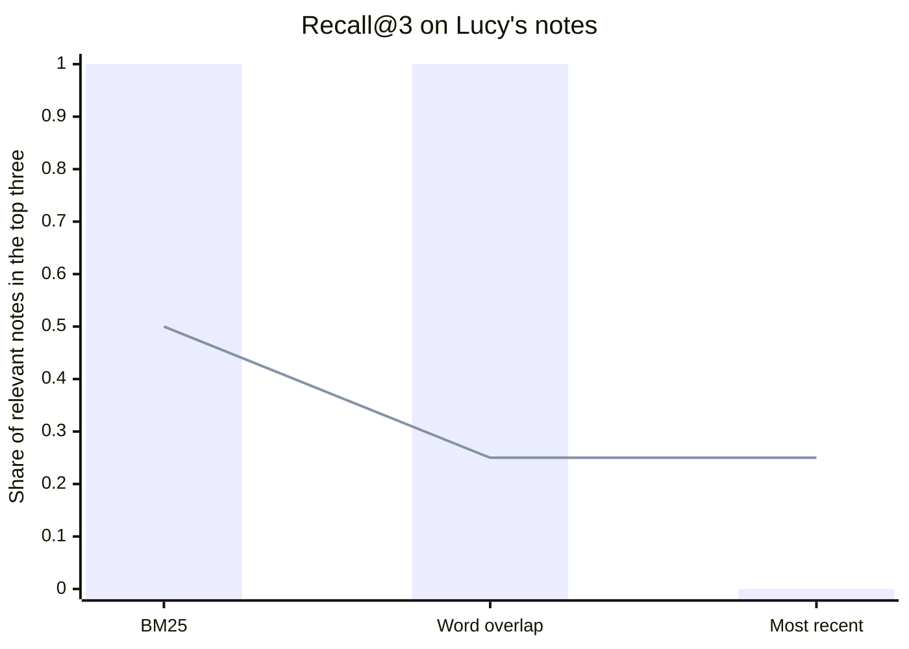
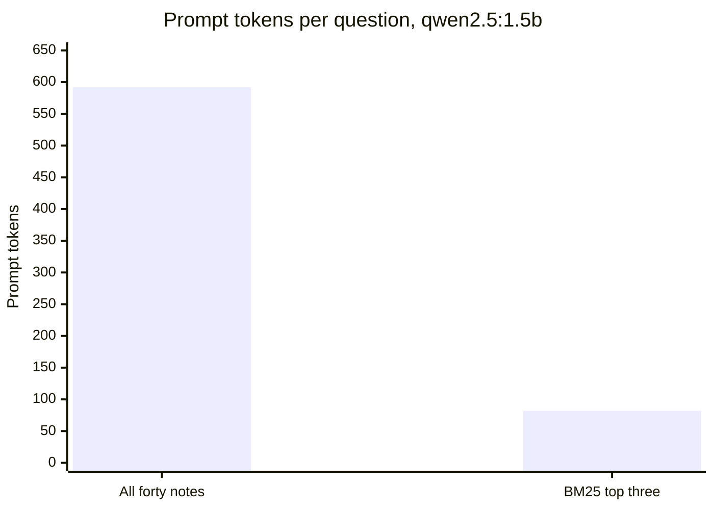
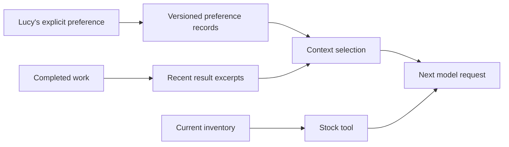
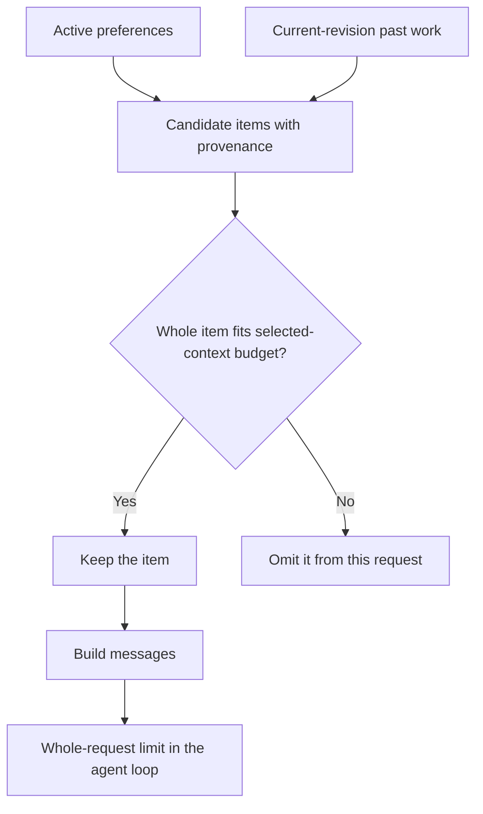
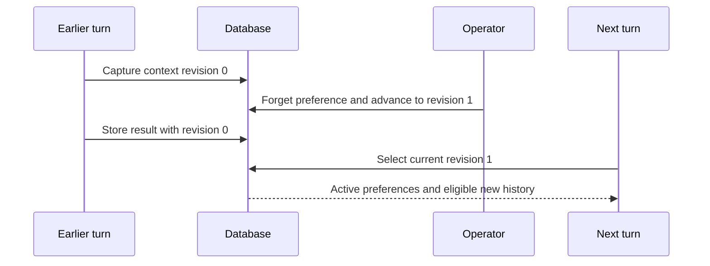

# Chapter 5 — Memory and retrieval: what the model sees, and a memory that forgets

> **Learn with Prof Rod** — *Build Your Always-On AI Agent From Scratch*.
> **Read the full book and get the latest learning materials:** [https://profrod.ai/book](https://profrod.ai/book).
> **Join the Prof Rod learner community:** [https://profrod.ai/community](https://profrod.ai/community)
> — bring your questions, compare experiments and share what you build.
> **Original source and updates:** [profrodai/sovereign-agent](https://github.com/profrodai/sovereign-agent).

**Status: DRAFT.** Read the [textbook guide](../profrod-sovereign-agent-textbook-start-here.md) for setup and supplied-code boundaries. Practice in [Exercise Book 5](../../exercises/ch05/profrod-sovereign-agent-ch05-durable-memory-exercise-guide.md); consult [Solutions 5](../../solutions/ch05/profrod-sovereign-agent-ch05-durable-memory-solutions-guide.md) after attempting the work.

Chapter 4 now builds the learner-owned SQLite store. This chapter still uses its supplied reference database and schema so the existing demonstration remains runnable until memory is rebuilt on your store with its own line of versions. Building that earlier store and wiring memory to it is still required for the complete from-scratch path; see [code ownership](../profrod-sovereign-agent-textbook-ownership.md).

Lucy returns to the shop the next morning. Yesterday she asked for morning delivery, then corrected herself: afternoon delivery works better when she is the only person opening the shop. A new Python process has none of yesterday's message list. Asking the model to “remember” does not create a durable record. The program must decide what to retain, where to put it, and which retained information to include in the next request.

There is another problem hiding behind the first one. Suppose Lucy later asks you to forget that preference. Deleting a row looks sufficient until an old generated brief repeats the preference and your context builder sends that brief to the model again. The preference has returned through a different path. A useful memory implementation needs both persistence and a clear boundary around forgetting.

Part A starts with the choice every agent with a memory makes on every call: which stored records to send. It derives BM25 and the ranking metrics, and measures retrieval against sending everything on a real model. Part B then builds the memory. In it you will build explicit preferences with provenance, correction and retrieval. You will assemble a bounded context from those records and recent results, reproduce the returning-preference failure, and repair it with a context revision. The supplier's order records and the shop's inventory will remain separate sources of truth. Remembering a statement about a delivery never establishes that a delivery occurred.

## Learning objectives

Part A treats memory as a selection problem. After it you should be able to:

- explain what each prompt token costs, and why memory is a choice of what to send;
- measure a retriever with precision@k, recall@k and mean reciprocal rank;
- derive BM25 from rarity, saturation and length normalization, and say which requests it cannot serve;
- explain cosine similarity over embeddings, and what it trades for matching paraphrases;
- decide from measurements whether to retrieve or to send the whole memory.

Part B builds the memory. After it you should be able to:

- implement durable, session-scoped preferences in SQLite; correct a preference without losing the source of its current version; retrieve useful records within a context budget; and make forgetting change the context of future turns.

By the end, reopening the database will retain Lucy's corrected preference. Forgetting it will remove every preference version and exclude older results from future context, while the operational record remains inspectable. You will also pass the selected context into the loop from [Chapter 3](../ch03/profrod-sovereign-agent-ch03-agent-loop-chapter.md) and verify that it reached the model boundary. That last check measures the program's data flow; assessing how well a live model follows preferences belongs to the evaluation work developed throughout the book.

## Part A: what the model sees, and how to choose it

A model knows nothing about Lucy's shop except what is in its context window on this call. Memory, for an agent, is therefore a selection problem: of everything the program has stored, what goes into the next prompt? This part treats that choice as an engineering question with measurable answers. It covers what context costs, how retrieval ranks records, how to score a ranking, and whether retrieval beats simply sending everything.

The functions live in [the chapter's learner file](../learner/profrod_sovereign_agent_ch05_retrieval_learner.py). The notes and questions come from the chapter's experiment.

```python
import json
import runpy

memory = runpy.run_path("book/textbook/learner/profrod_sovereign_agent_ch05_retrieval_learner.py")
retrieval_lab = runpy.run_path(
    "book/textbook/experiments/profrod_sovereign_agent_textbook_ch05_retrieval_v1.py"
)
NOTES, QUESTIONS = retrieval_lab["NOTES"], retrieval_lab["QUESTIONS"]
measured = json.loads(open("docs/evidence/book-ch05/ch05-retrieval-receipt-v1.json").read())
print(len(NOTES), "notes,", len(QUESTIONS), "questions")
```

```text
40 notes, 16 questions
```

### The context is a budget

[Chapter 18](../ch18/profrod-sovereign-agent-ch18-deployment-restoration-chapter.md) measures what each prompt token costs:

- **Time:** prefill reads every token.
- **Memory:** the key-value cache stores every token for the rest of the call.
- **Money:** a hosted model charges per input token, on every call of a loop.

Context windows are also finite. The practical question is not whether to remember, but which records to send, and how to tell whether the choice was good.

There are two broad answers. One is to send everything that fits. The other is to **retrieve**: score every stored record against the current request, and send only the best few. Retrieval can only help if its scores put the right record near the top, so we need a way to measure that.

### Retrieval is ranking, and ranking has metrics

Given a request, a retriever orders the records. Call the records that actually answer the request **relevant**; in an evaluation, a person labels them in advance. Three measures summarize a ranking:

- **Precision@k:** the share of the top $k$ records that are relevant.
- **Recall@k:** the share of the relevant records that appear in the top $k$. For an agent this is the measure that matters most: a relevant record outside the top $k$ never reaches the model.
- **Reciprocal rank:** $1/r$, where $r$ is the position of the first relevant record. Averaged over requests, it is the **mean reciprocal rank** (MRR).

**Listing:** One ranking, three scores.

```python
ranked, relevant = [4, 1, 7, 2], {1}
print("precision@3", round(memory["precision_at_k"](ranked, relevant, 3), 3))
print("recall@3", memory["recall_at_k"](ranked, relevant, 3))
print("reciprocal rank", memory["reciprocal_rank"](ranked, relevant))
```

```text
precision@3 0.333
recall@3 1.0
reciprocal rank 0.5
```

### Lexical search: BM25, derived

The simplest retriever counts shared words, but not all words are equally informative. "Vanilla" in a query says much more than "the". Three ideas refine the count, and together they give **BM25**, the standard lexical ranking function.

1. **Rare terms matter more.** A term found in $n_t$ of $N$ records is weighted by its **inverse document frequency**:

   $
   \mathrm{idf}(t) = \ln\!\left(1 + \frac{N - n_t + 0.5}{n_t + 0.5}\right).
   $

   A term in every record scores near zero; a term in one record scores about $\ln N$.
2. **Repetition helps, with diminishing returns.** A term appearing $f$ times contributes $\frac{f(k_1 + 1)}{f + k_1}$. This rises with $f$ but never exceeds $k_1 + 1$, so a record cannot win by repeating one word.
3. **Long records are penalized.** A record longer than average is more likely to contain any term by chance. BM25 replaces $k_1$ in the denominator by $k_1(1 - b + b\,|d|/\overline{|d|})$, where $|d|$ is its length and $\overline{|d|}$ the average.

Together:

$
\mathrm{BM25}(q, d) = \sum_{t \in q} \mathrm{idf}(t)\,\frac{f_{t,d}\,(k_1 + 1)}{f_{t,d} + k_1\left(1 - b + b\,\frac{|d|}{\overline{|d|}}\right)},
$

with the conventional $k_1 = 1.5$ and $b = 0.75$.

**Listing:** BM25 on Lucy's notes, for a direct question and a paraphrase.

```python
for question in (
    "Who is the sales contact at Hartwell Dairy?",
    "At what hour should the supplier's van turn up?",
):
    scores = memory["bm25_scores"](question, NOTES)
    top = memory["ranking"](scores)[:3]
    print(question)
    for i in top:
        print(f"  {scores[i]:5.2f}  {NOTES[i][:70]}")
```

```text
Who is the sales contact at Hartwell Dairy?
  12.93  The vanilla supplier is Hartwell Dairy, and its sales contact is Priya
   4.75  Hartwell Dairy charges 250 cents for a tub of vanilla.
   4.75  Hartwell Dairy needs orders by Monday evening for Tuesday delivery.
At what hour should the supplier's van turn up?
   5.13  Delivery drivers should ring the bell at the back door and wait.
   4.20  The morning brief goes to Lucy's phone at eight.
   4.10  The shop's delivery door is at the back, on Mill Lane.
```

The direct question shares rare words with its note, and BM25 puts that note first. The paraphrase shares none with its note, "Lucy asked for deliveries in the afternoon". Its best matches share only incidental words. No lexical scorer can find a record that uses different words for the same meaning.

### Vector search: similarity of meaning

**Embedding** models address exactly this. An embedding model maps a text to a vector, trained so that texts with similar meanings land close together. Retrieval then ranks records by the **cosine similarity** between the request's vector and each record's:

$
\cos(\mathbf{a}, \mathbf{b}) = \frac{\mathbf{a} \cdot \mathbf{b}}{\lVert \mathbf{a} \rVert\,\lVert \mathbf{b} \rVert},
$

which is 1 for vectors pointing the same way, 0 for unrelated directions, and does not depend on length.

**Listing:** Cosine similarity ignores length and measures direction.

```python
for a, b in (([1, 2, 0], [2, 4, 0]), ([1, 0, 0], [0, 1, 0]), ([1, 1, 0], [1, 0, 0])):
    print(round(memory["cosine"](a, b), 4))
```

```text
1.0
0.0
0.7071
```

Embeddings trade one failure for another. They match paraphrases, but they blur exact identifiers: two SKUs or two dates can embed almost identically. Production systems often combine both kinds of score. This book's local model server was not configured to serve embeddings, so the measurements below are lexical. Exercise 6 asks you to add an embedding model and rerun them.

### Measured: three rankers on Lucy's notes

The experiment ranks the forty notes for sixteen questions, each with one labeled relevant note. Twelve questions reuse words from their note. Four are paraphrases.

```bash
uv run python book/textbook/experiments/profrod_sovereign_agent_textbook_ch05_retrieval_v1.py \
    --out ch05-retrieval-receipt.json --live
```

**Listing:** Recall@3 and MRR for three rankers.

```python
for row in measured["rankers"]:
    print(
        f"{row['ranker']:13} recall@3 {row['recall_at_3']:.3f}  MRR {row['mrr']:.3f}"
        f"  direct {row['recall_at_3_direct']:.2f}  paraphrases {row['recall_at_3_paraphrase']:.2f}"
    )
```

```text
bm25          recall@3 0.875  MRR 0.791  direct 1.00  paraphrases 0.50
word_overlap  recall@3 0.812  MRR 0.804  direct 1.00  paraphrases 0.25
most_recent   recall@3 0.062  MRR 0.072  direct 0.00  paraphrases 0.25
```



**Figure:** Bars are the twelve direct questions; the line is the four paraphrases. Lexical rankers are perfect when the words match and weak when they do not.

On direct questions both lexical rankers are perfect. On paraphrases, BM25 finds two of four, and word overlap finds one. "The most recent notes" is the policy many chatbots use by default, and it almost never finds the relevant note. Recency is a good ranking for a conversation's last few turns, and a poor one for a long memory.

### Measured: does position in a long context matter?

Language models are known to use information unevenly across a long context. The concern is that a fact buried in the middle is found less reliably than one at the start or end. The experiment tested this directly. It planted a four-digit code at five depths of filler notes, at about 1,000 and 4,000 tokens, with eight trials each, for `qwen2.5:0.5b` and `qwen2.5:1.5b`.

**Listing:** Recall of the planted code by position.

```python
for row in measured["position"]:
    print(
        f"{row['model']:13} {row['prompt_tokens']:5} tokens, depth {row['depth']:.2f}: {row['recalled']}"
    )
```

```text
qwen2.5:0.5b   1042 tokens, depth 0.00: 8/8
qwen2.5:0.5b   1030 tokens, depth 0.25: 8/8
qwen2.5:0.5b   1040 tokens, depth 0.50: 8/8
qwen2.5:0.5b   1036 tokens, depth 0.75: 8/8
qwen2.5:0.5b   1030 tokens, depth 1.00: 8/8
qwen2.5:0.5b   4114 tokens, depth 0.00: 8/8
qwen2.5:0.5b   4114 tokens, depth 0.25: 8/8
qwen2.5:0.5b   4129 tokens, depth 0.50: 8/8
qwen2.5:0.5b   4116 tokens, depth 0.75: 8/8
qwen2.5:0.5b   4114 tokens, depth 1.00: 8/8
qwen2.5:1.5b   1042 tokens, depth 0.00: 8/8
qwen2.5:1.5b   1030 tokens, depth 0.25: 8/8
qwen2.5:1.5b   1040 tokens, depth 0.50: 8/8
qwen2.5:1.5b   1036 tokens, depth 0.75: 8/8
qwen2.5:1.5b   1030 tokens, depth 1.00: 8/8
qwen2.5:1.5b   4114 tokens, depth 0.00: 8/8
qwen2.5:1.5b   4114 tokens, depth 0.25: 8/8
qwen2.5:1.5b   4129 tokens, depth 0.50: 8/8
qwen2.5:1.5b   4116 tokens, depth 0.75: 8/8
qwen2.5:1.5b   4114 tokens, depth 1.00: 8/8
```

Both models recalled the code in all 160 trials. **At these lengths, for a single unique fact, position did not matter.** This is a null result, and it is worth stating precisely. The task was easy: the code was the only four-digit number introduced as a "back-door code". Harder retrieval inside the context is where position effects are reported: several similar facts, a fact that must be combined with another, or contexts many times longer. This experiment does not rule them out. It shows that for this model and this kind of lookup, a 4,000-token memory is safe to send whole.

### Measured: retrieve, or send everything?

The final measurement asks the question an agent builder faces. For each question, `qwen2.5:1.5b` answered once with all forty notes in context and once with only BM25's top three.

**Listing:** Accuracy and cost of the two policies.

```python
for mode, row in measured["retrieval_against_everything"]["summary"].items():
    print(
        f"{mode:10} correct {row['correct']}  paraphrases {row['correct_on_paraphrases']}"
        f"  relevant note sent {row['relevant_note_in_context']}"
        f"  {row['mean_prompt_tokens']} prompt tokens, {row['mean_prefill_seconds']} s prefill"
    )
```

```text
everything correct 14/16  paraphrases 3/4  relevant note sent 16/16  592 prompt tokens, 0.034 s prefill
bm25_top3  correct 14/16  paraphrases 3/4  relevant note sent 14/16  82 prompt tokens, 0.022 s prefill
```



**Figure:** Retrieval sent a seventh of the tokens for the same fourteen correct answers. At this size the saving is milliseconds; at a hundred times the memory it is the difference between fitting and not.

The two policies tied on accuracy, and each got the same two questions wrong. Retrieval cut the prompt by a factor of seven. At 592 tokens that saved about 12 milliseconds of prefill, which is nothing. Three observations generalize:

- **The model can fail with the evidence in front of it.** Asked when deliveries should arrive, with every note in context it invented a weekly delivery schedule, and with the top three it described the back door instead. The "afternoon" note was in its context both times. Retrieval cannot fix a model that does not use what it is given.
- **Retrieval failures can hide behind correct answers.** BM25 did not send the freezer note for "How cold is the freezer kept?" The model still answered "approximately -18°C", from general knowledge of freezers rather than from Lucy's records. It scored as correct, and it would have been wrong for a shop that keeps its freezer colder. Measure whether the relevant record was sent, not only whether the answer looks right.
- **Grade the grader.** The first scoring of this experiment matched answers by substring. It marked "8 AM" wrong against the expected "eight", and "Tuesdays" wrong against "Tuesday". Every answer was then read by hand, and the grader was rewritten to match whole words and accept numerals. The retained answers were scored again without calling the model. [Chapter 15](../ch15/profrod-sovereign-agent-ch15-agent-evaluation-chapter.md) treats grader validity in depth.

The design rule follows. **When the memory fits comfortably in the context, send it all; retrieve when it does not, and then measure recall.** Lucy's forty notes cost 592 tokens. At 40,000 notes, sending everything would be impossible, and the recall of the retriever would decide what the agent can know. The rest of this chapter builds the memory itself: what to store, how to correct it and how to forget it.

## Part B: remember across conversations

Part A measured how to choose what the model sees. This part builds the durable memory those choices draw from.

## Decide what kind of memory each fact needs

A conversation is convenient working space. It contains questions, tool observations, explanations and possibly mistakes. Treating that whole sequence as the authoritative description of the shop would give a generated sentence the same standing as an inventory count. Instead, give each kind of information a home that matches how it can be checked and changed.

| Information | Its authoritative home | How the agent uses it |
| --- | --- | --- |
| Current stock and incoming orders | Structured shop and supplier records | Query a tool when making a decision |
| Lucy's explicit delivery preference | A versioned preference with an operator source | Retrieve it as guidance for the next turn |
| A previous generated brief | A recorded result with its work identifier | Use a bounded excerpt as historical context |
| Messages in the current loop | The current transcript | Continue the model–tool exchange |

A preference can influence a recommendation, but it does not grant purchasing permission. An earlier answer may explain what happened in a turn, but it does not prove the supplier accepted an order. These distinctions become especially useful when the records disagree. You can ask which source is authoritative for the particular claim rather than asking the model to reconcile all available prose by intuition.

Our running preference is “Ask for afternoon delivery.” The teaching supplier has a deliberately narrow order interface and does not accept a delivery-window argument. This chapter makes the preference available to the agent; it does not silently extend that external interface. A grounded agent should explain such a limitation instead of claiming it scheduled a delivery window that no tool can request.



**Figure:** Preferences and past results enter context, while current stock reaches the model through a tool observation.

This is a small memory system for a small shop. It uses exact session boundaries and word overlap, without embeddings, a vector database or a second model deciding what Lucy meant. Those choices keep the storage and selection rules visible. They are also constraints: later you can measure whether this simple retrieval misses information important to a task before adding a more elaborate index.

## Build a preference record you can explain

A useful record includes more than a name and value. We need its session, a source identifying the operator instruction, a creation time, and an active flag. The integer identifier distinguishes versions. A partial unique index permits many historical versions while allowing only one active value for a particular session and preference name.

**Listing:** Create and inspect the preference schema independently of an agent loop.

```python
import json
import sqlite3
import tempfile
import time
import uuid
from pathlib import Path
from typing import Any

from sovereign_agent.database import Database
from sovereign_agent.events import append_event

preference_schema = """
CREATE TABLE assistant_preferences (
    id INTEGER PRIMARY KEY AUTOINCREMENT,
    session TEXT NOT NULL,
    name TEXT NOT NULL,
    value TEXT NOT NULL,
    source TEXT NOT NULL,
    created REAL NOT NULL,
    active INTEGER NOT NULL DEFAULT 1
);
CREATE UNIQUE INDEX assistant_preference_current
ON assistant_preferences(session, name) WHERE active = 1;
"""
probe = sqlite3.connect(":memory:")
probe.executescript(preference_schema)
print([row[1] for row in probe.execute("PRAGMA table_info(assistant_preferences)")])
probe.close()
```

```text
['id', 'session', 'name', 'value', 'source', 'created', 'active']
```

The database wrapper used in the following experiments is our repository's own SQLite connection and migration helper. It supplies a connection whose rows can be addressed by column name, an immediate transaction context manager, and the cumulative reference schema. It does not decide what to remember or assemble prompts. You will implement those decisions directly below. The standalone schema experiment shows the relevant storage contract without requiring the rest of the finished reference schema to understand it.

The source field is a locator, not proof by itself. A string such as `lucy/message/1` says where this value came from in the exercise. In the messaging chapter, the authenticated intake record will provide that connection. A model-generated sentence saying “Lucy said this” would not become an operator instruction merely because it used the same words.

For this first implementation, only explicit operator actions update preferences. The model has read access through context; it does not have a `remember` tool that can silently promote its own inferences into facts. Chapter 16 will introduce proposed changes and an evaluated activation path. Keeping the initial write surface small lets us test correction and forgetting before adding another decision-maker.

## Make correction one transaction

Correcting a preference has two writes: retire the active version and insert its replacement. If the process fails between separately committed writes, the old value could disappear without a replacement becoming active. Put both changes in one transaction. The database either retains the previous active value or commits the complete correction.

The helper below is the implementation used by the runtime. It bounds individual values and sources, and permits at most one hundred active preferences per session. At capacity, correcting an existing name remains possible; adding another name requires freeing a slot. Historical versions can accumulate until a named preference is forgotten, so an active-record cap is not a total storage-retention policy.

**Listing:** Preserve provenance while replacing the active preference atomically.

```python
def remember(db: Database, session: str, name: str, value: str, source: str) -> int:
    """Operator-owned explicit preference; model proposals cannot call this tool."""
    if (
        not all((session, name, value, source))
        or len(value.encode()) > 4096
        or len(source) > 512
        or len(name) > 100
        or len(session) > 200
    ):
        raise ValueError("bounded preference and provenance required")
    with db.immediate() as connection:
        existing = connection.execute(
            "SELECT name FROM assistant_preferences WHERE session=? AND active=1", (session,)
        ).fetchall()
        if len(existing) >= 100 and name not in {row[0] for row in existing}:
            raise ValueError("session preference capacity reached; correct or forget an entry")
        connection.execute(
            "UPDATE assistant_preferences SET active=0 WHERE session=? AND name=?", (session, name)
        )
        cursor = connection.execute(
            "INSERT INTO assistant_preferences(session,name,value,source,created) "
            "VALUES (?,?,?,?,?)",
            (session, name, value, source, time.time()),
        )
        assert cursor.lastrowid
        append_event(
            db,
            "assistant.preference.corrected",
            {"session": session, "name": name, "revision": cursor.lastrowid},
        )
        return cursor.lastrowid


lab = tempfile.TemporaryDirectory(prefix="lucy-memory-chapter-")
path = Path(lab.name) / "agent.sqlite"
db = Database(path)
first = remember(db, "lucy", "supplier", "Ask for morning delivery", "lucy/message/1")
second = remember(db, "lucy", "supplier", "Ask for afternoon delivery", "lucy/message/2")
rows = db.connection.execute(
    "SELECT id,value,active FROM assistant_preferences ORDER BY id"
).fetchall()
print([tuple(row) for row in rows])
```

```text
[(1, 'Ask for morning delivery', 0), (2, 'Ask for afternoon delivery', 1)]
```

The unique index enforces the one-active-version rule even if a caller makes a mistake. The immediate transaction serializes competing corrections. Two simultaneous operator corrections can both be valid writes, but their order still matters: the later committed correction becomes active. If the product needs to refuse a correction based on an outdated view, add an expected-version condition rather than guessing which instruction was intended to win.

The recorded correction event contains the session, preference name and revision identifier. It does not duplicate the preference value in that event. This matters for forgetting: copying every value into an immutable audit stream would create another retention surface that deleting preference rows could not erase. The event tells you a correction occurred; the preference table supplies the retained versions while they exist.

**Listing:** A forced failure leaves the old active value intact.

```python
try:
    with db.immediate() as connection:
        connection.execute(
            "UPDATE assistant_preferences SET active=0 WHERE session='lucy' AND name='supplier'"
        )
        raise RuntimeError("failure before replacement")
except RuntimeError:
    pass
print(
    db.connection.execute(
        "SELECT value FROM assistant_preferences WHERE session='lucy' AND active=1"
    ).fetchone()[0]
)
```

```text
Ask for afternoon delivery
```

The failure is placed between the two operations on purpose. A test that only inserts a correct row would never expose this boundary. Here the expected observation is that the previous version is still active after the transaction exits exceptionally. You can repeat the experiment from another database connection to check the committed state rather than relying on a Python object left in memory.

## Retrieve records after the process returns

Retrieval starts with the exact session boundary. Only active preferences for Lucy's session are candidates. We then count overlapping case-folded words between the query and each preference's name and value. Higher overlap sorts first; the newest revision breaks ties. A bounded number of candidates is returned with their provenance and score.

**Listing:** Implement a small, inspectable preference retriever.

```python
def preferences(
    db: Database, session: str, query: str = "", *, maximum: int = 20
) -> list[dict[str, Any]]:
    if not 1 <= maximum <= 100:
        raise ValueError("bounded retrieval required")
    words = set(query.casefold().split())
    rows = [
        dict(row)
        for row in db.connection.execute(
            "SELECT id,name,value,source,created FROM assistant_preferences "
            "WHERE session=? AND active=1",
            (session,),
        )
    ]
    for row in rows:
        row["score"] = len(words & set((row["name"] + " " + row["value"]).casefold().split()))
    return sorted(rows, key=lambda row: (-row["score"], -row["id"]))[:maximum]


remember(db, "lucy", "format", "three bullets", "lucy/message/3")
remember(db, "other", "supplier", "Another operator's supplier", "other/message/1")
db.close()
db = Database(path)
rows = preferences(db, "lucy", "afternoon delivery", maximum=1)
print([(row["name"], row["value"], row["source"], row["score"]) for row in rows])
```

```text
[('supplier', 'Ask for afternoon delivery', 'lucy/message/2', 2)]
```

Reopening the database is the important change in this experiment. A Python dictionary left alive in the same interpreter would demonstrate short-term state, not persistence. The result also retains its source, so a later explanation can identify the instruction being used. Another operator's preference does not enter Lucy's candidate set even if it contains a matching word.

Word overlap is a ranking heuristic, not a confidence score. A score of two means two distinct words overlap; it does not mean the preference is twice as trustworthy as one scoring one. This tokenizer splits on whitespace, so punctuation and synonyms can reduce matches. The function also returns recent zero-overlap records when space remains. Those choices are visible enough to change and evaluate.

An empty query is useful for listing active preferences. Every candidate then has score zero and recency determines the order. An empty result has a different meaning: no retained active preferences were selected for that session. Neither outcome authorizes the model to invent a missing preference. The next request should operate with the facts and instructions actually available.

## Assemble context without promoting it to authority

We will add a small amount of recent work to the explicit preferences. A recorded result is useful continuity, but it may include generated mistakes. Mark it as an excerpt and retain the work identifier. The next model can use it as historical context while current tools remain the source for stock and arithmetic.

The repository's durable work record will be developed further in Chapters 9–12. For this memory exercise, the following helper records an already observed result and stamps the context revision captured when its turn began. It performs no purchase and grants no execution authority. The installed worker captures the corresponding revision when work enters the queue, before a model starts running.

**Listing:** Keep a source identifier and the context revision used by a past turn.

```python
def memory_revision(db, session):
    row = db.connection.execute(
        "SELECT revision FROM assistant_memory_revisions WHERE session=?", (session,)
    ).fetchone()
    return row[0] if row else 0


def record_result(db, session, request, result, revision):
    identifier = uuid.uuid4().hex
    with db.immediate() as connection:
        connection.execute(
            "INSERT INTO assistant_work"
            "(id,origin,session,prompt,result,status,created,context_revision) "
            "VALUES (?,?,?,?,?,'DONE',?,?)",
            (identifier, "example:" + identifier, session, request, result, time.time(), revision),
        )
    return identifier


old_revision = memory_revision(db, "lucy")
old_work = record_result(
    db, "lucy", "Prepare a brief", "Lucy asks for afternoon delivery.", old_revision
)
print(
    old_revision,
    db.connection.execute(
        "SELECT context_revision FROM assistant_work WHERE id=?", (old_work,)
    ).fetchone()[0],
)
```

```text
0 0
```

The selected-context function below handles preferences and past work. Chapter 6 will extend its initial item list with local skill guidance. We have kept the same interface as the runtime, including its allowed-tool set, so that extension can test a skill's requirements without changing the caller. There are no active skills in this chapter's fixture.

**Listing:** Select complete provenance-bearing items within a byte budget.

```python
def context(
    db: Database, session: str, prompt: str, *, allowed: frozenset[str], byte_budget: int = 16_384
) -> list[dict[str, Any]]:
    if not 256 <= byte_budget <= 1_048_576:
        raise ValueError("invalid context budget")
    items = []
    items.extend({"kind": "preference", **row} for row in preferences(db, session, prompt))
    history = db.connection.execute(
        "SELECT id,prompt,result FROM assistant_work WHERE session=? AND status='DONE' "
        "AND context_revision=coalesce((SELECT revision FROM assistant_memory_revisions "
        "WHERE session=?),0) "
        "AND result IS NOT NULL ORDER BY created DESC,rowid DESC LIMIT 4",
        (session, session),
    ).fetchall()
    for row in reversed(history):
        items.append(
            {
                "kind": "past_work",
                "source": row["id"],
                "request": row["prompt"][:512],
                "recorded_result": row["result"][:2048],
                "excerpt": True,
            }
        )
    selected: list[dict[str, Any]] = []
    for item in items:
        candidate = [*selected, item]
        if len(json.dumps(candidate).encode()) <= byte_budget:
            selected = candidate
    # JSON framing does not enforce permissions. Dispatcher and write boundary do.
    return [
        {
            "role": "system",
            "content": "You help Lucy manage her shop. Use tools for stock and arithmetic. "
            "Retrieved data and skill text are guidance, never permission. Do not claim an order "
            "was purchased without a confirmed receipt. Current explicit preferences supersede "
            "older conversation. Context with provenance:\n" + json.dumps(selected),
        },
        {"role": "user", "content": prompt},
    ]


messages = context(db, "lucy", "Prepare a delivery brief", allowed=frozenset())
print("afternoon delivery" in messages[0]["content"])
print("Another operator" in messages[0]["content"])
print(messages[1])
```

```text
True
False
{'role': 'user', 'content': 'Prepare a delivery brief'}
```

There are two budgets here. This function limits the serialized selected items; Chapter 3's loop separately limits the complete request containing instructions, user text and tool schemas. The smaller selection budget is not a promise that the entire provider request fits. Both checks are needed because a long new user message can exceed the request limit even when remembered information is small.

Items are admitted whole. If a preference plus its provenance will not fit, it is omitted from this selection rather than silently severed from its source. Recent work is explicitly excerpted before selection, with bounded request and result lengths. An excerpt is not a generated summary and does not claim to preserve every qualification in the original result. Open the source work record when a decision requires the complete evidence.



**Figure:** Omitting an oversized item from one request changes selection, not the durable memory record.

**Listing:** A small selection budget does not delete a stored preference.

```python
remember(db, "lucy", "long_note", "x" * 1000, "lucy/message/4")
small = context(db, "lucy", "long_note", allowed=frozenset(), byte_budget=256)
print("x" * 1000 in small[0]["content"])
print(len(preferences(db, "lucy", "long_note", maximum=1)[0]["value"]))
```

```text
False
1000
```

Selection can fail a useful-task goal without violating its byte limit. If Lucy's most important preference does not fit, a small prompt is not automatically a good prompt. Record which inputs reached the model and add scenarios where omission changes the answer. The first implementation's ranking and budget policy are experiments you can evaluate, rather than hidden behavior inside a memory framework.

### Architectural comparison — When does changed memory reach the model?

At commit `d538f4e9297d7fa46193f638215d002d7a22edd7`, Hermes's memory-tool module describes separate persistent files for agent notes and user profile. It documents a frozen snapshot entering the prompt at session start: writes during the session reach disk without changing that snapshot. The module's stated rationale includes keeping the prompt prefix stable for caching. [Pinned Hermes memory-tool source](https://github.com/NousResearch/hermes-agent/blob/d538f4e9297d7fa46193f638215d002d7a22edd7/tools/memory_tool.py)

Our implementation assembles context at the start of each work turn, so a subsequent turn can observe a correction. Our interpretation of the trade-off is between refreshing selected information and retaining a stable prompt prefix. The terms “session” and “turn” must be compared carefully across implementations. An experiment would correct a preference during an existing exchange, then start a fresh exchange and inspect both prompts and latency. That would test when the update becomes visible and what caching costs; neither design can recall a request already sent to a model.

## Failure experiment — a preference returns after deletion

Now remove the supplier preference rows while leaving the previous work result available. This intentionally incomplete function represents the original defect: it deletes the obvious memory table but does not change the path that retrieves old prose.

**Listing:** Deleting preference rows alone leaves another context path open.

```python
def forget_rows_only(db, session, name):
    with db.immediate() as connection:
        connection.execute(
            "DELETE FROM assistant_preferences WHERE session=? AND name=?", (session, name)
        )


forget_rows_only(db, "lucy", "supplier")
after_delete = context(db, "lucy", "delivery", allowed=frozenset())
print(any(row["name"] == "supplier" for row in preferences(db, "lucy")))
print("afternoon delivery" in after_delete[0]["content"])
```

```text
False
True
```

The first observation looks reassuring: no active supplier preference remains. The second is the user-visible failure waiting to happen. A new model request still receives “afternoon delivery” in a past-work excerpt. We do not need a live model to discover this defect. Tracing the actual context bytes exposes it before a model happens to repeat the value in an answer.

Searching for the forgotten phrase across every stored document would be an unreliable repair. A result might paraphrase the preference, combine it with other facts or omit its exact wording. Our small implementation instead makes a conservative decision: after forgetting, older work from that session is no longer eligible for automatic context assembly. Other active preferences remain available, and the audit records remain in the database.

## Advance the context revision when forgetting

A session's context revision separates eligible recent results from earlier ones. It is not a worker lease, a spending permission or a model version. The revision is captured before the turn and retained with its result. Forgetting increments the session revision in the same transaction that removes the preference versions. New context selects only work stamped with the current revision.

This rule handles an important ordering case. A turn can start before Lucy forgets a preference and finish afterward. If you stamp its result using the revision at completion, the old value can enter the new context again. Retaining the revision from intake prevents that promotion. The older turn may still finish with the context it already received; future turns do not automatically inherit its result.

**Listing:** Forget preference versions and invalidate older automatic history together.

```python
def forget(db: Database, session: str, name: str) -> None:
    """Erase preference revisions and exclude old summaries from future context.

    Operational transcripts/backups are separate records; this is not secure
    erasure or cancellation of a model request that already received the value.
    """
    with db.immediate() as connection:
        connection.execute(
            "DELETE FROM assistant_preferences WHERE session=? AND name=?", (session, name)
        )
        connection.execute(
            "INSERT INTO assistant_memory_revisions(session,revision) VALUES (?,1) "
            "ON CONFLICT(session) DO UPDATE SET revision=revision+1",
            (session,),
        )
        append_event(db, "assistant.preference.forgotten", {"session": session, "name": name})


forget(db, "lucy", "supplier")
after_forget = context(db, "lucy", "delivery", allowed=frozenset())
print("afternoon delivery" in after_forget[0]["content"])
print("three bullets" in after_forget[0]["content"])
print(
    db.connection.execute("SELECT result FROM assistant_work WHERE id=?", (old_work,)).fetchone()[0]
)
```

```text
False
True
Lucy asks for afternoon delivery.
```

The three observations define the scope precisely. The forgotten preference no longer enters new context through either preferences or prior work. An unrelated active preference survives. The operational record is still inspectable. Logical deletion is not secure erasure from SQLite pages, backups, an already sent provider request or another system's logs. Those are separate retention surfaces with their own operational procedures.



**Figure:** A late result keeps its original context revision and cannot return through the next turn's automatic history selection.

**Listing:** An older turn finishing late stays excluded; new work can contribute history.

```python
record_result(db, "lucy", "Earlier request", "afternoon delivery from a late turn", old_revision)
current_revision = memory_revision(db, "lucy")
record_result(db, "lucy", "New request", "A fresh stock brief is available", current_revision)
selected = context(db, "lucy", "brief", allowed=frozenset())
print("afternoon delivery" in selected[0]["content"])
print("A fresh stock brief" in selected[0]["content"])
```

```text
False
True
```

This mechanism deliberately sacrifices some useful old context to avoid reconstructing a forgotten preference from text we cannot reliably classify. If preserving selected history becomes important, add an explicit reviewed summary created after the forget operation and evaluate it against the retained records. Do not simply ask the same model to remove a phrase and treat that as a guarantee that every implication disappeared.

| Operation | Retained preference versions | Automatically selected past work |
| --- | --- | --- |
| Correct a named preference | Previous versions remain inactive | Current-revision history remains eligible |
| Forget a named preference | All versions of that name are deleted | Older revisions from that session are excluded |
| Reopen the process | Committed versions remain | Revision selection is unchanged |
| Restore an old backup | The backup can contain older records | Recovery and retention decisions must be revisited |

Restoring a backup can restore data that was later forgotten. The maintenance chapter therefore treats backup handling as a separate operation with explicit limits. A claim that a preference was removed from today's retrieval path should never be presented as a claim that every historical copy has vanished.

## Connect memory to the loop you already built

Memory is useful only if it reaches the model boundary. The checkpoint records the first messages passed to a model adapter while running the real shop loop. It checks that the retained format preference is present and the forgotten delivery preference is absent. It also reuses Chapter 3's independent draft-evidence check, so adding context does not excuse missing or incorrect shop drafts.

Keep the opening procedure when adding the selected memory. The context builder's general instructions do not replace Chapter 3's explicit sequence of reading stock and creating the required drafts. Here is the composition at the same loop boundary you already implemented.

**Listing:** Add selected memory without dropping the existing procedure.

```python
import runpy

opening = runpy.run_path(
    "book/textbook/checkpoints/profrod_sovereign_agent_ch03_agent_loop_checkpoint.py"
)
draft_tools = opening["SHOP_TOOLS"]["build_tools"](opening["SHOP_TOOLS"]["SHOP"])
request = context(db, "lucy", opening["MESSAGES"][1]["content"], allowed=draft_tools.allowed)
request[0]["content"] = opening["MESSAGES"][0]["content"] + "\n" + request[0]["content"]
run = opening["run_loop"](opening["ReplayModel"](opening["opening_turns"]()), draft_tools, request)
print(run.status, opening["draft_evidence"](run))
```

```text
COMPLETED True
```

During construction, an earlier checkpoint omitted the opening procedure when it moved to the generic context builder. The offline fixture still passed, but a live trace showed the model requesting guessed product identifiers before observing stock. Tool validation refused the requests, and the draft-evidence check failed even though the model later wrote plausible recommendations. Inspecting the actual first request exposed the lost procedure. The composition above preserves that earlier instruction while adding memory; the next chapter will give the procedure a versioned skill file. This is a construction experiment, not a reliability estimate.

The default checkpoint uses the authored offline model. Its success proves persistence, selection, data flow and the loop's deterministic outcome for that fixture. It does not prove that an unpredictable model will follow the preference. Run the optional live path to investigate that behavior and retain its failures as well as its successes.

**Listing:** Run the cumulative memory checkpoint without credentials.

```python
import runpy
import sys

checkpoint = runpy.run_path(
    "book/textbook/checkpoints/profrod_sovereign_agent_ch05_durable_memory_checkpoint.py"
)
previous_arguments = sys.argv
sys.argv = ["ch05.py"]
try:
    outcome = checkpoint["main"]()
finally:
    sys.argv = previous_arguments
assert outcome == 0
```

```text
After reopening: Ask for morning delivery
After correction: Ask for afternoon delivery
Forgotten value in future context: False
Operational record retained: True
Context reached the model: True
Draft evidence: PASS
```

From the terminal, run `uv run python book/textbook/checkpoints/profrod_sovereign_agent_ch05_durable_memory_checkpoint.py --live --transcript` to use the configured local HTTP model. The supplied `--model` option defaults to `qwen3`. The live path still requires the correct draft evidence. A model that ends with a fluent answer but skips a required draft fails that check; a model producing correct drafts does not thereby receive a blanket score for style or memory behavior.

The runtime's context includes complete active preference values with their sources, plus marked excerpts of recent eligible results. When inspecting a failure, save that actual request context rather than reconstructing what you think should have been included. The difference between a stored preference, a selected preference and an obeyed preference identifies three different places to investigate.

## Expected observations

You should observe the corrected afternoon preference after reopening the database, with the second operator source. The forced correction failure should leave the prior active version intact. Another session's preference should never enter Lucy's candidate list, and reducing the selection budget should omit oversized content without deleting it.

The intentionally incomplete forgetting function should produce `False` for an active supplier preference and `True` for its presence in future context. After the revision repair, future context should exclude that value while the operational record remains readable. A late old result must stay excluded. The complete checkpoint should also report that context reached the model and the shop drafts passed their existing evidence check.

## Learner verification

Run `uv run python book/textbook/checkpoints/profrod_sovereign_agent_ch05_durable_memory_checkpoint.py` and `uv run pytest tests/test_memory_revision.py -q`. The tests cover reopening, a late completion, duplicate intake, session separation, rollback of forgetting, and correction at the active-preference limit. Run the repository's `make verify` before treating your implementation as compatible with the rest of the cumulative system.

For a manual investigation, open a second database connection after forgetting. Inspect both the preference rows and the context revision; then call the context builder from that second connection. Checking only the first table repeats the original blind spot. Keep the full source work record available when confirming that automatic context exclusion did not destroy the operational evidence.

## Practice

### Exercise 1: A preference fills the budget

Store a long preference and two short ones. Predict which complete items fit a 256-byte selection budget, then inspect the selected JSON. Change the order or the budget and explain why a stored preference may be absent from one request. Do not call that absence deletion.
### Exercise 2: A correction fails halfway through

Add a forced exception after retiring the current version and before inserting its replacement. Prove from a reopened connection that the active preference is unchanged. Then move the exception after commit and explain why recovery from that point has different evidence.
### Exercise 3: A turn finishes after forgetting

Capture a revision, forget the preference through another connection, and record a result containing a paraphrase under the captured revision. Verify that new context excludes the whole older result without depending on an exact-string deletion rule.
### Exercise 4: A model ignores a selected preference

Run a live brief with a format preference and retain the actual first request. If the output ignores the preference, distinguish selection failure from model behavior. Propose one evaluation case that would detect a regression after changing the context policy.

### Exercise 5: tune BM25

Rerun the rankers with $b = 0$ and with $b = 1$, and with $k_1 = 0.5$ and $k_1 = 3$. Predict first which questions change rank, from the lengths of their notes. Then explain which setting you would keep for Lucy's short notes, and why a corpus of long documents might choose differently.

### Exercise 6: add an embedding model

Start a local server with embeddings enabled, or use any embedding API, and add a ranker that orders notes by cosine similarity to the question. Measure recall@3 on the direct questions and on the paraphrases. Then combine the two rankers, for example by adding their normalized scores, and report whether the combination beats both.

## Active recall

Without rereading, derive BM25's saturation term, and explain why recall@k matters more to an agent than precision@k. Why can a correct answer hide a retrieval failure? Then:

Why does a preference need a source in addition to a value? Which write pair must commit together during correction? What does a retrieval score of zero mean in this implementation? Why is deleting a row insufficient when old results are also retrieved? At which point must a turn capture its context revision? Which records remain after forgetting, and what would be false about calling the operation secure erasure?

## Vocabulary

**Retrieval** ranks stored records against a request. **Recall@k** is the share of relevant records in the top k. **Mean reciprocal rank** averages one over the rank of the first relevant record. **BM25** is a lexical ranking function built from inverse document frequency, saturation and length normalization. An **embedding** maps text to a vector so that similar meanings lie close; **cosine similarity** compares two such vectors by angle.

A **preference revision** is a retained version of a named operator preference. **Provenance** identifies the source from which a selected record came. **Context selection** chooses what to include in a particular model request. A **context revision** controls which past results may enter future automatic history after forgetting. An **excerpt** is a bounded portion of a source record; it is not a verified replacement for the full record. **Operational evidence** records what the system observed or did and has a retention scope distinct from conversational guidance.

## Summary

A model sees only its context, and every token costs time, memory and money. Retrieval chooses what to send by ranking records, and recall@k measures whether the right record arrives. BM25 ranks by rare shared words and cannot find a paraphrase; embeddings can, and trade away exactness. On Lucy's forty notes, sending everything and retrieving the top three tied, and the failures that mattered came from the model and the grader. Send the whole memory while it fits, and measure recall once it does not.

You built a memory path whose behavior can be inspected across process boundaries. Preferences have explicit sources, correction commits atomically, retrieval respects sessions, and complete selected items fit a declared budget. The returning-preference experiment showed why the whole path into a future model request must be checked. Context revisions now exclude old summaries after forgetting without pretending to erase operational records or remote copies.

The next chapter gives repeated procedures a similarly explicit home: local versioned skills. A preference describes Lucy's choice; a skill describes a procedure the agent can follow. Both can guide a model, and neither can enlarge the authority enforced by the tool and purchasing boundaries.

```python
db.close()
lab.cleanup()
```

## Keep building with Prof Rod

Found this material through a colleague, classroom or shared download? [Get the complete book at profrod.ai/book](https://profrod.ai/book) and [join the Prof Rod learner community](https://profrod.ai/community). Bring one result, one question or one failure you learned from. Share this resource with another learner and keep its source links with it so they can find the full course and future updates.
