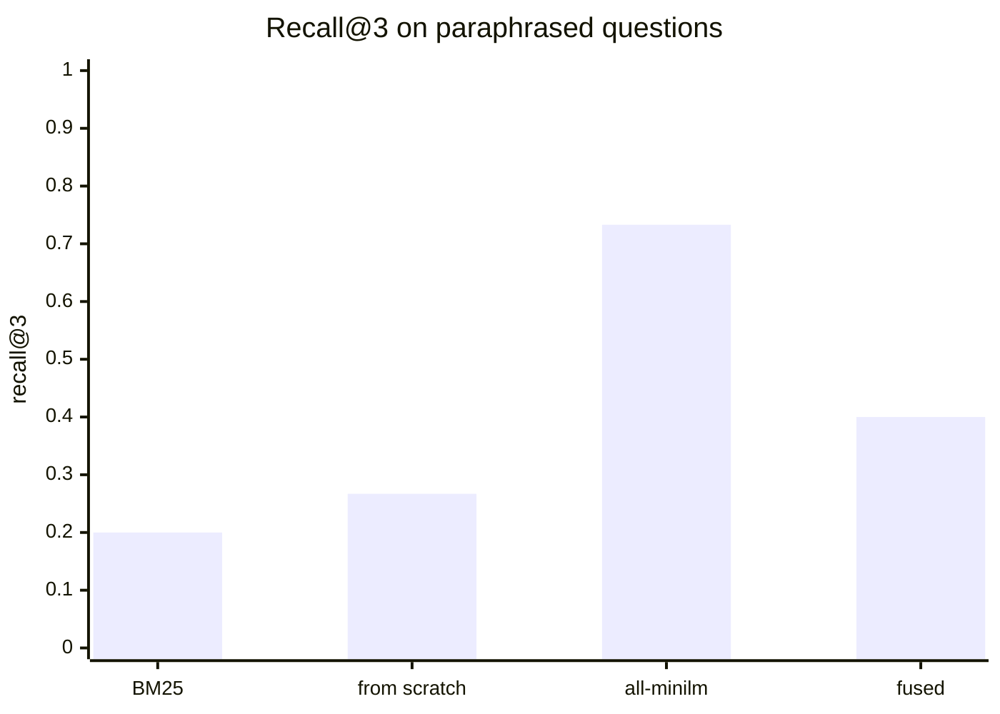

# Chapter 6 — Embeddings and vector search: when words are not enough

> **Learn with Prof Rod** — *Build Your Always-On AI Agent From Scratch*.
> **Read the full book and get the latest learning materials:** [https://profrod.ai/book](https://profrod.ai/book).
> **Join the Prof Rod learner community:** [https://profrod.ai/community](https://profrod.ai/community)
> — bring your questions, compare experiments and share what you build.
> **Original source and updates:** [profrodai/sovereign-agent](https://github.com/profrodai/sovereign-agent).

**Status: PLANNED, manuscript drafted.** Read the [textbook guide](../profrod-sovereign-agent-textbook-start-here.md) for setup and supplied-code boundaries. The chapter text, learner file, experiment and checkpoint below are written and run; the two ninety-minute Colab notebooks and the educator guide are still being written. Until they exist this chapter stays PLANNED in the book manifest, and its exercises live at the end of this page.

[Chapter 5](../ch05/profrod-sovereign-agent-ch05-durable-memory-chapter.md) chose which of Lucy's notes the model sees by counting shared words with BM25, and it measured the limit of that choice. The right note came back for almost every question asked in the note's own words, and for few of the paraphrases. "At what hour should the supplier's van turn up?" shares no content word with the note that answers it: "Lucy asked for deliveries in the afternoon, because she opens the shop alone in the morning." No lexical scorer can find that note.

An **embedding** places a text as a list of numbers, a vector, so that texts with similar meanings land near each other whatever words they use. Searching by nearness finds the paraphrased note. It also brings failures of its own, and a cost that grows with every note. Part A builds embeddings from nothing and measures what a real embedding model finds that words cannot, where it is fragile, and how search scales. Part B gives Lucy's agent a vector index it can trust: it records which model made each vector, keeps only the current version of a changed note, and combines vector and word search.

## Learning objectives

Part A measures embeddings. After it you should be able to:

- explain why a word's index carries no meaning, and why the embedding lookup is a matrix product;
- derive skip-gram with negative sampling, and the contrastive objective that trains sentence encoders;
- show that cosine similarity, dot product and Euclidean distance agree on unit vectors;
- measure dense, lexical and fused retrieval with recall@k and reciprocal rank, and explain when fusion hurts;
- explain exact and approximate nearest-neighbor search, and measure a graph index's recall against its comparisons.

Part B builds Lucy's vector index. After it you should be able to:

- store each vector with its model, dimensions and note revision in SQLite;
- refuse to compare vectors made by different models;
- search only the current revision of each note;
- combine vector and word rankings with reciprocal rank fusion.

## Part A: from words to vectors

The functions live in [the chapter's learner file](../learner/profrod_sovereign_agent_ch06_embeddings_learner.py). The measurements come from [the chapter's experiment](../experiments/profrod_sovereign_agent_textbook_ch06_embeddings_v1.py), which ran a real embedding model on the author's Mac mini.

```python
import json
import runpy

vec = runpy.run_path("book/textbook/learner/profrod_sovereign_agent_ch06_embeddings_learner.py")
lexical = runpy.run_path("book/textbook/learner/profrod_sovereign_agent_ch05_retrieval_learner.py")
memory = runpy.run_path(
    "book/textbook/experiments/profrod_sovereign_agent_textbook_ch05_retrieval_v1.py"
)
NOTES = memory["NOTES"]
measured = json.loads(open("docs/evidence/book-ch06/ch06-embeddings-receipt-v1.json").read())
```

### A word's index is not its meaning

A program first meets a word as a position in a vocabulary. Number the words alphabetically and "vanilla" sits next to "vegan", far from "chocolate". The numbers come from spelling, so any closeness they suggest is an accident.

A **one-hot** vector removes the accident. For a vocabulary of $V$ words, word $i$ becomes a vector of $V$ zeros with a single 1 in position $i$. The **dot product** of two vectors sums their pairwise products,

$$
\mathbf{a} \cdot \mathbf{b} = \sum_{k} a_k b_k,
$$

and for two different one-hot vectors every product is zero. One-hot vectors make no claim that two words are related, which is honest, and useless for finding a note that says the same thing in other words.

**Listing:** One-hot vectors are equally far apart.

```python
vocab = ["chocolate", "vanilla", "vegan"]
for a in vocab:
    for b in vocab:
        if a < b:
            print(a, b, vec["dot"](vec["one_hot"](a, vocab), vec["one_hot"](b, vocab)))
```

```text
chocolate vanilla 0
chocolate vegan 0
vanilla vegan 0
```

### The embedding lookup is a matrix product

An **embedding table** $E$ gives each word a short vector of $d$ numbers instead. Written as a $d \times V$ matrix with one column per word, looking up word $i$ is the same as multiplying $E$ by its one-hot vector:

$$
E\,\mathbf{e}_i = \text{column } i \text{ of } E.
$$

Every embedding layer in a neural network is this product, implemented as a lookup because multiplying by a vector of zeros is wasteful. What remains is to choose the numbers in $E$ so that related words get nearby columns.

**Listing:** Multiplying a two-row table by a one-hot vector returns that word's column.

```python
table = [[0.9, 0.1, 0.8], [0.2, 0.7, 0.3]]  # columns: chocolate, vanilla, vegan
print(vec["matvec"](table, vec["one_hot"]("vegan", vocab)))
```

```text
[0.8, 0.3]
```

### Learning where words live

The oldest successful recipe learns $E$ from which words appear near each other. **Skip-gram** slides a window over the text and pairs each center word $c$ with each neighbor $o$ within two positions. Each word owns two vectors: an embedding $\mathbf{e}_w$ and a context vector $\mathbf{u}_w$. For a real pair the model should score $\mathbf{e}_c \cdot \mathbf{u}_o$ high; for a few words $k$ drawn at random, low. With the logistic function $\sigma(x) = 1/(1 + e^{-x})$, **negative sampling** minimizes

$$
\ell = -\log \sigma(\mathbf{e}_c \cdot \mathbf{u}_o) - \sum_{k} \log \sigma(-\mathbf{e}_c \cdot \mathbf{u}_k).
$$

Its derivative with respect to a score $s$ is simply $\sigma(s) - y$, where $y$ is 1 for the real pair and 0 for a random one. Each training step nudges both vectors by that error times the other vector. Words that share neighbors are pulled toward the same context vectors, and so toward each other.

**Listing:** Train 16-dimensional word vectors on Lucy's forty notes.

```python
words, losses = vec["train_word_vectors"](NOTES, dim=16, epochs=60, seed=7)
print(len(words), "words; loss per pair", round(losses[0], 3), "->", round(losses[-1], 3))
for word in ("vanilla", "freezer", "saturdays"):
    others = [w for w in words if w != word]
    others.sort(key=lambda w: -vec["cosine"](words[w], words[word]))
    print(word, "->", others[:3])
```

```text
200 words; loss per pair 2.763 -> 0.451
vanilla -> ['summer', 'last', 'charges']
freezer -> ['alarm', 'if', 'april']
saturdays -> ['alone', 'ten', 'sundays']
```

The loss falls, and words move together when they share notes or neighbors: "vanilla" lands beside "summer" and "charges", from the notes about its sales and its price, and "saturdays" beside "alone", which never shares a note with it but shares its neighbors, "opens the shop". Forty notes are far too little text for general meaning, though. The vectors know nothing about a word the notes never use, and they will fail on exactly the paraphrases we care about.

### From words to a text

A note is several words. The simplest way to turn their vectors into one is to average them, which is called **mean pooling**, and then **normalize** the result to length one, so that only its direction remains. Two texts are then compared by the **cosine** of the angle between their vectors,

$$
\cos(\mathbf{a}, \mathbf{b}) = \frac{\mathbf{a} \cdot \mathbf{b}}{\lVert \mathbf{a} \rVert \, \lVert \mathbf{b} \rVert},
$$

which is 1 for the same direction and 0 for unrelated ones. Mean pooling forgets word order: "Tom works on Saturdays" and "Saturdays works on Tom" get the same vector.

**Listing:** One vector per note, compared by cosine.

```python
freezer = vec["text_vector"](NOTES[6], words)
for i in (31, 9):
    print(round(vec["cosine"](freezer, vec["text_vector"](NOTES[i], words)), 3), NOTES[i])
```

```text
0.643 The freezer was serviced in April and runs at minus eighteen degrees.
0.216 The shop is closed on Sundays.
```

### Sentence encoders: learned from pairs

A modern **sentence encoder** is a transformer, like the models in [Chapter 1](../ch01/profrod-sovereign-agent-ch01-first-model-call-chapter.md), whose pooled output is trained directly for retrieval. The training data is pairs that mean the same thing: a question and its answer, a title and its article. For a batch of $n$ pairs $(q_i, d_i)$, with similarity $s_{ij} = \cos(\mathbf{q}_i, \mathbf{d}_j)$ and a temperature $\tau$, the **contrastive** loss

$$
\mathcal{L} = -\frac{1}{n} \sum_{i} \log \frac{\exp(s_{ii}/\tau)}{\sum_{j} \exp(s_{ij}/\tau)}
$$

pulls each matching pair together and pushes every other document in the batch away. It is a softmax over the batch, the same function that turned logits into probabilities in Chapter 1. The model this chapter measures, `all-minilm`, is a six-layer transformer with 23 million parameters, trained this way by the sentence-transformers project on about a billion sentence pairs. It maps any text to 384 numbers. We serve it locally through Ollama, as the book's other models.

### Cosine, dot product and distance

Vector databases offer three similarity measures: cosine, dot product and Euclidean distance. For vectors of length one they are the same ranking in disguise. Expanding the squared distance,

$$
\lVert \mathbf{a} - \mathbf{b} \rVert^2 = \lVert \mathbf{a} \rVert^2 + \lVert \mathbf{b} \rVert^2 - 2\,\mathbf{a} \cdot \mathbf{b} = 2 - 2 \cos(\mathbf{a}, \mathbf{b}),
$$

so a smaller distance always means a larger cosine, and for unit vectors the cosine is the dot product. Normalize once when you store the vectors, and the cheapest measure, the dot product, gives the same answers as the other two. The model we use already returns unit vectors.

**Listing:** Squared distance and cosine for two unit vectors.

```python
a, b = vec["normalize"]([1, 2, 2]), vec["normalize"]([2, 1, 2])
print(round(vec["squared_distance"](a, b), 4), round(2 - 2 * vec["cosine"](a, b), 4))
```

```text
0.2222 0.2222
```

### Measured: dense against lexical retrieval

The experiment asked Chapter 5's twelve direct questions and fifteen paraphrases of the forty notes: Chapter 5's four, and eleven new ones written to share no content word with their note. It ranked the notes four ways:

- **BM25**, Chapter 5's lexical scorer;
- **word vectors trained from scratch** on the forty notes, as above;
- **`all-minilm`**, whose vectors are dense: every one of the 384 numbers is used, unlike the mostly-zero word counts BM25 works with;
- **fused**, combining BM25 and `all-minilm` as described in the next section.

```bash
ollama pull all-minilm
uv run python book/textbook/experiments/profrod_sovereign_agent_textbook_ch06_embeddings_v1.py \
    --out ch06-embeddings-receipt.json
```

**Listing:** Recall and reciprocal rank for four rankers.

```python
for row in measured["retrieval"]["table"]:
    print(
        f"{row['ranker']:10} {row['questions']:10} recall@1 {row['recall_at_1']:.3f}  "
        f"recall@3 {row['recall_at_3']:.3f}  "
        f"reciprocal rank {row['mean_reciprocal_rank']:.3f}"
    )
```

```text
bm25       direct     recall@1 0.750  recall@3 1.000  reciprocal rank 0.861
bm25       paraphrase recall@1 0.200  recall@3 0.200  reciprocal rank 0.268
scratch    direct     recall@1 0.917  recall@3 1.000  reciprocal rank 0.944
scratch    paraphrase recall@1 0.133  recall@3 0.267  reciprocal rank 0.249
all-minilm direct     recall@1 0.833  recall@3 1.000  reciprocal rank 0.903
all-minilm paraphrase recall@1 0.667  recall@3 0.733  reciprocal rank 0.754
fused      direct     recall@1 0.917  recall@3 1.000  reciprocal rank 0.958
fused      paraphrase recall@1 0.333  recall@3 0.400  reciprocal rank 0.443
```

On direct questions every ranker finds the right note within three. On paraphrases the picture splits. BM25 finds the right note in the top three for only 3 of 15, and the from-scratch vectors for 4; they learned from forty notes, and one question used no word they had ever seen. `all-minilm` finds it for 11 of 15. Its training on a billion pairs is what lets "the red berry flavor" land near "strawberry", and "the owner's mobile" near "Lucy's phone".



**Figure:** On the fifteen paraphrases, a trained encoder finds nearly three times as many right notes as word matching. Fusing it with BM25 gave some of that back.

### Fusion is not free

Search systems often combine a lexical and a dense ranking, to get the exact matching of one and the paraphrase matching of the other. **Reciprocal rank fusion** is the standard way: each note scores

$$
\text{RRF}(n) = \sum_{r \in \text{rankings}} \frac{1}{k + \text{rank}_r(n)},
$$

with $k = 60$, so that being near the top of either ranking counts, and no score scales need to be compared.

On direct questions fusion was the best ranker at recall@1, 0.917 against 0.833 for `all-minilm` alone, because both rankers agreed. On paraphrases it fell from 0.733 to 0.4 at recall@3. BM25 is not merely weak on a paraphrase: it confidently ranks notes that share an incidental word. For "Why don't we sell the green nut flavor?" it put first a note about flavors falling below their reorder point, which shares only "flavor". `all-minilm` ranked the right note first, and after equal-weight fusion that note fell out of the top ten. **Fusion helps when both rankings carry signal for the question at hand.** A system that fuses by default needs to check, on its own questions, that the combination beats its best single ranker; Exercise 3 asks you to find a weighting that does.

### Where dense retrieval is fragile

The experiment probed three known weaknesses.

**Listing:** Order codes, negations and a changed rule.

```python
probes = measured["probes"]
for row in probes["codes"]["rows"]:
    print(
        row["query"], "dense rank", row["dense_rank"], "score", row["dense_score"],
        "best rival", row["best_rival_dense_score"], "| BM25 rank", row["bm25_rank"],
    )
for row in probes["negation"]:
    negated, paraphrased = row["cosine_negated"], row["cosine_paraphrase"]
    print(f"{negated:.3f} negated  {paraphrased:.3f} paraphrased  {row['sentence']}")
stale = probes["stale"]
print("old rule", stale["cosine_old"], "new rule", stale["cosine_new"])
```

```text
PX-4471 dense rank 1 score 0.608 best rival 0.454 | BM25 rank 1
PX-4417 dense rank 1 score 0.523 best rival 0.473 | BM25 rank 1
PX-7144 dense rank 1 score 0.549 best rival 0.534 | BM25 rank 1
0.861 negated  0.933 paraphrased  Mango sorbet contains dairy.
0.893 negated  0.904 paraphrased  The freezer alarm is on.
0.836 negated  0.858 paraphrased  Tom works on Saturdays.
0.764 negated  0.802 paraphrased  Lucy approved the order.
0.728 negated  0.889 paraphrased  The supplier delivers on Tuesdays.
old rule 0.707 new rule 0.734
```

- **Codes.** Three order codes that use the same four digits in different orders all came back first under `all-minilm`, but with thin margins: for one code the right note scored 0.549 and a wrong one 0.534. BM25 matched each code exactly. Identifiers are the lexical scorer's strength.
- **Negation.** "Mango sorbet contains no dairy" stays at a cosine of 0.861 from "Mango sorbet contains dairy". Across five pairs a negated sentence stayed above 0.72, only a little further than a genuine paraphrase. A search for dairy-free flavors will find notes about dairy.
- **Change.** When Meadow Farm's delivery days changed, the question "When does Meadow Farm deliver?" scored 0.707 against the old rule and 0.734 against the new one. Nearness cannot tell current from superseded; only a record of the change can.

### Search at scale: exact and approximate

Exact search compares the query with every stored vector: $n \cdot d$ multiplications for $n$ vectors of $d$ dimensions. For Lucy's forty notes that is nothing. For a million documents of 384 dimensions it is 384 million multiplications per query, and 1.5 GB of vectors at four bytes per number.

**Approximate nearest-neighbor** indexes compare far fewer vectors and accept that they may miss some true neighbors. The most widely used, HNSW, builds a **navigable small-world graph**: each vector is linked to its nearest neighbors, and a search starts somewhere, repeatedly moves to whichever unexplored neighbor is closest to the query, and keeps the best $ef$ vectors it has seen. A larger $ef$ explores more and misses less. The learner file builds a single-layer version exactly, for teaching.

The experiment embedded 2,000 sentences from this book's own chapters, held out 100 more as queries, and compared the graph's top ten with exact search.

**Listing:** Recall against comparisons, for five search widths.

```python
graph = measured["approximate"]
size = graph["index_megabytes"]
print(graph["corpus"], "vectors of", graph["dimensions"], "numbers:", size, "MB")
for row in graph["rows"]:
    share = row["share_of_exact_comparisons"]
    print(
        f"ef {row['ef']:3}: recall@10 {row['mean_recall_at_10']:.3f}, "
        f"{row['mean_compared']:.0f} vectors compared ({share:.0%} of exact)"
    )
```

```text
2000 vectors of 384 numbers: 3.07 MB
ef  10: recall@10 0.803, 243 vectors compared (12% of exact)
ef  20: recall@10 0.899, 337 vectors compared (17% of exact)
ef  40: recall@10 0.955, 492 vectors compared (25% of exact)
ef  80: recall@10 0.987, 746 vectors compared (37% of exact)
ef 160: recall@10 0.997, 1097 vectors compared (55% of exact)
```

With $ef = 40$ the graph found 95.5% of the true top ten while comparing a quarter of the vectors. The saving grows with the collection: a graph search's work grows roughly with the logarithm of $n$, exact search's with $n$ itself. HNSW adds a hierarchy of sparser layers to jump across the collection quickly; other indexes cluster the vectors (IVF) or compress them (product quantization). All of them trade recall for speed, and the trade must be measured, as here, before it is trusted.

### The decision

- **Use a trained encoder for meaning, and BM25 for exact identifiers.** Neither alone covered both, on these questions.
- **Measure fusion before adopting it.** It helped direct questions and hurt paraphrases here.
- **Never let nearness stand in for currency.** A superseded note can be the nearest one; the index must know which version is current.
- **Use an approximate index only past the size where exact search is too slow,** and report its recall with it.

## Part B: a vector index for Lucy

Lucy's forty notes need no approximate index; exact search over forty vectors is instant. What they need is bookkeeping. A vector is meaningless without the model that made it, a note can change, and the agent must never rank a stale fact first. We store the vectors in the SQLite database from [Chapter 4](../ch04/profrod-sovereign-agent-ch04-sqlite-state-chapter.md), with that bookkeeping in the schema.

So that this chapter runs anywhere without a model server, the listings embed with the word vectors trained above and label them `scratch-16`. The same code works unchanged with `all-minilm`; only the embedding function and its label change.

### Store vectors with their provenance

Each row holds one revision of one note: its text, the model's name, the number of dimensions, the vector as 32-bit floats, and whether it is the current revision.

**Listing:** The store, with its schema and its two operations.

```python
import sqlite3
from array import array

MODEL = "scratch-16"


def embed(text):
    return vec["text_vector"](text, words)


def open_store(path=":memory:"):
    db = sqlite3.connect(path)
    db.execute(
        "CREATE TABLE IF NOT EXISTS note_vectors("
        " note_id INTEGER NOT NULL, revision INTEGER NOT NULL, current INTEGER NOT NULL,"
        " model TEXT NOT NULL, dimensions INTEGER NOT NULL, vector BLOB NOT NULL,"
        " text TEXT NOT NULL, PRIMARY KEY (note_id, revision))"
    )
    return db


def add(db, note_id, revision, text, model, vector):
    with db:  # one transaction: the old revision stops being current as the new one arrives
        db.execute("UPDATE note_vectors SET current = 0 WHERE note_id = ?", (note_id,))
        db.execute(
            "INSERT INTO note_vectors VALUES (?, ?, 1, ?, ?, ?, ?)",
            (note_id, revision, model, len(vector), array("f", vector).tobytes(), text),
        )


def search(db, query_vector, model, k=3):
    rows = db.execute(
        "SELECT note_id, model, dimensions, vector, text FROM note_vectors WHERE current = 1"
    ).fetchall()
    if any(row[1] != model or row[2] != len(query_vector) for row in rows):
        raise ValueError("stored vectors come from another model; re-embed them first")
    scored = [
        (vec["dot"](array("f", row[3]).tolist(), query_vector), row[0], row[4]) for row in rows
    ]
    return sorted(scored, key=lambda s: (-s[0], s[1]))[:k]


store = open_store()
for i, note in enumerate(NOTES):
    add(store, i, 1, note, MODEL, embed(note))
for score, note_id, text in search(store, embed("When does Meadow Farm deliver?"), MODEL):
    print(round(score, 3), note_id, text)
```

```text
0.871 15 Meadow Farm delivers only on Tuesdays and Fridays.
0.833 25 Strawberry sells best when the weather is warm.
0.811 3 Strawberry comes from Meadow Farm at 275 cents a tub.
```

### Keep only the current revision

Meadow Farm changes its delivery days. The new note gets a new revision of the same note, in the same transaction that retires the old one. Search reads only current rows, so the superseded rule cannot be ranked, however near it is. The old row stays in the table as history.

**Listing:** A changed rule replaces the old one in search, and both remain on record.

```python
changed = "From October, Meadow Farm delivers only on Wednesdays."
add(store, 15, 2, changed, MODEL, embed(changed))
print(search(store, embed("When does Meadow Farm deliver?"), MODEL, k=1)[0][2])
print(store.execute("SELECT revision, current FROM note_vectors WHERE note_id = 15").fetchall())
```

```text
From October, Meadow Farm delivers only on Wednesdays.
[(1, 0), (2, 1)]
```

### Refuse vectors from another model

Two models place texts in unrelated spaces; a cosine between a vector from one and a vector from another means nothing, and it still returns a number. The store therefore checks the model and the dimensions before ranking. When the model changes, every note must be embedded again with the new one.

**Listing:** A query from another model is refused, not ranked.

```python
try:
    search(store, [1.0] + [0.0] * 383, "all-minilm")
except ValueError as refusal:
    print("refused:", refusal)
```

```text
refused: stored vectors come from another model; re-embed them first
```

### Combine the two rankings

Lucy's questions include exact identifiers as well as paraphrases, so the agent keeps both rankers and fuses them, with the fusion measured on its own questions as the experiment showed it must be.

**Listing:** Hybrid search: BM25 and vectors over the current notes, fused.

```python
def hybrid(db, question, model, k=3):
    rows = db.execute(
        "SELECT note_id, text FROM note_vectors WHERE current = 1 ORDER BY note_id"
    ).fetchall()
    texts = [text for _, text in rows]
    scores = lexical["bm25_scores"](question, texts)
    by_words = sorted(range(len(rows)), key=lambda i: (-scores[i], i))
    dense = [row[1] for row in search(db, embed(question), model, k=len(rows))]
    by_vector = [next(i for i, row in enumerate(rows) if row[0] == note_id) for note_id in dense]
    fused = vec["reciprocal_rank_fusion"]([by_words, by_vector])
    return [rows[i][0] for i in fused[:k]]


print(hybrid(store, "What is the reorder point for chocolate?", MODEL))
```

```text
[12, 10, 11]
```

Chapter 7's skills and every later memory lookup use this retriever through the same interface as Chapter 5's selection: a question in, a ranked list of current notes out.

## Expected observations and learner verification

Run the chapter's checkpoint from the repository root:

```bash
uv run python book/textbook/checkpoints/profrod_sovereign_agent_ch06_embeddings_vector_search_checkpoint.py
```

It checks the learner functions against hand-computed values, rebuilds a store in a temporary database file and closes and reopens it, confirms that a changed note is the only current revision, that a query from another model is refused, and that an exact graph search with a wide beam returns exact search's answer. It then recomputes the experiment's recall and reciprocal rank from the rankings retained in the receipt.

## Exercises

### Exercise 1: embed Lucy's notes yourself

Pull `all-minilm`, embed the forty notes and the twenty-seven questions, and reproduce the recall table. Then replace `embed` in Part B with your `all-minilm` function and rerun the listings. Which answers change?

### Exercise 2: write paraphrases that break it

Write five new paraphrases that you expect `all-minilm` to miss, and five you expect it to find. Measure them. What do the misses have in common?

### Exercise 3: fuse without losing the paraphrases

Weight the two rankings in reciprocal rank fusion, or fuse only when BM25's top score is high, and find a rule that beats `all-minilm` alone on both direct questions and paraphrases. Report it on questions you did not use to choose it.

### Exercise 4: measure the graph on a larger collection

Embed 10,000 sentences and repeat the approximate search. How do recall and the share of vectors compared change at each $ef$, compared with 2,000?

## Active recall

Without rereading: why is a one-hot vector honest but useless for similarity? What does negative sampling push toward 1, and what toward 0? Why do cosine, dot product and distance agree on unit vectors? When did fusion hurt? Why must a vector be stored with its model's name?

## Vocabulary

An **embedding** is a learned vector for a word or a text. A **one-hot** vector marks one word in a vocabulary. **Skip-gram with negative sampling** learns word vectors from neighboring words. **Mean pooling** averages token vectors into one. A **sentence encoder** is trained **contrastively** on pairs that mean the same thing. **Dense retrieval** ranks by vector similarity; **lexical retrieval** by shared words. **Reciprocal rank fusion** combines rankings by their ranks. **Approximate nearest-neighbor search** trades recall for fewer comparisons, for example with a **navigable small-world graph**.

## Summary

A word's index carries no meaning; a learned vector can. Trained on forty notes, word vectors learned little; trained on a billion sentence pairs, `all-minilm` found the right note for 11 of 15 paraphrases, where BM25 found 3. It was fragile where words are exact: codes that differ in digit order were ranked right by thin margins, negations barely moved a vector, and a superseded rule stayed nearly as close as the current one. Fusing the two rankers helped direct questions and hurt paraphrases. A graph index found 95.5% of the true neighbors while comparing a quarter of the vectors. Lucy's index records each vector's model and revision, refuses mismatched models, searches only current notes, and fuses vector and word rankings.

Continue to [Chapter 7: versioned skills](../ch07/profrod-sovereign-agent-ch07-versioned-skills-chapter.md). [Exercise Book](../../exercises/ch06/profrod-sovereign-agent-ch06-embeddings-vector-search-exercise-guide.md) · [Solutions Book](../../solutions/ch06/profrod-sovereign-agent-ch06-embeddings-vector-search-solutions-guide.md) · [Textbook contents](../profrod-sovereign-agent-textbook-start-here.md).

## Keep building with Prof Rod

Found this material through a colleague, classroom or shared download? [Get the complete book at profrod.ai/book](https://profrod.ai/book) and [join the Prof Rod learner community](https://profrod.ai/community). Bring one result, one question or one failure you learned from. Share this resource with another learner and keep its source links with it so they can find the full course and future updates.
