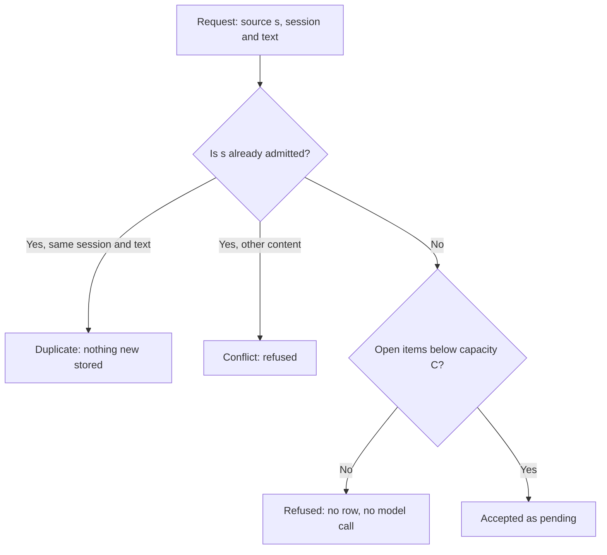
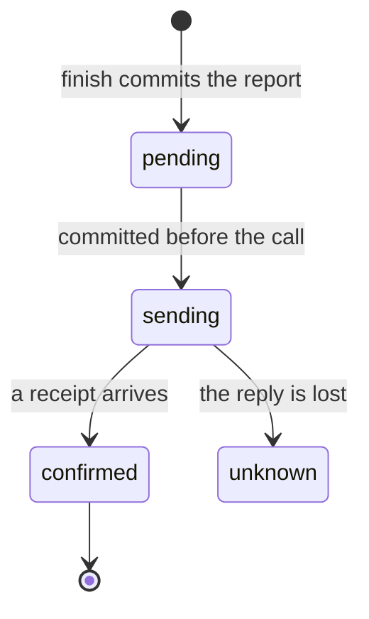
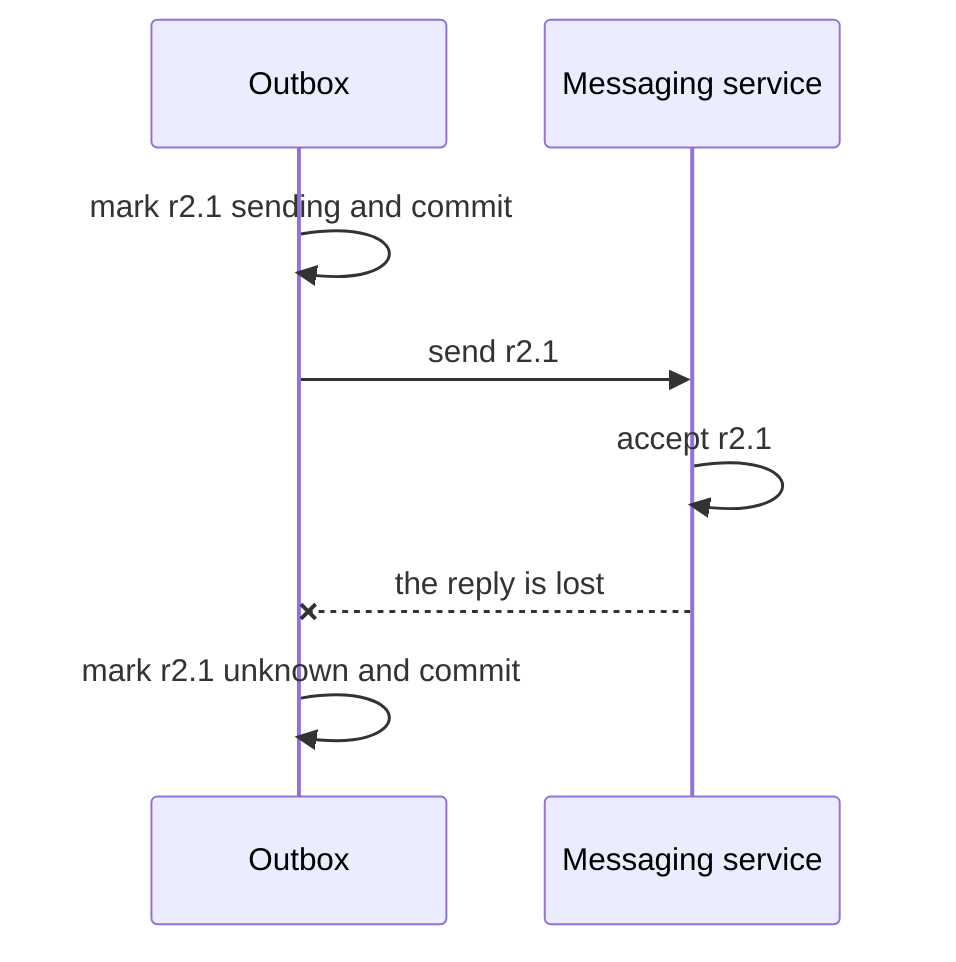

# Chapter 7 — Build a durable work inbox and report outbox

> **Learn with Prof Rod** — *Build Your Always-On AI Agent From Scratch*.
> **Read the full book and get the latest learning materials:** [https://profrod.ai/book](https://profrod.ai/book).
> **Join the Prof Rod learner community:** [https://profrod.ai/community](https://profrod.ai/community)
> — bring your questions, compare experiments and share what you build.
> **Original source and updates:** [profrodai/sovereign-agent](https://github.com/profrodai/sovereign-agent).

**Status: DRAFT.** Read the [textbook guide](../profrod-sovereign-agent-textbook-start-here.md) for setup and supplied-code boundaries. Practice in [Exercise Book 7](../../exercises/ch07/profrod-sovereign-agent-ch07-durable-inbox-outbox-exercise-guide.md); consult [Solutions 7](../../solutions/ch07/profrod-sovereign-agent-ch07-durable-inbox-outbox-solutions-guide.md) after attempting the work. Both ninety-minute units run on Google Colab with the standard library only. Chapters 8 and 9 still use the supplied queue until they are rebuilt on this one.

Lucy is in the car park with a box of cones under one arm. She taps "Prepare the opening brief" on her phone, the signal drops, and she taps it again. Two things can go wrong from here, and they are different.

The first is on the way in. Did the shop's program receive one request or two? If it runs the brief twice, the model is paid twice, and if the brief ever places orders, the shop orders twice. The second is on the way out. The program finishes the brief, records it, and sends it to Lucy's phone, and the messaging service accepts the message but the reply saying so never arrives. Should the program send it again? If it does, Lucy may get two briefs. If it doesn't, she may get none.

This chapter builds the mechanism that makes both questions answerable: an **inbox** of durable work, and an **outbox** of durable reports. It builds them on the Chapter 4 store and runs every request through your own Chapter 3 loop. Then it measures the two numbers that decide how to run them: how much work piles up, and what retrying a lost reply really costs.

## Learning objectives

By the end you will be able to:

1. Persist a request under the identity of the *occurrence*, and tell an identical duplicate from a conflicting one.
2. Refuse work before any model runs when the queue is full, and predict how full it gets with Little's law, $L = \lambda W$.
3. Name the states a work item may be in and the transitions between them, and make the database refuse any other transition.
4. Finish work and create its report in one transaction, and prove that no finished work can be observed without its report.
5. Send a report so that a lost reply becomes an honest *unknown*, and derive what resending would cost, in duplicate copies, against what it would gain.

You bring the Chapter 4 store and transactions, and the Chapter 3 loop. No queue, outbox or delivery-guarantee knowledge is assumed.

## Keep your implementation in a file

Create `book/textbook/learner/profrod_sovereign_agent_ch07_work_queue_learner.py`. It loads your Chapter 4 learner file for `StateStore`. The repository includes a completed comparison copy; the Chapter 7 checkpoint loads the learner file and checks it against this chapter's acceptance examples, running each request through your Chapter 3 loop with authored model turns:

```bash
uv run python book/textbook/checkpoints/profrod_sovereign_agent_ch07_durable_inbox_outbox_checkpoint.py
```

The queue code needs Python 3.12 or newer. The checkpoint also runs your Chapter 2 and 3 files, which currently use Python 3.14 syntax.

## A list forgets

The simplest inbox is a Python list: append each request, pop the oldest when the worker is free.

**Listing:** A list-backed inbox across a restart.

```python
import runpy
import sqlite3
import tempfile
from pathlib import Path

inbox = ["Prepare the opening brief", "Count vanilla"]
print("before restart:", inbox)
inbox = []  # what a new process starts with
print("after restart:", inbox)
```

```text
before restart: ['Prepare the opening brief', 'Count vanilla']
after restart: []
```

Nothing surprising, but it names the first requirement: a request the program has accepted must survive the program. Chapter 4 already built the place for that. The inbox becomes a table in Lucy's store, with its own line of schema versions, `work`.

## Identity belongs to the occurrence

Lucy's two taps sent the same text. The till, a minute later, might send the same text for a different reason. Text is not identity. What matters is the **occurrence**: this particular request, which the sender names with a **source identity**. A messaging service gives each message an identifier; the till numbers its requests; Chapter 9's clock will name each scheduled run by its time.

Admission is then the append function from Chapter 4, applied to occurrences instead of events. Let $Q$ be the set of admitted requests, each a triple $(s, \sigma, x)$ of source identity $s$, session $\sigma$ and text $x$:

$$
\mathrm{admit}(Q, (s, \sigma, x)) \;=\;
\begin{cases}
Q & \text{if } (s, \sigma, x) \in Q \quad \text{(duplicate)}\\
Q \cup \{(s, \sigma, x)\} & \text{if } s \notin \mathrm{ids}(Q) \quad \text{(accepted)}\\
\bot & \text{otherwise} \quad \text{(conflict)}
\end{cases}
$$

It inherits Chapter 4's proof: admitting the same occurrence twice leaves $Q$ as admitting it once. Lucy's second tap carries the same message identifier, so it is a duplicate, and the model runs once. The till's request carries its own identity, so it is new work even though its text is the same.

Two things this does *not* do. It does not decide who is allowed to ask: knowing an occurrence is new says nothing about whether its sender is Lucy. Authentication belongs to the adapter that receives the message (Chapter 8), and the queue keeps the identity it was given without letting any generated text replace it. And it does not make two different occurrences the same because their text matches. That is the right behaviour: "count vanilla" at 9:00 and at 11:00 are two counts.

## How full the inbox gets

An inbox that accepts everything will, on a bad morning, accept more than the worker can do. Each admitted request is a promise, and a promise the shop cannot keep is worse than a refusal it can explain. So admission is **bounded**: when the number of open items (pending or running) reaches a capacity $C$, a new request is refused before anything is stored and before any model runs.



**Figure:** Admission asks about identity before capacity, so a repeat is answered even when the inbox is full, and refused work leaves no row behind.

How large should $C$ be? Let $L$ be the average number of open items, $\lambda$ the average rate at which requests are accepted, and $W$ the average time from admission to finish. **Little's law** says

$$
L = \lambda W.
$$

It holds for almost any queue, whatever the order of service and whatever the distributions, and the argument is short. Draw $L(t)$, the number of open items at time $t$, over a long period $[0, T]$. The area under that curve can be counted two ways. Row by row, it is $\int_0^T L(t)\,dt = \bar{L}\,T$. Item by item, each item contributes one unit of height for as long as it is open, so the area is also the sum of all items' times in the system, $\sum_i W_i = N \bar{W}$, where $N$ is the number of items. Setting the two equal, $\bar{L} = (N/T)\,\bar{W} = \lambda \bar{W}$. Items still open at the edges of the period make the two counts differ slightly, and the difference shrinks as $T$ grows.

The law tells you what a capacity means. If Lucy's worker takes three minutes per brief and requests arrive at 0.3 per minute, the worker is busy 90% of the time. From the experiment below, an unbounded queue then averages about five open items, and each one waits about sixteen minutes. With $C = 3$, about one request in nine is refused, and those accepted wait about five minutes. Neither is free, but the second makes a promise the shop can keep, and says so when it can't.

## Name the states

"Pending", "running" and "finished" are only useful if they cannot be arbitrary labels. A **state machine** lists the states and the transitions allowed between them:

$$
\text{pending} \xrightarrow{\ \text{claim}\ } \text{running} \xrightarrow{\ \text{finish}\ } \text{finished}.
$$

Nothing else is allowed. Finished work does not go back to pending; pending work does not jump to finished without having run. The queue enforces this twice. Its methods only ever make these two moves. And a trigger in the database refuses any other `UPDATE` of the state, whoever issues it.

A trigger runs *implicitly*: code that updates the state never mentions it, and it fires anyway. That is its strength and its danger. It catches a bug you did not know you had. It also surprises a reader who does not know it is there. So the trigger in this chapter enforces exactly one rule you can read in the migration, and the Python code makes the same moves explicitly.

A **claim** moves one pending item to running for one worker, and commits before the work starts. On an empty queue it returns nothing, and the worker calls no model. The queue remembers which worker claimed which item, so a worker cannot finish work it did not claim.

## Finish and report together

When the work is done, two things must be recorded: the work is finished, and there is a report to send. If the program stops between the two, the shop has finished work with no report. The customer will never hear, and nothing on disk says they should.

Write the two invariants the outbox must keep:

$$
\text{(R1)}\quad \forall w:\ \mathrm{state}(w) = \text{finished} \Rightarrow \exists r:\ \mathrm{work}(r) = w
\qquad
\text{(R2)}\quad \forall r:\ \mathrm{state}(\mathrm{work}(r)) = \text{finished}.
$$

Every finished item has a report, and every report belongs to finished work. The finish transaction moves one item from running to finished *and* inserts its report. It preserves both invariants when it runs in full, and Chapter 4's atomicity means no one ever observes it run in part. By the same induction as Chapter 4, R1 and R2 hold in every observable state.

A report is also immutable. Its identity names the work and a **generation**, `r2.1` for the first report of work item 2. A trigger refuses any change to what it says. If later recovery (Chapter 12) produces a second terminal result, it creates `r2.2` rather than rewriting `r2.1`, which may already be on Lucy's phone.

## The whole queue

**Listing:** The work queue on top of your Chapter 4 store.

```python
work_module = runpy.run_path(
    "book/textbook/learner/profrod_sovereign_agent_ch07_work_queue_learner.py"
)
StateStore, WorkQueue = work_module["StateStore"], work_module["WorkQueue"]
FakeService, work_once = work_module["FakeService"], work_module["work_once"]
TransitionError = work_module["TransitionError"]
print(sorted(work_module["TRANSITIONS"]))
print(work_module["WORK_MIGRATIONS"][1][3])
```

```text
[('pending', 'running'), ('running', 'finished')]
CREATE TRIGGER report_body_fixed BEFORE UPDATE OF body, work_id, generation ON reports BEGIN SELECT RAISE(ABORT, 'a report never changes what it says'); END
```

Open the learner file beside this page as you read the rest. `admit`, `claim`, `finish` and `send_one` each run inside one `store.immediate()` transaction, and each is a direct translation of a rule above.

**Listing:** Admission: duplicates, conflicts, separate occurrences and a full queue.

```python
workspace = Path(tempfile.mkdtemp(prefix="ch07-"))
store = StateStore(workspace / "shop.sqlite3")
store.initialize()
queue = WorkQueue(store, capacity=3)

for source, session, text in [
    ("s1", "lucy", "Prepare the opening brief"),
    ("s1", "lucy", "Prepare the opening brief"),
    ("s1", "lucy", "Order everything"),
    ("s2", "lucy", "Prepare the opening brief"),
    ("s3", "till", "Count vanilla"),
    ("s4", "till", "Count chocolate"),
]:
    print(source, queue.admit(source, session, text))
print(store.connection.execute("SELECT source_id, state FROM work ORDER BY work_id").fetchall())
```

```text
s1 accepted
s1 duplicate
s1 conflict
s2 accepted
s3 accepted
s4 refused
[('s1', 'pending'), ('s2', 'pending'), ('s3', 'pending')]
```

The refused request left no row. Nothing was promised, so nothing is owed.

**Listing:** Run the oldest request through your Chapter 3 loop and finish it with its report.

```python
loop = runpy.run_path("book/textbook/learner/profrod_sovereign_agent_ch03_agent_loop_learner.py")


def run_through_loop(text):
    model = loop["ReplayModel"](loop["opening_turns"]())
    tools = loop["shop_tools"]
    dispatcher = tools["build_tools"](tools["SHOP"])
    messages = [*loop["messages"][:1], {"role": "user", "content": text}]
    return loop["run_loop"](model, dispatcher, messages, limits=loop["Limits"]()).answer


print(work_once(queue, "w1", run_through_loop))
print(store.connection.execute("SELECT report_id, body, delivery FROM reports").fetchall())
```

```text
r1.1
[('r1.1', 'Drafts: vanilla 6 tubs, strawberry 4 tubs; total 2600 pence GBP. No purchase.', 'pending')]
```

The report's text is your loop's answer. A queue test that used a hard-coded string would pass even if your loop had never run. This one cannot.

**Listing:** A failure between finishing and reporting, and a worker that did not claim the work.

```python
from dataclasses import replace


def stop():
    raise RuntimeError("stopped between finish and report")


assignment = queue.claim("w1")
try:
    queue.finish(assignment, "brief", between=stop)
except RuntimeError as error:
    print(error)
print(store.connection.execute("SELECT source_id, state FROM work ORDER BY work_id").fetchall())
try:
    queue.finish(replace(assignment, worker_id="w2"), "brief")
except TransitionError as error:
    print(error)
print(queue.finish(assignment, "brief"))
```

```text
stopped between finish and report
[('s1', 'finished'), ('s2', 'running'), ('s3', 'pending')]
work 2 is not running for this worker
r2.1
```

After the injected failure, `s2` is still running and has no report: neither half of the finish committed. Worker `w2` is refused. The claiming worker then finishes it normally.

## The network is outside the transaction

The report now sits in the outbox, committed. Sending it means calling a service on the other side of a network, and no database transaction can include that call. The service keeps its own records, and a crash can happen at any instant around the call.

So the outbox moves each report through its own small state machine. `send_one` picks the oldest pending report, marks it **sending**, and commits *before* calling the service. When the call returns a receipt, it marks the report **confirmed**. When the call fails in a way that means "the service may have accepted this", it marks the report **unknown**. An unknown report is never picked up again by `send_one`.



**Figure:** Each report moves through its own states, and `sending` is on disk before the network is touched, so a crash during the call is visible afterwards.



**Figure:** The service holds the report while the shop has heard nothing, so the outbox records what it knows, unknown, instead of guessing.

**Listing:** One confirmed send, then a send whose reply is lost.

```python
service = FakeService()
print(queue.send_one(service))
service.lose_reply = True
print(queue.send_one(service))
service.lose_reply = False
print(queue.send_one(service))
print("service accepted:", service.accepted)
store.close()
```

```text
('r1.1', 'confirmed')
('r2.1', 'unknown')
None
service accepted: ['r1.1', 'r2.1']
```

The service accepted `r2.1`; the shop does not know that, and says so. What should happen next is a decision, and the arithmetic below is what it should rest on.

## What resending costs

Model one send. With probability $\ell$ it is lost before the service sees it. Otherwise the service accepts it, and with probability $p$ the reply is lost on the way back. The sender cannot tell these apart: in both cases it hears nothing. So the probability of hearing nothing is

$$
r = \ell + (1 - \ell)\,p.
$$

**Never resend** (what `send_one` does). The report is delivered if the first send reached the service:

$$
P(\text{delivered}) = 1 - \ell, \qquad \mathbb{E}[\text{copies}] = 1 - \ell, \qquad P(\text{two or more copies}) = 0.
$$

**Resend until a reply, at most $k$ sends.** Send $i$ happens only if sends $1, \dots, i-1$ all went unanswered, which has probability $r^{i-1}$. Each send that happens is accepted with probability $1 - \ell$. Summing,

$$
\mathbb{E}[\text{copies}] = (1 - \ell)\sum_{i=1}^{k} r^{i-1} = (1 - \ell)\,\frac{1 - r^{k}}{1 - r},
$$

and the report is missed only if all $k$ sends were lost before arrival, so $P(\text{delivered}) = 1 - \ell^{k}$. Exactly one copy arrives in two ways. The accepted send is the first to reach the service and its reply arrives. Or it is the only send ever accepted, its reply lost, and every other send lost before arrival. So

$$
P(\text{exactly one}) = (1 - p)(1 - \ell^{k}) + k\,p\,(1 - \ell)\,\ell^{k-1},
$$

and $P(\text{two or more}) = 1 - \ell^{k} - P(\text{exactly one})$.

**Resend, and the receiver drops repeated report identities.** Delivery is as good as resending, $1 - \ell^{k}$, and copies never exceed one.

### Run the experiment

The experiment sends 100,000 reports under each policy with $\ell = 0.02$ and $p = 0.05$:

```bash
uv run python book/textbook/experiments/profrod_sovereign_agent_textbook_ch07_work_v1.py --out ch07-work-receipt.json
```

One run, recorded on 2026-09-26 on macOS 26.6.2 (arm64) with Python 3.14.3:

| Policy | Delivered (model) | Copies per report (model) | Two or more copies (model) |
| --- | --- | --- | --- |
| Never resend | 0.9802 (0.9800) | 0.9802 (0.9800) | 0 (0) |
| Resend, at most 3 sends | 1.0000 (1.0000) | 1.0524 (1.0523) | 0.0498 (0.0499) |
| Resend, receiver drops repeats | 1.0000 (1.0000) | 1.0000 (1.0000) | 0 (0) |

Resending buys the last 2% of deliveries and pays for it with about one duplicate in twenty. No sender-side cleverness removes that trade: a sender that hears nothing cannot know whether its message arrived. The only way to get both, every report delivered and none twice, is on the *receiving* side. The receiver must recognise a report identity it has already accepted. **At-least-once sending plus an idempotent receiver gives an exactly-once effect.** Exactly-once *sending* is not on offer.

That is why the report identity is immutable and why the outbox keeps it. Whether to resend an unknown report is then a decision about a specific service. If Chapter 8's messaging service drops repeated identities, resending is safe and the unknown can be retried. If it does not, the shop should ask Lucy, or check the conversation, before sending again. The outbox's job is to make that decision possible, not to make it silently.

The same experiment checks Little's law on your real queue: requests arrive at random with probability $\lambda$ per tick, one worker takes three ticks per item, and the open count is read from the database every tick.

| $\lambda$ | Capacity | $L$ measured | $\lambda W$ measured | $W$ | Refused |
| --- | --- | --- | --- | --- | --- |
| 0.2 | 1000 | 0.9435 | 0.9435 | 4.57 ticks | 0 |
| 0.3 | 1000 | 5.1185 | 5.1275 | 16.37 ticks | 0 |
| 0.3 | 3 | 1.4500 | 1.4501 | 5.19 ticks | 136 of 1,253 |

The law holds on every row, to the precision the edges of the run allow. The middle row shows why capacity is a decision and not a detail. At 90% utilisation an unbounded inbox is long, and every request in it waits.

## What one worker leaves open

This chapter's worker is deliberately single. If it crashes while an item is running, the item stays `running` forever: the state machine has no transition out, and this chapter adds none. That is honest, and it is visible. An independent reader can list every item stuck in `running`, and nothing pretends the work finished. Deciding when a running item's worker is truly gone, and giving the work to another worker without both finishing it, is Chapter 12's subject: leases, generations and fenced ownership.

## Hand the queue to messaging and schedules

Chapter 8's Telegram adapter becomes a *producer* for this inbox. It admits each authenticated message under the service's message identifier, and it acknowledges the message to the service only after `admit` has committed, so a crash between the two causes a duplicate, never a loss. Chapter 9's clock and stock producers admit their work the same way, naming each occurrence by its schedule. None of them runs the model directly. They all put work in one inbox, drained by one worker running your loop.

## Expected observations

Run the checkpoint from the repository root:

```bash
uv run python book/textbook/checkpoints/profrod_sovereign_agent_ch07_durable_inbox_outbox_checkpoint.py
```

It prints fifteen `ok` lines and ends with `Chapter 7 checkpoint: work is admitted once, finished with its report, and sent honestly.` Read these five closely:

- `s1 again, same content: duplicate`, and `s1 with other text: conflict`.
- `capacity 3: s3 accepted, s4 refused`, followed by `the refused request was never stored`.
- `s1 ran through the Chapter 3 loop and has one pending report`. The report's body is your loop's answer, not a fixed string.
- `failure between finish and report: neither committed`.
- `send r2.1, reply lost: unknown`, then `no pending report left; unknown is never resent`.

The last line is a negative control. The checkpoint plants finished work without a report and requires the invariant query to find it. If that line fails, the fault is in the check, and every green line above it is in doubt.

The experiment's receipt should show each policy's measured delivery, copies and duplicate rate within a few thousandths of the model over 100,000 reports, and $L$ equal to $\lambda W$ on every Little's-law row to the precision the run's edges allow.

## Learner verification

Check the queue from outside it. After your program has closed the file, open it with a separate connection and run the two outbox invariants as queries:

```sql
-- R1: finished work with no report. Must return no rows.
SELECT work_id FROM work
WHERE state = 'finished' AND work_id NOT IN (SELECT work_id FROM reports);

-- R2: a report whose work is not finished. Must return no rows.
SELECT report_id FROM reports JOIN work USING (work_id)
WHERE state != 'finished';
```

Then make each query fail on purpose, as Exercise 1 does for R1. A check that has never returned a row has not yet shown that it can.

Finally, list what an operator would need to decide by hand: every item still `running`, and every report left `unknown`. Both must be visible to that query, and neither may change by itself when the program restarts.

## Exercises that change the decision

### Exercise 1: Find the finished work nobody will hear about

Change `finish` to insert the report in a second, separate transaction. Use the `between` hook to stop after the first. Show with an independent query that R1 is broken, then restore the single transaction and show it holds.

### Exercise 2: Resend when it is safe

Add `retry_unknown(transport)` that resends one unknown report, but only if the transport declares that it drops repeated report identities. Show with `FakeService(idempotent=True)` that a report sent twice is accepted once, and with the default service that `retry_unknown` refuses to send.

### Exercise 3: Choose a capacity

Lucy's worker takes 4 minutes per brief, and on busy mornings requests arrive at 0.2 per minute. Predict $L$ and $W$ for an unbounded inbox. Then use the experiment's `little` function to measure them, and pick the smallest capacity for which accepted requests wait under 8 minutes on average. Report the refusal rate you pay for it.

### Exercise 4: A duplicate that is not a duplicate

The till sends `("t1", "till", "Count vanilla")` and, an hour later after a restart that reset its counter, `("t1", "till", "Count chocolate")`. What does the queue answer, and why is that the right answer even though the till is not misbehaving? Propose a source identity the till could use instead.

## Active recall and vocabulary

- **Inbox:** persisted requests awaiting work. **Outbox:** persisted reports awaiting delivery.
- **Source identity:** the name of an occurrence, chosen by its sender. It is not the text.
- **Capacity:** the most open work the queue will promise. Beyond it, requests are refused before anything is stored.
- **Little's law:** $L = \lambda W$, for almost any stable queue.
- **State machine:** the allowed states and transitions. Here a trigger refuses any other transition.
- **Unknown:** a send the service may have accepted. It is never silently resent.
- **Exactly-once effect:** at-least-once sending plus a receiver that drops repeated identities.

Answer without looking back: why does admission need the source identity rather than the text? Which two invariants does the finish transaction keep, and what would a reader see if they broke? With $\ell = 0.02$ and $p = 0.05$, what does resending up to three times cost per hundred reports?

## Summary

You gave Lucy's shop a durable inbox and outbox on the Chapter 4 store. Requests are admitted once per occurrence, by the same set semantics as Chapter 4's events. Admission is bounded before any model runs, and Little's law, measured on the real queue, says what a capacity costs. Work moves through a state machine that the database enforces. Finishing and reporting commit together, so no finished work can be observed without its report. Sending happens outside any transaction and records an honest unknown when the reply is lost. The arithmetic of resending, measured over 100,000 reports, shows that only the receiver can turn at-least-once delivery into an exactly-once effect.

Continue to [Chapter 8: Telegram](../ch08/profrod-sovereign-agent-ch08-telegram-messaging-chapter.md). [Exercise Book](../../exercises/ch07/profrod-sovereign-agent-ch07-durable-inbox-outbox-exercise-guide.md) · [Solutions Book](../../solutions/ch07/profrod-sovereign-agent-ch07-durable-inbox-outbox-solutions-guide.md) · [Textbook contents](../profrod-sovereign-agent-textbook-start-here.md).

## Keep building with Prof Rod

Found this material through a colleague, classroom or shared download? [Get the complete book at profrod.ai/book](https://profrod.ai/book) and [join the Prof Rod learner community](https://profrod.ai/community). Bring one result, one question or one failure you learned from. Share this resource with another learner and keep its source links with it so they can find the full course and future updates.
