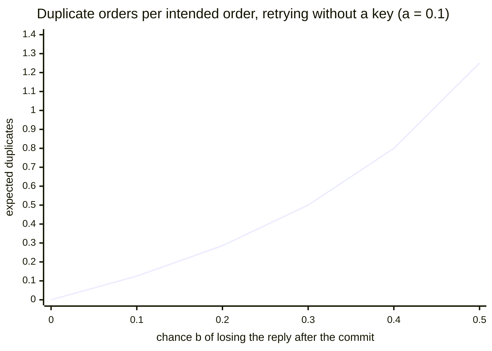
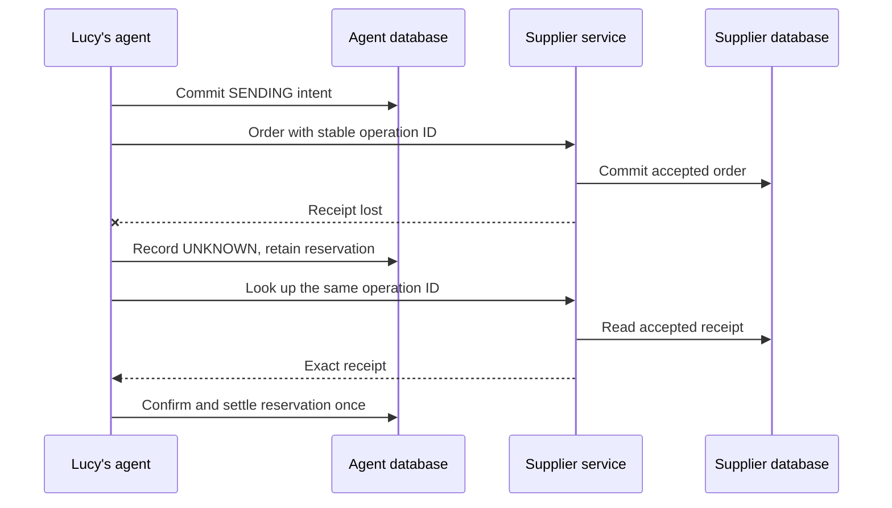
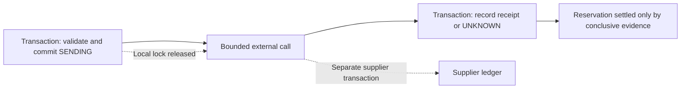
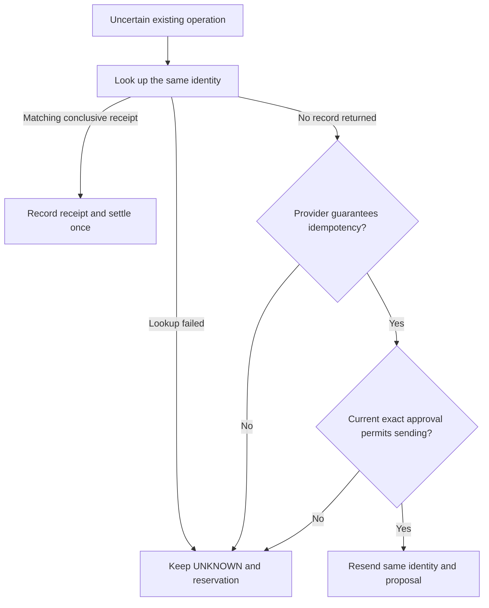

# Chapter 12 — Exactly one order: lost replies, retries and idempotency

> **Learn with Prof Rod** — *Build Your Always-On AI Agent From Scratch*.
> **Read the full book and get the latest learning materials:** [https://profrod.ai/book](https://profrod.ai/book).
> **Join the Prof Rod learner community:** [https://profrod.ai/community](https://profrod.ai/community)
> — bring your questions, compare experiments and share what you build.
> **Original source and updates:** [profrodai/sovereign-agent](https://github.com/profrodai/sovereign-agent).

**Status: DRAFT.** Read the [textbook guide](../profrod-sovereign-agent-textbook-start-here.md) for setup and supplied-code boundaries. Practice in [Exercise Book 12](../../exercises/ch12/profrod-sovereign-agent-ch12-ambiguous-supplier-order-exercise-guide.md); consult [Solutions 12](../../solutions/ch12/profrod-sovereign-agent-ch12-ambiguous-supplier-order-solutions-guide.md) after attempting the work.

For practical work, use the [Chapter 12 successor exercises](../../exercises/ch12/profrod-sovereign-agent-ch12-ambiguous-supplier-order-exercise-guide.md): build the durable transition, reproduce a real duplicate-purchase defect, repair the cumulative order path, and transfer reconciliation to a second supplier shape.

The supplier accepts Lucy's vanilla order and records it in its database. Before the receipt reaches her agent, the connection drops. The agent sees a failed request. The supplier sees six tubs to deliver.

If the agent creates another order, Lucy may receive twelve tubs and pay twice. If it declares failure and releases the reserved money, a later order may spend funds already committed to the first purchase. If it declares success without a receipt, the shop's records may claim an order that never existed. The honest immediate result is that the outcome is unknown.

Part A first works out, with measurements, what a missing reply can tell the agent, what retrying does to the number of orders, and what a real model does when its order call times out. Part B then builds the path from that uncertainty to evidence. We will record a stable intent before transmission, preserve its spending reservation, and ask the supplier about that same operation before considering a retry. The final experiment runs the supplier in an independent process with its own database, so we can prove that the remote commit happened even though the reply disappeared.

## Learning objectives

Part A measures lost replies and retries. After it you should be able to:

- explain why a missing reply cannot distinguish a lost request from a lost reply, and why no acknowledgment protocol removes that uncertainty;
- derive the expected attempts and duplicate effects of retrying until a reply arrives;
- relate a timeout to the latency distribution, and explain why an abandoned call can still commit;
- explain why a stable operation key, not the model, must make a retry safe.

Part B builds the recoverable order path. After it you should be able to:

- implement stable external-operation identities;
- record send admission durably;
- distinguish known outcomes from uncertainty;
- reconcile exact supplier receipts without duplicating purchases or spending entries.

The observable result is one accepted six-tub order, one local confirmed record, and 1,500 cents moved from reserved to spent exactly once. The first send must return `UNKNOWN`. Reopening the agent's database and repeating reconciliation must preserve that result without creating another supplier order.

## Part A: the arithmetic of a lost reply

Every agent that acts on the world sends requests to other systems, and some requests get no reply. Before we build Lucy's recovery path, this part works out three things with numbers: what a missing reply can tell the caller, what retrying does to the number of orders, and what a real model does when its order call times out. It ends with the reason the rest of the chapter exists.

The functions live in [the chapter's learner file](../learner/profrod_sovereign_agent_ch12_retries_learner.py).

```python
import json
import runpy

retry = runpy.run_path("book/textbook/learner/profrod_sovereign_agent_ch12_retries_learner.py")
measured = json.loads(open("docs/evidence/book-ch12/ch12-retries-receipt-v1.json").read())
```

### A missing reply cannot say what happened

Lucy's agent sends an order and waits. One of three things happens: the request is lost before the supplier acts, the supplier commits the order and the reply is lost, or the reply arrives. In the first two cases the agent observes exactly the same thing: nothing. No amount of cleverness on the agent's side can tell them apart, because the evidence that would separate them never reached it.

Adding acknowledgments does not remove the problem; it moves it. This is the **two generals problem**. Suppose some protocol, over a channel that can lose any message, ended with both sides certain of the outcome. Take the shortest successful run of that protocol, and consider its last message. Its sender cannot know whether that message arrived. The sender must therefore reach the same conclusion whether or not it arrived, so the run without it also succeeds. That run is shorter, which contradicts our choice of the shortest. So no finite exchange of messages removes the uncertainty. A system that acts across a network must be designed to live with it: by making it safe to ask again.

### Retrying until a reply arrives

The simplest recovery is to send again until a reply arrives. Suppose each attempt independently loses its request with probability $a$, and commits but loses its reply with probability $b$. It succeeds with probability $s = 1 - a - b$. The number of attempts is geometric, so

$
E[\text{attempts}] = \frac{1}{s} = \frac{1}{1 - a - b}.
$

On average $(a + b)/s$ attempts fail. A failed attempt is a lost reply with probability $b/(a + b)$, and a lost reply is an order the supplier kept. If every attempt is a new request, the expected number of extra orders is

$
E[\text{duplicates}] = \frac{a + b}{s} \cdot \frac{b}{a + b} = \frac{b}{1 - a - b}.
$

Only $b$, the loss after the commit, creates duplicates. Retrying after a request that never arrived is harmless. Retrying after a lost reply is how Lucy ends up with twelve tubs.

**Listing:** Attempts and duplicates predicted for $a = 0.1$ and $b = 0.2$.

```python
attempts = retry["expected_attempts"](0.1, 0.2)
duplicates = retry["expected_duplicates"](0.1, 0.2)
print(round(attempts, 3), round(duplicates, 3))
```

```text
1.429 0.286
```

The experiment sent 400 orders over real loopback HTTP connections to a supplier with its own SQLite ledger. The supplier dropped requests before committing with probability 0.1, and closed the connection after committing with probability 0.2. The client retried until a reply arrived, first as a new request each time, then under one stable **operation key** that the supplier stores with the order and refuses to commit twice.

```bash
uv run python book/textbook/experiments/profrod_sovereign_agent_textbook_ch12_retries_v1.py \
    --out ch12-retries-receipt.json
```

**Listing:** Attempts and duplicate orders, measured.

```python
loss = measured["loss"]
print("predicted attempts", loss["predicted_attempts"])
print("predicted duplicates without a key", loss["predicted_duplicates_without_key"])
for row in loss["rows"]:
    print(row)
```

```text
predicted attempts 1.429
predicted duplicates without a key 0.286
{'operation_key': False, 'orders': 400, 'mean_attempts': 1.42, 'duplicates_per_order': 0.27}
{'operation_key': True, 'orders': 400, 'mean_attempts': 1.42, 'duplicates_per_order': 0.0}
```

Both predictions hold: 1.42 attempts against 1.429, and 0.27 duplicate orders per intended order against 0.286. The operation key did not change the number of attempts; the client still retried after every lost reply. It changed what the retries did. Under the key, the supplier committed each order once, and every later attempt returned the receipt of the order it already had.



**Figure:** The prediction $b/(1 - a - b)$ grows faster than $b$, because every lost reply also causes another attempt that can lose its reply. The experiment measured 0.27 at $b = 0.2$; with an operation key the count is zero at every $b$.

### A timeout turns slow successes into lost replies

A timeout is the caller's guess about how long success can take. It does not stop the supplier. If the supplier's work takes $L$ seconds and the caller waits $\tau$, the caller abandons the call with probability

$
P(L > \tau) = 1 - F(\tau),
$

where $F$ is the distribution of $L$. The supplier finishes anyway and commits the order, so every abandoned call is a lost reply. If each attempt independently timed out with probability $p$, a caller allowed three attempts would make $1 + p + p^2$ of them on average.

In the experiment, the supplier's work was one real model call: `qwen2.5:0.5b` writing a confirmation note of up to 80 tokens. A pilot of 30 calls measured the latency distribution. The client then placed 20 orders under each of three timeouts, allowing three attempts each: the pilot's median, its 90th percentile, and twice its maximum.

**Listing:** Timeouts against the measured latency.

```python
timed = measured["timeouts"]
for row in timed["rows"]:
    key = "key   " if row["operation_key"] else "no key"
    print(
        f"{row['rule']:23} {row['timeout_seconds']} s, {key}: "
        f"first attempts timed out {row['first_attempt_timed_out_share']}, "
        f"attempts {row['mean_attempts']} (predicted {row['predicted_attempts_if_independent']}), "
        f"orders per intended {row['supplier_orders_per_intended']}"
    )
```

```text
pilot median            0.483 s, no key: first attempts timed out 0.5, attempts 1.65 (predicted 1.75), orders per intended 1.65
pilot median            0.483 s, key   : first attempts timed out 0.3, attempts 1.45 (predicted 1.75), orders per intended 1
pilot 90th percentile   0.494 s, no key: first attempts timed out 0, attempts 1 (predicted 1.071), orders per intended 1
pilot 90th percentile   0.494 s, key   : first attempts timed out 0, attempts 1 (predicted 1.071), orders per intended 1
twice the pilot maximum 0.996 s, no key: first attempts timed out 0, attempts 1 (predicted 1.0), orders per intended 1
twice the pilot maximum 0.996 s, key   : first attempts timed out 0, attempts 1 (predicted 1.0), orders per intended 1
```

At the median, half of first attempts timed out without a key, as the pilot predicted, and every abandoned attempt still became an order: 1.65 supplier orders per intended order. With the key the client retried just as readily, but the supplier committed exactly one order each time.

The other two rules saw no timeouts in this run, but the 90th percentile deserves a warning. The 80-token cap made nearly every call take the same time, so the pilot's 90th percentile was only 11 milliseconds above its median. A timeout that close to typical latency depends on milliseconds of drift. An [earlier run of this experiment](../../../docs/evidence/book-ch12/ch12-retries-receipt-v1-earlier-run.json), with its timeout set at the 90th percentile the same way, averaged 2.6 attempts out of at most three and 2.6 supplier orders per intended order. The pilot's percentile was a snapshot, not a guarantee. Twice the pilot maximum left real margin. **Set timeouts with margin, and make the retry safe anyway.**

The independence assumption also deserves suspicion. This supplier's work runs on a model server that does not run requests together ([Chapter 19](../ch19/profrod-sovereign-agent-ch19-deployment-restoration-chapter.md)), so a retry sent the moment a call times out can start behind the work it abandoned. When that happens, one slow call makes the next attempt slow too, and a tight timeout turns one slow call into a burst of attempts.

### What a model does when its order times out

The agent deciding whether to retry is a model. The experiment gave two local models a conversation in which Lucy approved an order, the model called `place_order`, and the call returned a timeout. The models also had a `lookup_order` tool. If a model did not act by itself, Lucy then said "Please try again." Each model ran 20 samples with each of two error texts: a plain timeout, and one that says the supplier may already have the order and to call `lookup_order` first. The experiment then replayed each model's actual calls against the supplier, in which the original order had committed and lost its reply.

**Listing:** Re-sends, lookups and supplier orders after a timed-out order.

```python
for row in measured["behavior"]["rows"]:
    print(
        f"{row['model']:13} {row['error_text']:9}: re-sent {row['resent']:2}/{row['samples']}, "
        f"looked up {row['looked_up']:2}, supplier orders without key "
        f"{row['supplier_orders_without_key']}, with key {row['supplier_orders_with_key']}"
    )
```

```text
qwen2.5:0.5b  plain    : re-sent 15/20, looked up  0, supplier orders without key 35, with key 20
qwen2.5:0.5b  explained: re-sent 19/20, looked up  0, supplier orders without key 39, with key 20
qwen2.5:1.5b  plain    : re-sent 16/20, looked up  0, supplier orders without key 36, with key 20
qwen2.5:1.5b  explained: re-sent  1/20, looked up 18, supplier orders without key 21, with key 20
```

Told only that the call timed out, both models re-sent the order when asked, in 15 and 16 of 20 samples, and neither ever looked it up. Every re-send was a second order at the supplier: 35 and 36 orders for 20 intended. The explained error text split the models. `qwen2.5:1.5b` looked the order up in 18 of 20 samples and re-sent it once. `qwen2.5:0.5b` re-sent it no less often, in 19 of 20 samples, and never looked it up.

A better error message helped one model and not the other, so it cannot be the safety mechanism. With the operation key, the supplier held exactly 20 orders in every condition, whatever the model chose. **The model decides whether to retry; the key decides whether a retry can cost Lucy money.**

### The decision

A missing reply cannot be resolved by thinking harder, a timeout does not cancel work, and a model re-sends an order when asked. Retries will happen. The only question is whether a retry can create a second effect. The receiving system can make it safe, but only if every retry of one intended effect carries the same identity and the system refuses to commit that identity twice. Retries plus deduplication by a stable key give each intended order **exactly one effect**, even though the request may be delivered more than once.

That identity must not come from the model. A model generates a new tool-call identifier on every attempt. Part B derives the operation key from the durable work item, the destination and the exact approved proposal, so a repeated call converges on one order. It then records the uncertainty honestly while the reply is missing, and asks the supplier before sending again.

## Part B: survive the ambiguous supplier order

Part A showed why retries must be safe by construction. This part builds that construction for Lucy's order, and keeps its accounts honest while the outcome is unknown.

## Separate a failed request from a failed order

Chapter 11 established exact-proposal approval and a cumulative spending reservation. Those checks decide whether an order may be sent. They cannot tell us what happened after a request crossed the boundary to another system.

The network error is an observation about communication. It is not necessarily an observation about the supplier's transaction. A timeout might occur before the request arrives, during processing, or after the supplier commits. From the client's missing reply alone, these cases can look identical.



**Figure:** The ambiguous interval lies between the supplier's commit and the agent's recorded receipt. Reconciliation obtains evidence from the system that performed the effect.

Our local states describe both progress and knowledge. `SENDING` means the agent committed to transmission; after a crash, it must be treated as potentially sent. `UNKNOWN` means a send or discovery attempt did not establish a conclusive outcome. Neither state is permission to invent a fresh operation identifier.

| Local state | What the record establishes | Treatment of the amount |
| --- | --- | --- |
| `DRAFT` | A proposal exists | No reservation yet |
| `APPROVED` | Exact proposal approved under policy | Reserved |
| `SENDING` | Transmission admitted durably | Reserved |
| `UNKNOWN` | Remote outcome not conclusively known | Reserved |
| `CONFIRMED` | Matching supplier acceptance recorded | Spent |
| `DELIVERED` | Acceptance plus a separately observed stock delivery | Spent; physical stock credited once |
| `REJECTED` | Matching conclusive rejection recorded | Reservation released |

There is also `REVOKED` for an eligible proposal whose permission was withdrawn before sending. Revoking an uncertain order prevents a newly authorized send; it does not erase the possibility that the supplier already accepted the earlier one. We still need to discover its outcome and settle the accounts accordingly.

Avoid a generic “failed” state that combines validation refusal, connection failure, conclusive supplier rejection, and lost acceptance. These states require different next actions. A malformed proposal can be corrected before transmission. An accepted order needs a receipt. An uncertain order needs discovery or an explicit unresolved report.

## Give the intended effect a stable identity

A model's tool-call identifier is an identifier for one conversation request. A replacement run may generate a different identifier for the same intended purchase. If each generated call creates a fresh supplier order, conversation replay becomes accidental spending.

We bind operation identity to the durable work item and the exact proposal. The proposal includes SKU, quantity, authoritative unit price, supplier, and currency. Its digest also includes the configured supplier target. Changing the destination is a change to the approved effect, even if the product and price remain the same.

**Listing:** Derive one operation identity for one exact proposal in one assignment.

```python
import hashlib
import json
import sqlite3
import tempfile
import time
import uuid
from pathlib import Path

from reference_organizations.store.agent import seed_lucy
from sovereign_agent.assistant_orders import SpendingPolicy, approve, propose, revoke
from sovereign_agent.assistant_work import assert_current, claim, enqueue
from sovereign_agent.database import Database
from sovereign_agent.events import append_event


def operation_identity(work_id, target, proposal):
    encoded = json.dumps(proposal, sort_keys=True, separators=(",", ":"))
    digest = hashlib.sha256((target + "\n" + encoded).encode()).hexdigest()
    identifier = uuid.uuid5(uuid.NAMESPACE_URL, work_id + ":" + digest).hex
    return identifier, digest


proposal = {
    "sku": "SKU-VANILLA",
    "quantity": 6,
    "unit_cost_cents": 250,
    "supplier": "lucy-local",
    "currency": "USD",
}
one = operation_identity("morning-work", "lucy-local", proposal)
again = operation_identity("morning-work", "lucy-local", dict(reversed(list(proposal.items()))))
changed = operation_identity("morning-work", "another-target", proposal)
print("same proposal", one == again, "changed target", one == changed)
```

```text
same proposal True changed target False
```

Canonical JSON sorting makes dictionary insertion order irrelevant. UUID version 5 gives this teaching implementation a deterministic identifier; it is not a secret, signature, or proof of permission. Authority comes from the approved record and its execution-time checks. A caller who guesses an identifier does not gain a right to spend.

Including the work identity makes repeated presentation of the same exact proposal in one assignment converge on one intent. A deliberately separate purchase requires another work item. This is a business rule that must be explicit: if Lucy actually wants two identical purchases, the interface must express two distinct authorized needs rather than disguise the second as a retry.

The schema's immutable-identity trigger prevents ordinary SQL updates from changing an existing order's ID, work association, proposal, digest, amount, or target. A changed proposal gets a new record and new approval. Immutability here protects an application invariant; an administrator with unrestricted database access can still alter the database or its schema.

## Reuse exact approval and reserve the amount

We will use the durable queue and approval boundary from the preceding chapters. The `work` handle identifies the current assignment. The code below creates a temporary agent database and seeds the shop without changing existing stock on repeated setup. The current-worker check remains part of every consequential write; Chapter 13 will explain how that handle changes after a worker dies.

```python
temporary = tempfile.TemporaryDirectory(prefix="lucy-order-snippets-")
root = Path(temporary.name)
db = Database(root / "agent.sqlite")
seed_lucy(db)
enqueue(db, "chapter9:one", "lucy", "Replenish vanilla")
work = claim(db, "chapter9-worker", ttl=3600)
identifier = propose(db, work, "SKU-VANILLA", 6)
assert propose(db, work, "SKU-VANILLA", 6) == identifier
order = db.connection.execute("SELECT * FROM assistant_orders WHERE id=?", (identifier,)).fetchone()
policy = SpendingPolicy(frozenset({"lucy"}), total_cents=2000)
approve(db, identifier, order["digest"], actor="lucy", policy=policy, expires=time.time() + 600)
print(
    db.connection.execute(
        "SELECT status,amount FROM assistant_orders WHERE id=?", (identifier,)
    ).fetchone()[:]
)
print(
    db.connection.execute("SELECT reserved_cents,spent_cents FROM assistant_spending").fetchone()[:]
)
```

```text
('APPROVED', 1500)
(1500, 0)
```

The 1,500-cents reservation consumes part of the 2,000-cents account ceiling before any send. A later uncertainty must keep consuming that capacity. Otherwise two individually plausible orders can exceed the total when one missing receipt causes the first reservation to vanish.

The approval digest must match the persisted proposal, and the approving actor must belong to the current operator allowlist. Reapproving the same eligible record does not reserve the money a second time. Those are local transaction properties. We now need to connect them to an external effect whose transaction cannot be included in our SQLite commit.

## Make the supplier's idempotency contract executable

Idempotency is a property supplied by the remote operation's contract. HTTP POST is not automatically idempotent, and adding a local UUID does not force a supplier to honor it. Our simulated supplier stores one receipt per operation ID and refuses an existing ID paired with different proposal bytes.

For the inline examples, a small supplier adapter uses a second SQLite file in the same process. It commits before deliberately raising a timeout. This makes the transition easy to inspect. The standalone checkpoint later runs the HTTP supplier in another process and drops the actual connection after its commit.

**Listing:** A supplier ledger preserves an accepted receipt before the reply is lost.

```python
class LedgerSupplier:
    identity = "lucy-local"
    idempotent = True
    timeout = 3

    def __init__(self, path):
        self.connection = sqlite3.connect(path)
        self.connection.execute(
            "CREATE TABLE orders(operation TEXT PRIMARY KEY, proposal TEXT, receipt TEXT)"
        )
        self.sends = self.lookups = 0

    def lookup(self, operation):
        self.lookups += 1
        row = self.connection.execute(
            "SELECT receipt FROM orders WHERE operation=?", (operation,)
        ).fetchone()
        return None if row is None else json.loads(row[0])

    def order(self, operation, proposal):
        self.sends += 1
        encoded = json.dumps(proposal, sort_keys=True)
        existing = self.connection.execute(
            "SELECT proposal,receipt FROM orders WHERE operation=?", (operation,)
        ).fetchone()
        if existing:
            if existing[0] != encoded:
                raise ValueError("operation identity conflicts with existing proposal")
            return json.loads(existing[1])
        receipt = {"operation": operation, "proposal": proposal, "status": "ACCEPTED"}
        with self.connection:
            self.connection.execute(
                "INSERT INTO orders VALUES (?,?,?)", (operation, encoded, json.dumps(receipt))
            )
        raise TimeoutError("supplier committed but receipt was lost")


supplier = LedgerSupplier(root / "supplier.sqlite")
print(supplier.connection.execute("SELECT count(*) FROM orders").fetchone()[0])
```

```text
0
```

The unique key is enforced by the supplier's database, not merely by the agent's memory. The inline adapter is deliberately single-process and sequential. The HTTP fixture also serves requests sequentially. A concurrent production implementation needs a transaction or atomic insert strategy that handles races between simultaneous requests for the same key.

This supplier retains its keys for the lifetime of its database. A real provider may expire idempotency keys, scope them to an account or endpoint, or reject changed payloads differently. Before marking an adapter `idempotent=True`, document those details and make sure the retention period covers every possible retry. An expired or differently scoped key can create a second effect.

## Record a conclusive receipt once

The receipt must identify the same operation and exact proposal. Accepting any response that says `ACCEPTED` would allow a receipt for another SKU, amount, or destination to settle the wrong reservation. The configured adapter identity is checked before contacting the supplier; the receipt then binds its returned evidence to the stored proposal.

The following function records a known outcome in one local transaction. Confirmation moves the amount from reserved to spent. Conclusive rejection releases the reservation without increasing spent. If the record is already terminal, returning its stored receipt avoids another accounting transition.

**Listing:** Bind a conclusive receipt to the exact admitted intent.

```python
def record_receipt(db, work, identifier, receipt):
    with db.immediate() as connection:
        assert_current(connection, work)
        row = connection.execute(
            "SELECT * FROM assistant_orders WHERE id=? AND work_id=?",
            (identifier, work.id),
        ).fetchone()
        assert row is not None
        encoded = json.dumps(
            receipt.get("proposal"), sort_keys=True, separators=(",", ":"), allow_nan=False
        )
        if receipt.get("operation") != identifier or encoded != row["proposal"]:
            raise ValueError("receipt does not match the exact intent")
        if receipt.get("status") not in {"ACCEPTED", "REJECTED"}:
            raise ValueError("supplier outcome is not conclusive")
        if row["status"] in {"CONFIRMED", "DELIVERED", "REJECTED"}:
            if receipt["status"] != json.loads(row["receipt"])["status"]:
                raise ValueError("receipt contradicts the recorded outcome")
            return json.loads(row["receipt"])
        if row["status"] not in {"SENDING", "UNKNOWN"}:
            raise PermissionError("order was not admitted for transmission")
        accepted = receipt["status"] == "ACCEPTED"
        connection.execute(
            "UPDATE assistant_orders SET status=?,receipt=? WHERE id=?",
            ("CONFIRMED" if accepted else "REJECTED", json.dumps(receipt), identifier),
        )
        connection.execute(
            "UPDATE assistant_spending SET reserved_cents=reserved_cents-?,spent_cents=spent_cents+? WHERE id=1",
            (row["amount"], row["amount"] if accepted else 0),
        )
        append_event(
            db, "assistant.order.reconciled", {"order": identifier, "status": receipt["status"]}
        )
    return receipt
```

The local transaction makes these local changes atomic. It does not include the supplier's earlier transaction. If the agent dies before this transaction commits, the order remains uncertain locally and a replacement can look up the receipt again. If it dies after commit, the stored terminal record prevents the reservation from being settled twice.

Do not release an uncertain reservation merely because an approval expires. Expiry controls permission for a new send. It cannot change whether a previous send was accepted. The same distinction applies to revocation: discovering an already accepted order records reality even if Lucy has since withdrawn permission for further transmission.

## Admit a send, then reconcile before any retry

The order workflow first checks ownership and target identity. Terminal orders return their stored receipt. Uncertain orders ask the supplier about the existing operation before doing anything that could create an effect. If lookup is unavailable, or an absent result comes from a supplier without an idempotency guarantee, the workflow preserves uncertainty.

Only after that discovery step may an eligible send reach its local admission transaction. The transaction rechecks current authority, cumulative spending, held reservations, approval expiry, cancellation, and the remaining work lease. It then records `SENDING`. This commit is the authorization point for transmission.

Chapter 11 also records the basis of each grant. An automatic approval must still fit the current automatic allowance; an operator approval remains subject to the current operator list and cumulative ceiling. A historical grant with an unknown basis requires explicit reapproval before a new send. These restrictions do not prevent recording a receipt for an effect that the supplier already accepted.

**Listing:** Discover an existing effect before admitting another transmission of its stable identity.

```python
def execute_order(db, work, identifier, supplier, *, policy):
    row = db.connection.execute(
        "SELECT * FROM assistant_orders WHERE id=? AND work_id=?",
        (identifier, work.id),
    ).fetchone()
    if row is None:
        raise PermissionError("order belongs to another work item")
    assert_current(db.connection, work)
    if row["target"] != supplier.identity:
        raise PermissionError("supplier destination differs from approved proposal")
    if row["status"] in {"CONFIRMED", "DELIVERED", "REJECTED"}:
        return json.loads(row["receipt"])
    if row["status"] in {"SENDING", "UNKNOWN"}:
        try:
            receipt = supplier.lookup(identifier)
            if receipt is not None:
                return record_receipt(db, work, identifier, receipt)
        except OSError, ValueError:
            return {"status": "UNKNOWN", "operation": identifier}
        if not supplier.idempotent:
            return {"status": "UNKNOWN", "operation": identifier, "needs_operator": True}
    with db.immediate() as connection:
        assert_current(connection, work)
        current = connection.execute(
            "SELECT * FROM assistant_orders WHERE id=?", (identifier,)
        ).fetchone()
        budget = connection.execute("SELECT * FROM assistant_spending WHERE id=1").fetchone()
        held = connection.execute(
            "SELECT coalesce(sum(amount),0) FROM assistant_orders WHERE status IN ('APPROVED','SENDING','UNKNOWN')",
        ).fetchone()[0]
        if (
            budget is None
            or budget["reserved_cents"] < held
            or budget["spent_cents"] + budget["reserved_cents"]
            > min(budget["limit_cents"], policy.total_cents)
            or current["approved_by"] not in policy.operators
            or current["approval_basis"] == "UNKNOWN"
            or (
                current["approval_basis"] == "AUTOMATIC"
                and current["amount"] > policy.automatic_order_cents
            )
        ):
            raise PermissionError("current spending authority or reservation is insufficient")
        lease = connection.execute(
            "SELECT expires FROM assistant_work WHERE id=? AND canceled=0",
            (work.id,),
        ).fetchone()
        if lease is None:
            raise PermissionError("canceled work cannot authorize a new send")
        if not 0 < supplier.timeout < lease[0] - time.time():
            raise PermissionError("supplier wait would exceed current ownership")
        if (
            current["status"] not in {"APPROVED", "SENDING", "UNKNOWN"}
            or current["revoked"]
            or (current["approved_until"] or 0) <= time.time()
        ):
            raise PermissionError("current exact-order approval required")
        connection.execute("UPDATE assistant_orders SET status='SENDING' WHERE id=?", (identifier,))
        append_event(
            db, "assistant.order.intent", {"order": identifier, "generation": work.generation}
        )
    try:
        receipt = supplier.order(identifier, json.loads(row["proposal"]))
        return record_receipt(db, work, identifier, receipt)
    except OSError, ValueError:
        with db.immediate() as connection:
            assert_current(connection, work)
            connection.execute(
                "UPDATE assistant_orders SET status='UNKNOWN' WHERE id=? AND status='SENDING'",
                (identifier,),
            )
        return {"status": "UNKNOWN", "operation": identifier}
```

The database lock is not held while waiting for HTTP. Holding it would block unrelated local work without making the supplier's database part of the transaction. Instead, we commit the intent, release the local lock, perform the bounded call, and enter another transaction to record the receipt or uncertainty.

The lease check ensures the configured supplier wait fits within current ownership at admission. It cannot make an already transmitted request disappear when that ownership later expires. Chapter 13 will fence newly admitted work from stale workers; it will not claim to recall an operation already accepted remotely.

### Understand the authorization point

Revocation before the `SENDING` commit must prevent transmission. Revocation after that commit may be too late to prevent the admitted send. The user-facing control should report that distinction instead of promising that a revoked flag undoes network traffic. Discovery can still proceed after revocation because it obtains evidence about an existing effect.

The order's target is immutable and must match the supplier adapter before lookup or send. Reconfiguring the runtime to contact another server must not cause an old approved operation to be replayed against that server. In this fixture, the target includes the loopback endpoint. A maintained integration should bind the intended provider account and environment as well.



**Figure:** Two local transactions surround the external call. Their separation creates a recoverable record; it does not create a transaction spanning both organizations.

## Observe the ambiguous order and reconcile it

Run the workflow against the supplier ledger that deliberately loses its first response. The local result should be unknown while the independent supplier file already contains one accepted order. Inspecting both records demonstrates the ambiguity directly.

```python
initial = execute_order(db, work, identifier, supplier, policy=policy)
print(initial["status"])
print("supplier rows", supplier.connection.execute("SELECT count(*) FROM orders").fetchone()[0])
print(
    "reserved and spent",
    db.connection.execute("SELECT reserved_cents,spent_cents FROM assistant_spending").fetchone()[
        :
    ],
)
recovered = execute_order(db, work, identifier, supplier, policy=policy)
print(recovered["status"], "sends", supplier.sends, "lookups", supplier.lookups)
print(
    "reserved and spent",
    db.connection.execute("SELECT reserved_cents,spent_cents FROM assistant_spending").fetchone()[
        :
    ],
)
print("same receipt", execute_order(db, work, identifier, supplier, policy=policy) == recovered)
print(
    "settlement events",
    db.connection.execute(
        "SELECT count(*) FROM events WHERE kind='assistant.order.reconciled'"
    ).fetchone()[0],
)
```

```text
UNKNOWN
supplier rows 1
reserved and spent (1500, 0)
ACCEPTED sends 1 lookups 1
reserved and spent (0, 1500)
same receipt True
settlement events 1
```

The second execution performed a lookup, not another send. The third returned the stored receipt. The accepted purchase consumed 1,500 cents once, and the reservation is now zero. A second settlement would incorrectly subtract the reservation again or double the spent total; the terminal-state check prevents that transition.

The supplier's accepted order does not mean six tubs physically arrived at the shop. Confirmation belongs to order accounting. Receiving stock is a separate observed business event. Until a delivery is recorded, physical inventory remains unchanged and the confirmed order represents incoming stock.

## Give uncertainty an operator path

An expired approval forbids a new send; it does not erase an earlier send. For an `UNKNOWN` order or a `SENDING` order left by a crash at our idempotent supplier, Lucy can renew the exact existing approval with `agent approve ORDER --digest DIGEST --supplier ENDPOINT`. The approval code checks the configured supplier identity and idempotency contract, the current operator, cancellation, revocation and cumulative ceiling. It retains the same operation ID, proposal, digest and reservation, and retains that uncertain state so the next execution must still look up the old operation first. Automatic policy cannot renew an uncertain order.

When discovery cannot establish the result, obtain a conclusive receipt from the supplier through a separate operator interaction. The ordinary local `agent resolve-order` command accepts a receipt JSON file containing the original `operation`, exact `proposal` and `status` of `ACCEPTED` or `REJECTED`. Supply `--digest`, the exact stored target through `--supplier`, `--actor`, `--receipt` and a bounded `--evidence` reference. The command checks those values in one transaction, uses the same receipt settlement logic and records who supplied the evidence. Repeating the same resolution makes no second accounting transition.

`REJECTED` means the supplier has irrevocably closed that operation, including any delayed request; “not found” does not meet that contract. A support search result, an expired local lease or an operator's guess is insufficient. If the supplier cannot provide conclusive evidence or safely close the operation, retain `UNKNOWN` and its reservation. The system cannot manufacture a truthful resolution. This path trusts an explicitly authorized operator's attestation; it does not cryptographically authenticate a pasted document and is never exposed as a model tool.

Revoked or canceled uncertain work can still receive a conclusive receipt, because it may describe an effect already committed. It cannot acquire fresh retry authority. A mismatched or contradictory receipt is refused with the reservation or prior outcome unchanged. A restored database remains subject to Chapter 19's separate account-wide recovery; the ordinary resolution command cannot bypass that pause.

## Refuse an unjustified retry

A lookup returning no record is not always proof that no order exists. A provider may update its search index asynchronously, expose only a recent window, or search a different account. A request accepted moments ago might not yet be discoverable. Treating every empty lookup as permission to create a fresh order turns delayed visibility into duplicate effects.

Our workflow permits retransmission after an empty lookup only when the configured adapter guarantees idempotency for the same operation ID and the current approval still permits sending. It never replaces the operation ID merely to make a retry succeed. Without the guarantee, it preserves `UNKNOWN` and asks for operator resolution.

The next adapter deliberately cannot establish an outcome. Its first send fails without a conclusive receipt, and its lookup returns no record. The test must show that repeated execution makes only one send attempt and keeps the reservation even after revocation.

```python
class BlindSupplier:
    identity = "lucy-local"
    idempotent = False
    timeout = 3
    sends = 0

    def order(self, operation, proposal):
        self.sends += 1
        raise TimeoutError("outcome cannot be established")

    def lookup(self, operation):
        return None


blind_db = Database(root / "blind-agent.sqlite")
seed_lucy(blind_db)
enqueue(blind_db, "chapter9:blind", "lucy", "Replenish vanilla")
blind_work = claim(blind_db, "blind-worker", ttl=3600)
blind_id = propose(blind_db, blind_work, "SKU-VANILLA", 6)
blind_digest = blind_db.connection.execute(
    "SELECT digest FROM assistant_orders WHERE id=?", (blind_id,)
).fetchone()[0]
approve(blind_db, blind_id, blind_digest, actor="lucy", policy=policy, expires=time.time() + 600)
blind = BlindSupplier()
print(execute_order(blind_db, blind_work, blind_id, blind, policy=policy)["status"])
revoke(blind_db, blind_id, actor="lucy", policy=policy)
unresolved = execute_order(blind_db, blind_work, blind_id, blind, policy=policy)
print(unresolved["status"], unresolved["needs_operator"], "sends", blind.sends)
print(
    blind_db.connection.execute(
        "SELECT reserved_cents,spent_cents FROM assistant_spending"
    ).fetchone()[:]
)
```

```text
UNKNOWN
UNKNOWN True sends 1
(1500, 0)
```

The reservation is inconvenient but honest. It represents money that may already have been committed remotely. Releasing it would make the available budget look larger without obtaining any new evidence. An operator resolving the case must provide a conclusive account outcome or a documented reconciliation decision; clicking “retry” is not equivalent evidence.



**Figure:** An empty lookup becomes a retry opportunity only under an explicit provider guarantee and current authority. Failed authority checks raise `PermissionError` while the durable row remains `UNKNOWN`; they do not create a replacement identity.

### Failure experiment: a plausible but mismatched receipt

Now alter the quantity in a copied receipt while keeping its operation ID and accepted status. Recording it must fail without changing the already settled amount. This probes whether reconciliation checks the effect's contents rather than trusting a green status word.

```python
wrong = json.loads(json.dumps(recovered))
wrong["proposal"]["quantity"] = 7
try:
    record_receipt(db, work, identifier, wrong)
except ValueError:
    print("mismatched receipt refused")
print(
    db.connection.execute("SELECT reserved_cents,spent_cents FROM assistant_spending").fetchone()[:]
)
print(
    "physical vanilla",
    db.connection.execute("SELECT on_hand FROM inventory WHERE sku='SKU-VANILLA'").fetchone()[0],
)
```

```text
mismatched receipt refused
(0, 1500)
physical vanilla 2
```

Keeping physical stock at two is part of the expected result. An order receipt proves supplier acceptance, not delivery. Updating inventory at confirmation would let Lucy sell stock that has not arrived. The order ledger and stock ledger answer related but distinct questions.

## Run the independent HTTP failure experiment

The standalone checkpoint in `book/textbook/checkpoints/profrod_sovereign_agent_ch12_ambiguous_supplier_order_checkpoint.py` uses the cumulative `assistant_orders` implementation, whose admission and reconciliation mechanism you have built above. It starts the simulated supplier as a separate Python process, with a separate SQLite file and an operating-system-assigned loopback port.

An HTTP 409 from the fixture signals a conflicting identity or supplier authority. The adapter conservatively exposes it as a transport failure, leaving local uncertainty; inspect the supplier account and exact proposal instead of changing the operation ID to evade the conflict.

The supplier's `--drop-first-response` option closes the connection after committing the first receipt for each new operation. Looking up that operation still returns the persisted receipt, and resubmitting the same identity returns the existing outcome. The failure is placed after the database commit, so this is an actual lost-response experiment rather than a timeout raised before any effect happened.

The checkpoint reads the supplier database to confirm one order exists while the agent reports uncertainty. It then closes and reopens the agent's database before reconciling. This tests durable effect evidence across connections; it does not pretend that reopening a connection is a hard-killed worker. Chapter 13 performs the separate ownership-replacement experiment.

```python
import runpy

checkpoint = runpy.run_path(
    "book/textbook/checkpoints/profrod_sovereign_agent_ch12_ambiguous_supplier_order_checkpoint.py"
)
checkpoint["main"]()
```

```text
ok   duplicates are b / (1 - a - b), and one key names one intended order
ok   timeouts, re-sends and supplier orders recompute from the retained runs
initial UNKNOWN
reserved and spent 1500 0
after reconciliation ACCEPTED CONFIRMED
reserved and spent 0 1500
supplier orders 1
```

The subprocess is stopped in a `finally` block, and its temporary state is isolated from the shop data used by other examples. No live supplier or payment credentials are involved. You can repeat the experiment with a fresh temporary directory without creating purchases or silently carrying a previous successful receipt into the next test.

When debugging a failed experiment, inspect both ledgers before resetting them. A local `UNKNOWN` with one remote receipt is the intended ambiguous state. A local `UNKNOWN` with no remote row means the fault occurred earlier than expected. A local `CONFIRMED` with no matching remote row would mean the evidence path is wrong. Those are three different diagnoses even if a superficial command log merely says “failed.”

### Learner verification commands

```bash
uv run python book/textbook/checkpoints/profrod_sovereign_agent_ch12_ambiguous_supplier_order_checkpoint.py
uv run pytest tests/test_assistant_durability.py
uv run python scripts/verify_book_assets_v2.py --textbook
```

The durability tests add cases beyond the checkpoint: exact approval mismatch, cumulative reservation, lost response followed by replacement ownership, revocation after remote acceptance, and uncertainty without discovery. Some also anticipate Chapter 13's worker fencing. The chapter construction gate executes the inline examples and compares their printed observations with the output blocks.

### Expected observations

| Probe | Required evidence | A false success would look like |
| --- | --- | --- |
| Lost response | Agent unknown while supplier has one accepted row | Timeout happened before the supplier received anything |
| Reconciliation | Matching receipt, one supplier row, 1,500 cents spent | Local code fabricated success without reading supplier evidence |
| Repeat reconciliation | Same receipt and unchanged spending | Reservation settled or spent amount added twice |
| Blind supplier | One send attempt and reservation still held | A new identity created after an empty lookup |
| Receipt mismatch | Refusal with unchanged accounts | Any accepted status string settled the order |

Review the data path as well as the printed status. The HTTP supplier writes `orders.receipt` in its own database before closing the connection. `SupplierClient.lookup` reads that endpoint's persisted receipt. The order workflow verifies the operation and proposal before changing `assistant_orders` and `assistant_spending` together. The final count comes from the supplier file, not a counter returned by the agent under test.

## Keep crash recovery and backup recovery separate

The workflow handles an intent that still exists in the agent's durable database. A worker can recover it because the operation identifier and proposal survived. Restoring an older backup creates a harder case: a purchase accepted after that backup may be absent from every restored order row.

Looking up only the restored identifiers cannot discover an identifier the backup never contained. Nor can a new local epoch stop a request already admitted to the supplier before restoration. A safe operational restore therefore starts paused and requires account-wide reconciliation, including effects newer than the snapshot and possible late old requests.

Chapter 19 will examine that operational procedure. Do not add an automatic unpause here on the assumption that all restored rows are consistent. A backup's internal consistency proves that the snapshot can be read, not that it includes every effect that occurred in the outside world afterwards.

The scope of this chapter's guarantee is precise: given a retained intent, an exact approval, a controlled write boundary, and the stated supplier contract, the agent reconciles uncertainty without blindly creating a duplicate purchase. It does not create a universal exactly-once guarantee across arbitrary services, lost backups, dishonest adapters, or expired provider keys.

## Exercises that change the supplier contract

### Exercise 1 — Conclusive rejection

Change the inline supplier's first persisted receipt to `REJECTED` while retaining the lost-response behavior. Predict the local result before and after lookup. The first result should still be `UNKNOWN`, because its receipt was lost. Reconciliation should produce a local `REJECTED` record with zero reserved and zero spent, while retaining the supplier's conclusive rejection receipt.

Verify that repeating reconciliation leaves those amounts unchanged. A test that only checks a zero final balance would miss a transient double release; inspect the individual transition or add a nonnegative reservation invariant to your experiment. Restore the accepted fixture afterwards so the main checkpoint keeps its declared meaning.

### Exercise 2 — Delayed discovery

Make `lookup` return `None` the first time even though the supplier has a receipt. With a truthful idempotency guarantee, the workflow may retransmit the same identity and receive the original receipt without creating another row. Count send attempts separately from supplier orders: two transmissions can still represent one effect.

Then set `idempotent=False`. The same absent lookup must leave the order unknown with its reservation held. Allow a later lookup to reveal the receipt and verify that reconciliation succeeds without another send. This experiment demonstrates why “not found” and “definitely never happened” are different claims.

### Exercise 3 — Revocation after acceptance

Run the lost-response case, revoke the order while it is unknown, and then reconcile. The reservation should remain until the accepted receipt arrives, then move to spent. A matching accepted receipt must not be discarded simply because the operator revoked future authority after the supplier had already accepted the order.

For a second case, revoke an approved order before any send. Its handler must never run and its reservation must be released. Keep both cases in the test so the implementation cannot satisfy the exercise by always blocking reconciliation or by always permitting a new send.

### Exercise 4 — Back off without queuing behind yourself

Add exponential backoff with full jitter to the timeout experiment: before attempt $j$, wait a uniformly random time between zero and $\min(\text{cap}, \text{base} \cdot 2^{j})$. Rerun the timeout at the median. Does waiting reduce how often a retry queues behind the abandoned call? Report attempts and supplier orders per intended order, with and without a key, and explain why backoff alone cannot bring duplicates to zero.

### Exercise 5 — Put the key where the model cannot lose it

Change the behavior experiment so that `place_order` itself looks up the operation key before sending, and returns the stored receipt when the supplier already has it. Measure the same four conditions. The model's re-send rate should not change, but the supplier's orders should. Then remove `lookup_order` from the tool list and measure again. Which design depends least on the model's judgment?

## Active recall and vocabulary

Without rereading, derive the expected number of duplicate orders when every retry is a new request. Which kind of loss creates duplicates, and which is harmless? Why does a timeout not cancel the supplier's work? What did the models do when asked to try again? Then:

Why is a model tool-call ID insufficient as a purchase identity? What fact does `SENDING` establish after a crash? Why does an unknown order retain its reservation? When may an empty lookup lead to retransmission? What must match before a receipt can settle an order? Which outside effects can an old backup fail to remember?

The **two generals problem** shows that no finite exchange of messages over a lossy channel makes both sides certain of an outcome. An **operation key** is the identity a receiving system uses to recognize a retry of an effect it already committed; retries plus deduplication by that key give **exactly one effect**. An **intent** is the durable description of an effect the agent may attempt. An **operation identity** remains stable across repeated attempts for that effect. **Idempotency** is the provider's guarantee about repeated requests under that identity. A **receipt** is conclusive evidence returned by the supplier for the exact operation. **Reconciliation** obtains and records evidence about an uncertain outcome. A **reservation** retains spending capacity while an approved or uncertain effect may still consume it. The **authorization point** is the local commit after which transmission has been admitted.

```python
supplier.connection.close()
blind_db.close()
db.close()
temporary.cleanup()
print("temporary ledgers closed")
```

```text
temporary ledgers closed
```

## Summary

A missing reply cannot say whether the supplier acted, and no protocol can make it say. Retrying until a reply arrives creates $b/(1 - a - b)$ duplicate orders on average, where $b$ is the chance of losing a reply after the commit. A timeout does not cancel the supplier's work, so a tight timeout turns slow successes into lost replies. Asked to try again, the local models re-sent the order and never looked it up first. A stable operation key, stored by the supplier and derived from the work, the destination and the exact proposal, made every one of those re-sends harmless.

You built a recoverable order path around a failure that a network error alone cannot classify. Stable intent precedes transmission, uncertainty preserves the reservation, and an exact supplier receipt settles the outcome once. The independent-process experiment proves that remote acceptance and local uncertainty can coexist without justifying a duplicate purchase.

The next question concerns the worker carrying that intent. If its process dies and another starts, which one may continue? [Chapter 13](../ch13/profrod-sovereign-agent-ch13-worker-recovery-chapter.md) separates durable work from its current owner and rejects newly authorized writes from stale workers.

## Keep building with Prof Rod

Found this material through a colleague, classroom or shared download? [Get the complete book at profrod.ai/book](https://profrod.ai/book) and [join the Prof Rod learner community](https://profrod.ai/community). Bring one result, one question or one failure you learned from. Share this resource with another learner and keep its source links with it so they can find the full course and future updates.
