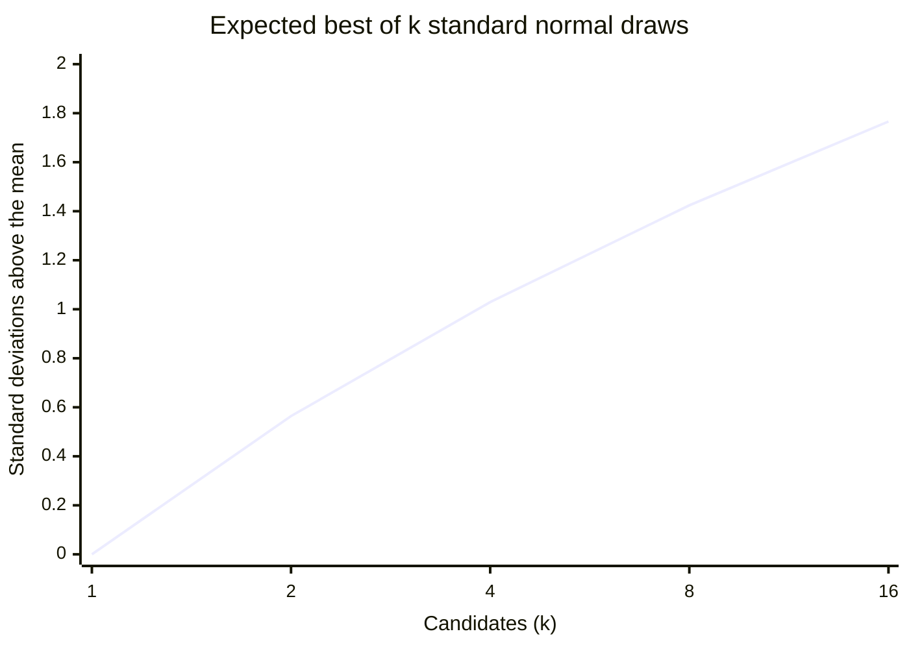
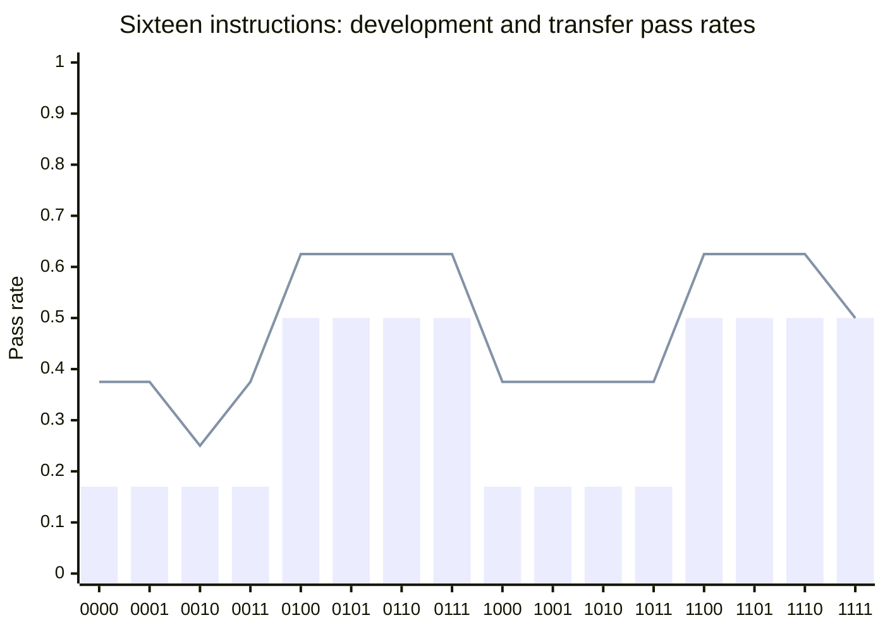
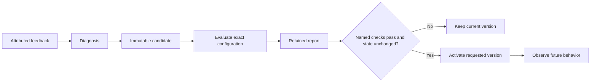
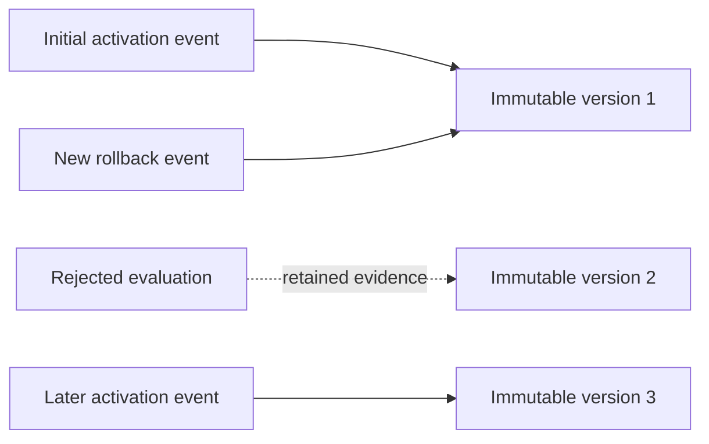
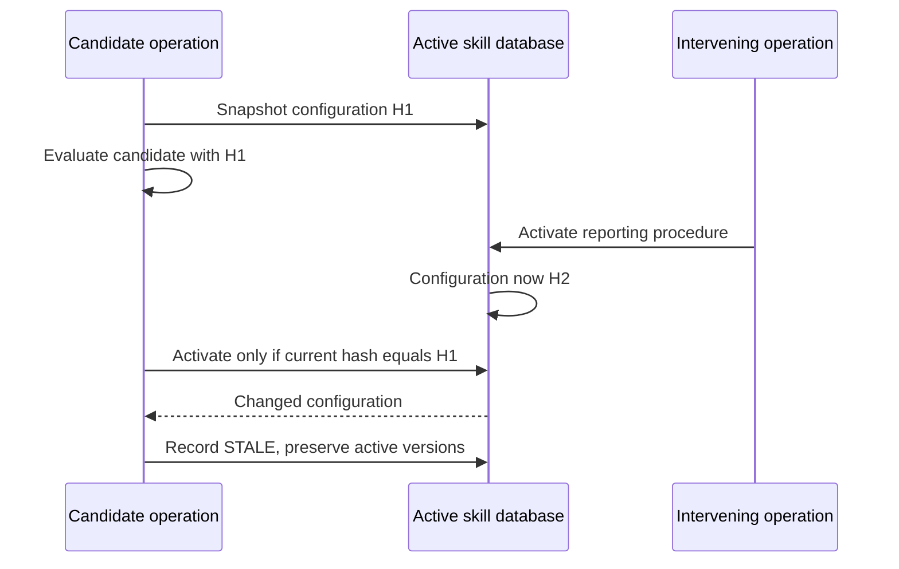

# Chapter 16 — Optimizing against an evaluation: the winner's curse and preferences

> **Learn with Prof Rod** — *Build Your Always-On AI Agent From Scratch*.
> **Read the full book and get the latest learning materials:** [https://profrod.ai/book](https://profrod.ai/book).
> **Join the Prof Rod learner community:** [https://profrod.ai/community](https://profrod.ai/community)
> — bring your questions, compare experiments and share what you build.
> **Original source and updates:** [profrodai/sovereign-agent](https://github.com/profrodai/sovereign-agent).

**Status: DRAFT.** Read the [textbook guide](../profrod-sovereign-agent-textbook-start-here.md) for setup and supplied-code boundaries. Practice in [Exercise Book 16](../../exercises/ch16/profrod-sovereign-agent-ch16-controlled-improvement-exercise-guide.md); consult [Solutions 16](../../solutions/ch16/profrod-sovereign-agent-ch16-controlled-improvement-solutions-guide.md) after attempting the work.

Lucy corrects the morning brief: keep monetary amounts in USD and make the closing sentence concise. The agent could simply add that sentence to its current context. Tomorrow, however, the conversation may be different, and a later correction may conflict with it. We need to decide what kind of change the feedback calls for and how to retain it without silently replacing known behavior.

Part A asks what choosing the best candidate on an evaluation does to that evaluation, and how preference data becomes the scores frontier labs optimize. It derives the winner's curse and the Bradley–Terry model, and measures a prompt search on a real model. Part B builds the path from an attributed correction to an immutable candidate, an evaluation report and an explicit activation. A regressing candidate must leave the active procedure intact. A passing candidate must still match the configuration it was tested against. Returning to an earlier version is another evaluated change, with history retained.

The live comparison in Chapter 15 showed that the frozen opening procedure improved named case outcomes over the same model without that guidance. Here we investigate the machinery that makes a procedure change reviewable. Our deterministic model fixture responds to the candidate text so we can force success, regression and a configuration race. That fixture proves control behavior; it does not measure the language quality of a new style instruction.

## Learning objectives

Part A treats improvement as optimization against a measurement. After it you should be able to:

- derive the winner's curse from the expected maximum of k noisy scores, and estimate how much a chosen candidate's score is inflated;
- explain when selection on a development set generalizes, and when it only finds noise;
- derive the Bradley–Terry model and its likelihood gradient, and fit ratings from pairwise preferences;
- explain where reward models, RL fine-tuning and preference optimization fit, and why they need held-out evaluation.

Part B builds evaluated changes. After it you should be able to:

- diagnose whether feedback belongs in a fact, preference, skill, prompt, tool or model change; retain its source and the exact candidate bytes; evaluate before activation; reject changed evaluation conditions; and perform rollback as a new, recorded operation.

The deliverable is a tested improvement cycle with immutable versions, saved reports, feedback provenance and a retained active configuration. The checkpoint rejects a bad currency instruction, activates a passing candidate, reevaluates an earlier version for rollback and refuses a candidate whose surrounding skill configuration changed during evaluation.

## Part A: optimizing against an evaluation

Improving an agent means trying changes and keeping the ones that score better. The score comes from an evaluation, and [Chapter 15](../ch15/profrod-sovereign-agent-ch15-agent-evaluation-chapter.md) showed that an evaluation is a noisy measurement. This part asks two questions. What happens when you choose the best of many candidates on a noisy measurement? And how does preference data turn into the scores that frontier labs optimize?

The functions live in [the chapter's learner file](../learner/profrod_sovereign_agent_ch16_optimization_learner.py).

```python
import json
import runpy

opt = runpy.run_path("book/textbook/learner/profrod_sovereign_agent_ch16_optimization_learner.py")
measured = json.loads(open("docs/evidence/book-ch16/ch16-optimization-receipt-v1.json").read())
```

### The winner's curse

Suppose $k$ candidates are equally good, and each is scored with independent noise of standard deviation $\sigma$. Choosing the highest score picks the luckiest candidate, so the winner's measured score exceeds its true score by, on average,

$
\sigma \cdot \mathbb{E}\Bigl[\max_{1 \le i \le k} Z_i\Bigr], \qquad Z_i \sim \mathcal{N}(0, 1).
$

The maximum of $k$ standard normals has density $k\,\varphi(x)\,\Phi(x)^{k-1}$, because all $k$ must fall at or below $x$ and one must be at $x$. Its expectation grows slowly with $k$; for large $k$ it approaches $\sqrt{2 \ln k}$, which overstates it at the small $k$ below.

**Listing:** The expected maximum of $k$ standard normals.

```python
for k in (1, 2, 4, 8, 16):
    print(k, round(opt["expected_max_normal"](k), 3) + 0.0)
```

```text
1 0.0
2 0.564
4 1.029
8 1.424
16 1.766
```



**Figure:** The expected maximum grows quickly at first and then slowly. Each doubling of the candidates adds less inflation, but it never stops adding.

Now apply it to an evaluation like Chapter 15's. Take sixteen candidate instructions that are all exactly as good, passing each case with probability 0.5. Score them on six cases, and keep the best.

**Listing:** The winner's measured score against its true score.

```python
curse = measured["offline"]["winners_curse_16_equal_candidates_true_rate_0.5"]
for cases, row in curse.items():
    print(
        f"{cases:>2} cases: chosen candidate measures {row['selected_measured']}, truly {row['selected_true']}"
    )
```

```text
6 cases: chosen candidate measures 0.842, truly 0.5
60 cases: chosen candidate measures 0.614, truly 0.5
```

On six cases the winner looks like an 84% candidate, and it is a 50% one. Nothing was learned: the search found noise. On sixty cases the optimism falls to eleven points, but it does not vanish. This is **Goodhart's law** at its most mechanical: when a measure becomes a target, the candidates that score best on it are, in part, the ones it mismeasures. Two rules follow. **Report the chosen candidate's score on data the selection never saw**, a fresh holdout, and **expect the winning score to shrink there**.

### Measured: a prompt search on a real model

The experiment searched instructions for Chapter 15's request-interpretation task with `qwen2.5:1.5b` at temperature zero. The sixteen candidates were Chapter 15's contract plus every subset of four hint sentences: quoted instructions, negation, "proposals do not place orders", and reporting-only requests. Each was scored on the six development cases and, separately, on the eight transfer cases.

```bash
uv run python book/textbook/experiments/profrod_sovereign_agent_textbook_ch16_optimization_v1.py \
    --out ch16-optimization-receipt.json --live
```

**Listing:** Development and transfer scores for all sixteen instructions.

```python
search = measured["prompt_search"]
for v in search["variants"]:
    print(f"hints {v['hints']}: development {v['dev']}/6, transfer {v['transfer']}/8")
for key in (
    "tied_at_best_dev",
    "chosen",
    "chosen_transfer_rate",
    "mean_transfer_rate_all_variants",
    "dev_transfer_correlation",
):
    print(key, search[key])
```

```text
hints 0000: development 1/6, transfer 3/8
hints 0001: development 1/6, transfer 3/8
hints 0010: development 1/6, transfer 2/8
hints 0011: development 1/6, transfer 3/8
hints 0100: development 3/6, transfer 5/8
hints 0101: development 3/6, transfer 5/8
hints 0110: development 3/6, transfer 5/8
hints 0111: development 3/6, transfer 5/8
hints 1000: development 1/6, transfer 3/8
hints 1001: development 1/6, transfer 3/8
hints 1010: development 1/6, transfer 3/8
hints 1011: development 1/6, transfer 3/8
hints 1100: development 3/6, transfer 5/8
hints 1101: development 3/6, transfer 5/8
hints 1110: development 3/6, transfer 5/8
hints 1111: development 3/6, transfer 4/8
tied_at_best_dev 8
chosen {'hints': '0100', 'dev': 3, 'transfer': 5}
chosen_transfer_rate 0.625
mean_transfer_rate_all_variants 0.484
dev_transfer_correlation 0.949
```



**Figure:** Bars are development pass rates; the line is transfer. Every instruction with the second hint (negation) steps up on both.

Here the search worked, and the reason is instructive. One hint, the second (negation), carried the whole effect. Every instruction containing it scored three of six on development and five of eight on transfer (four when all four hints were present). Every instruction without it scored one of six and two or three of eight. Development and transfer scores correlate at 0.95. The chosen instruction transferred *better* than its development score suggested.

The winner's curse is about noise, and this search had little. At temperature zero the model answers each case the same way every time, and the one real difference between candidates was large. **Selection generalizes when true differences between candidates are large compared with the noise of the score.** It fails when candidates are close, which is exactly where an optimizer spends its effort.

Two warnings survive the good result.

- Eight instructions tied at the best development score. Six development cases could not tell apart the three hints that did nothing on them.
- Adding every hint cost one transfer case. One case is within the noise, so this is not evidence that more hints hurt; the evaluation is too small to say.

### Preferences, and the Bradley–Terry model

Pass-or-fail cases need an authored answer. For open-ended outputs, such as an explanation or a brief, labs instead collect **preferences**: shown two answers, a person says which is better. The **Bradley–Terry model** turns pairwise preferences into a score per answer. Give each item $i$ a rating $r_i$, and model

$
P(i \succ j) = \frac{e^{r_i}}{e^{r_i} + e^{r_j}} = \sigma(r_i - r_j),
$

where $\sigma$ is the logistic function. Only differences matter, so the ratings are fixed up to a shared constant; we center them at zero. Given observed (winner, loser) pairs, the **log likelihood** is $\sum \log \sigma(r_w - r_\ell)$. Its gradient for item $i$ is

$
\frac{\partial \log L}{\partial r_i} = \sum_{\text{comparisons with } i} \bigl(\mathbf{1}[i \text{ won}] - P(i \text{ wins})\bigr):
$

actual wins minus expected wins. Gradient ascent on it recovers the ratings.

**Listing:** Recover known ratings from 3,000 simulated preferences.

```python
bt = measured["offline"]["bradley_terry"]
print("true:  ", [r + 0.0 for r in bt["true_ratings_centered"]])
print("fitted:", bt["fitted"], "largest error", bt["max_abs_error"])
print("log likelihood, fitted", bt["log_likelihood_fitted"], "true", bt["log_likelihood_true"])
print("P(best beats worst):", round(opt["bradley_terry"](0.8, -1.0), 3))
```

```text
true:   [-1.0, -0.3, 0.0, 0.5, 0.8]
fitted: [-0.939, -0.303, -0.032, 0.523, 0.751] largest error 0.061
log likelihood, fitted -1796.53 true -1797.62
P(best beats worst): 0.858
```

The fitted ratings are within 0.06 of the truth, and their likelihood is slightly higher than the true ratings'. That is what maximum likelihood means: it fits this sample, including its noise.

### Where reward models and RL fine-tuning fit

A **reward model** is Bradley–Terry with the table of ratings replaced by a network $r_\theta(x, y)$ that scores an answer $y$ to a prompt $x$. It is trained on preference pairs by minimizing $-\log \sigma\bigl(r_\theta(x, y_w) - r_\theta(x, y_\ell)\bigr)$, which is exactly the negative of the log likelihood above. **Reinforcement learning from human feedback** then adjusts the model to produce answers the reward model scores highly. Methods such as direct preference optimization skip the separate reward model and apply the same Bradley–Terry likelihood to the model's own probabilities.

Both run straight into this part's first lesson. The reward model is a measurement, and optimizing against it finds the answers it mismeasures, called **reward hacking**. That is why these methods add a penalty for moving far from the original model, and why labs evaluate the result on held-out preferences and tasks, not on the reward model itself.

This book's agent changes skills, not weights. The discipline is the same at both scales:

- choose on one set of cases and report on another;
- keep the history of every change;
- distrust a score that the change was chosen to raise.

The rest of this chapter builds that discipline for Lucy's skills.

## Part B: improve behavior with evaluated changes

Part A showed what optimizing against a measurement does. This part builds the machinery that keeps it honest: proposals, frozen evaluations, activation and rollback.

## Diagnose the correction before choosing where to write

A correction is evidence of a problem, not proof of its cause. If Lucy says the order quantity is wrong, the fault might be stale stock, missing incoming deliveries, an incorrect calculation or a model that ignored a correct tool result. Adding another instruction to a skill may conceal the immediate symptom while leaving the underlying defect in place.

Trace the failed result backward. Compare the answer with the tool observation, the tool observation with the structured record and the record with the event or operator input that supplied it. That trace tells us whether we need to correct data, code or guidance. The same discipline applies to a successful-looking result: a model can accidentally reach the right number from the wrong source.

| Diagnosis | Appropriate change | Evidence to retain |
| --- | --- | --- |
| Stock record is stale | Correct the authoritative operational record | Physical observation or receipt source |
| Lucy changed a durable preference | Correct explicit memory | Attributed operator correction and revision |
| A reusable procedure misses a step | Propose a new skill version | Failed case, intended behavior and candidate hash |
| The tool calculates incorrectly | Fix deterministic code | Independent regression test and corrected result |
| The model ignores usable guidance | Evaluate prompt or model configuration | Frozen configuration and comparable case reports |
| The final wording is misleading | Review output and propose a bounded change | Exact answer, supporting observations and review |

Lucy’s request has a preference component and a procedure component. USD is already a business convention and an evaluated currency requirement. Concise wording is a desired presentation behavior that the current automatic grader does not fully assess. We can stage a candidate that addresses it, but passing the quantity suite alone cannot prove that its prose is concise or helpful.

The distinction from [Chapter 11](../ch11/profrod-sovereign-agent-ch11-ambiguous-supplier-order-chapter.md) remains important: neither feedback nor a revised skill changes whether a supplier accepted an existing order. Memory and procedure updates cannot rewrite receipts. Operational facts, authority and language guidance have different responsibilities, even when the same user message prompts us to inspect all three.

## Separate proposal, evaluation and activation

A proposal is a record of a possible change. It should identify the feedback source, the behavior being requested, the candidate name and version, and the exact content to test. Creating it does not make the candidate active. A process may crash after staging a candidate without changing the procedure used by future work.

Evaluation produces evidence about that exact candidate in a recorded surrounding configuration. Activation changes which version future context assembly loads. These are separate state transitions. Combining them into “the agent learned” would hide whether a change was merely suggested, tested, selected or actually used.



**Figure:** A candidate becomes active only through the controlled transition. Failed or stale evaluation leaves the current procedure selected and preserves the evidence for another decision.

The teaching skill format remains local and small. We do not add a marketplace or let a downloaded skill grant itself tools. Its required-tool list controls whether context assembly includes the guidance under the current dispatcher. Purchasing permission still comes from the order policy and approval records, not from text inside a procedure.

For this chapter, the proposal event is written by the trusted builder path. A future model could suggest the content, but that suggestion would still need validation and staging through the same controlled path. Recording a source or content hash is provenance; it is not authentication of arbitrary text claiming to come from Lucy.

**Listing:** Stage the frozen opening procedure and retain the feedback that motivates review.

```python
import hashlib
import json
import os
import tempfile
import tomllib
import uuid
from collections.abc import Callable
from pathlib import Path
from typing import Any

from sovereign_agent.assistant_context import Skill, stage_skill
from sovereign_agent.database import Database
from sovereign_agent.events import append_event

temporary = tempfile.TemporaryDirectory(prefix="lucy-ch13-")
root = Path(temporary.name)
db = Database(root / "agent.sqlite")
original = tomllib.loads(
    Path("book/textbook/skills/profrod_sovereign_agent_textbook_opening_check_v1.toml").read_text()
)


def propose_skill(version, instructions, name=original["name"]):
    source = root / f"{name}-{version}.toml"
    with source.open("x") as stream:
        stream.write(
            "name="
            + json.dumps(name)
            + "\nversion="
            + json.dumps(version)
            + "\ninstructions="
            + json.dumps(instructions)
            + "\nrequires="
            + json.dumps(original["requires"])
            + "\n"
        )
    skill = stage_skill(db, source)
    with db.immediate():
        append_event(
            db,
            "assistant.skill.proposed",
            {
                "name": skill.name,
                "version": skill.version,
                "candidate_sha256": hashlib.sha256(skill.model_dump_json().encode()).hexdigest(),
                "feedback_source": "fixture/lucy/brief-1",
                "request": "Keep amounts in USD and make the closing sentence concise.",
            },
        )
    return skill


candidate = propose_skill("1", original["instructions"])
print("Staged version:", candidate.version)
print(
    "Active before evaluation:",
    db.connection.execute("SELECT count(*) FROM assistant_skills WHERE active=1").fetchone()[0],
)
print(
    "Proposal provenance:",
    json.loads(
        db.connection.execute(
            "SELECT payload FROM events WHERE kind='assistant.skill.proposed'"
        ).fetchone()[0]
    )["feedback_source"],
)
```

```text
Staged version: 1
Active before evaluation: 0
Proposal provenance: fixture/lucy/brief-1
```

The feedback source above is an explicitly named fixture, not a claim that a real shop owner sent a message. The event connects the proposed change with its motivation and content hash. The staged database content is immutable under that name and version. Reusing a version label for different bytes is refused by the skill loader from Chapter 6.

In an operator tool, prefer exclusive creation of a new proposal file rather than overwriting an existing path. The checkpoint uses fresh version paths and verifies their absence before writing. The database remains the authoritative staged content: modifying a source file afterward does not silently alter the version already stored and evaluated.

## Freeze the surrounding skill configuration

A candidate is not evaluated in isolation from every other instruction. The active reporting procedure, for example, may influence its output. Our evaluator copies the active skill set, replaces the candidate's own name with its proposed version and evaluates that combined configuration in fresh case databases. It does not accidentally test both old and new versions of the same skill together.

The report identifies each evaluated skill by name, version and content digest. Before starting, we also compute a digest of the currently active rows. That digest includes the stored source provenance. Activation later compares it with the current database state. A successful result obtained before another activation cannot automatically authorize a change against the new combination.

**Listing:** Construct the active-configuration snapshot and the guarded activation primitive.

```python
def skill_snapshot(db: Database) -> tuple[str, tuple[Skill, ...]]:
    """One read binds active guidance and provenance to an evaluation baseline."""
    rows = [
        tuple(row)
        for row in db.connection.execute(
            "SELECT name,version,content,source FROM assistant_skills WHERE active=1 ORDER BY name"
        )
    ]
    digest = hashlib.sha256(json.dumps(rows).encode()).hexdigest()
    return digest, tuple(Skill.model_validate_json(row[2]) for row in rows)


def activate_skill(
    db: Database,
    name: str,
    version: str,
    *,
    evaluate: Callable[[Skill], dict[str, bool]],
    required_cases: frozenset[str],
    expected_state: str | None = None,
) -> dict[str, bool]:
    row = db.connection.execute(
        "SELECT content FROM assistant_skills WHERE name=? AND version=?", (name, version)
    ).fetchone()
    if row is None or not required_cases:
        raise ValueError("staged skill and a nonempty regression suite required")
    skill = Skill.model_validate_json(row[0])
    baseline = skill_snapshot(db)[0] if expected_state is None else expected_state
    results = evaluate(skill)
    if skill.model_dump_json() != row[0]:
        raise ValueError(
            "evaluation changed the candidate instead of testing its immutable version"
        )
    if not required_cases.issubset(results) or any(value is not True for value in results.values()):
        raise ValueError("candidate did not pass all required regression cases")
    with db.immediate() as connection:
        # The staged version is immutable; evaluating outside the transaction does
        # not turn a long model evaluation into a database-wide write lock.
        if skill_snapshot(db)[0] != baseline:
            raise PermissionError("active skill configuration changed during evaluation")
        connection.execute("UPDATE assistant_skills SET active=0 WHERE name=?", (name,))
        connection.execute(
            "UPDATE assistant_skills SET active=1 WHERE name=? AND version=?", (name, version)
        )
        append_event(
            db, "assistant.skill.activated", {"name": name, "version": version, "cases": results}
        )
    return results


empty_state, active = skill_snapshot(db)
print("Initially active skills:", len(active))
print("Snapshot is a SHA-256 digest:", len(empty_state) == 64)
```

```text
Initially active skills: 0
Snapshot is a SHA-256 digest: True
```

The expensive evaluation happens outside the write transaction. Holding a SQLite write lock across model calls would obstruct unrelated work and make availability depend on model latency. Instead, we take a snapshot, evaluate, then enter a short transaction that checks the snapshot and changes the active version atomically.

This is an optimistic concurrency check. The digest is not a secret credential; anyone who can read those rows could recompute it. The trusted activation code uses it to detect that the facts underlying its decision changed. The operator and database access boundary still determine who may request the transition.

The candidate object is also checked after evaluation. An evaluator callback must not mutate the candidate and then claim to have tested its original version. The exact serialized content must remain equal to the staged record. Required case names must be present, and every supplied result must be the boolean `True`; a truthy string is not a passing check.

The snapshot covers active skill configuration. It does not freeze the entire external world, a remote model deployment or every future user preference. We preserve model labels and evaluation scope separately. A stronger operational claim would need stronger configuration capture and corresponding checks, not a broader interpretation of this one hash.

## Preserve the report before switching versions

The report must survive both a rejected candidate and a successful activation. If evidence is written only after the active version changes, a crash can leave a new procedure with no inspectable account of what was tested. We write a unique report first, then attempt the guarded transition, and record its disposition in the event ledger.

**Listing:** Construct the report writer and the evaluated change operation.

```python
from reference_organizations.store.evaluation import CASES, candidate_checks, evaluate
from sovereign_agent.model_turn import Model


def save_report(root: Path, report: dict[str, Any]) -> tuple[Path, str]:
    root.mkdir(parents=True, exist_ok=True, mode=0o700)
    path = root / (uuid.uuid4().hex + ".json")
    raw = (json.dumps(report, indent=2) + "\n").encode()
    descriptor = os.open(path, os.O_CREAT | os.O_EXCL | os.O_WRONLY, 0o600)
    with os.fdopen(descriptor, "wb") as stream:
        stream.write(raw)
        stream.flush()
        os.fsync(stream.fileno())
    return path, hashlib.sha256(raw).hexdigest()


def change_skill(
    db: Database,
    name: str,
    version: str,
    model_factory: Callable[[], Model],
    report_root: Path,
    *,
    repeats: int = 1,
    rollback: bool = False,
    model_label: str = "offline fixture",
) -> dict[str, Any]:
    row = db.connection.execute(
        "SELECT content FROM assistant_skills WHERE name=? AND version=?", (name, version)
    ).fetchone()
    if row is None:
        raise ValueError("stage the exact candidate before requesting activation")
    if (
        rollback
        and not db.connection.execute(
            "SELECT 1 FROM events WHERE kind='assistant.skill.activated' "
            "AND json_extract(payload,'$.name')=? AND json_extract(payload,'$.version')=? LIMIT 1",
            (name, version),
        ).fetchone()
    ):
        raise ValueError("rollback requires a previously activated version")
    skill = Skill.model_validate_json(row["content"])
    baseline, active = skill_snapshot(db)
    report = evaluate(model_factory, skill=skill, skills=active, repeats=repeats)
    report["active_skill_state"] = baseline
    report["model_label"] = model_label
    report["operation"] = "rollback" if rollback else "activation"
    path, digest = save_report(report_root, report)
    checks = candidate_checks(report)
    required = frozenset(f"{case.name}:{repeat}" for case in CASES for repeat in range(repeats))
    status = "REJECTED"
    if report["passed"]:
        try:
            activate_skill(
                db,
                name,
                version,
                evaluate=lambda _: checks,
                required_cases=required,
                expected_state=baseline,
            )
            status = "ROLLED_BACK" if rollback else "ACTIVATED"
        except PermissionError:
            status = "STALE"
    with db.immediate():
        append_event(
            db,
            "assistant.skill.evaluated",
            {
                "name": name,
                "version": version,
                "passed": report["passed"],
                "report": path.name,
                "sha256": digest,
                "rollback": rollback,
                "activation_status": status,
            },
        )
    return {
        "status": status,
        "passed": report["passed"],
        "name": name,
        "version": version,
        "report": str(path),
        "sha256": digest,
        "interpretation": "Passing named scenario checks is bounded evidence. "
        "STALE requires a new evaluation before activation. "
        "The offline model does not measure a skill's language-model quality.",
    }
```

The next examples exercise the writer and activation against real databases and generated report files. They independently read saved bytes and compare digests.

A report file created before a crash may exist without a corresponding activation event. That is a retained evaluation, not evidence that its candidate became active. Read the active rows and event history to determine the actual transition. Conversely, a saved report's `passed` value still describes named checks, with the Chapter 15 acceptance status preserving any ungraded explanation review.

The change operation records `REJECTED`, `ACTIVATED`, `ROLLED_BACK` or `STALE`. These dispositions describe control flow. They do not promise that a stylistic candidate improved every answer. A passing evaluation can still become stale before activation, and a successfully activated candidate can still need further observation for aspects outside the named suite.

| Disposition | What happened | What remains selected |
| --- | --- | --- |
| `REJECTED` | At least one named case failed | Previous active version |
| `ACTIVATED` | Cases passed and configuration matched | Requested candidate |
| `ROLLED_BACK` | Previously activated version passed reevaluation | Requested earlier version |
| `STALE` | Active configuration changed during evaluation | Configuration selected by the intervening change |

## Experiment: make the candidate cause a regression

We want to prove that the proposed instructions, rather than an unrelated test flag, reach the evaluator. The fixture below reads the actual assembled context. When it sees the deliberately bad currency instruction, it follows it and changes the final currency labels. Its stock and draft calls remain the same, so the currency check is the reason the candidate fails.

**Wrong-currency test input:** every price in Lucy's shop is in USD cents. The euro instruction below is a deliberate regression that the scenario checks must reject.

**Listing:** Activate the original, then reject an instruction that reports euros.

```python
from reference_organizations.store.agent import OfflineShopModel
from sovereign_agent.model_turn import ModelTurn


class FollowsCandidate(OfflineShopModel):
    """A deterministic policy fixture, not a measure of language-model quality."""

    def complete(self, messages, *args, **kwargs):
        turn = super().complete(messages, *args, **kwargs)
        if "Report every amount in euros." in messages[0]["content"]:
            return ModelTurn(
                turn.content.replace("cents USD", "euros"), turn.calls, turn.output_tokens
            )
        return turn


reports = root / "reports"
initial = change_skill(db, original["name"], "1", FollowsCandidate, reports)
propose_skill("2", original["instructions"] + "\nReport every amount in euros.")
regression = change_skill(db, original["name"], "2", FollowsCandidate, reports)
regression_report = json.loads(Path(regression["report"]).read_text())
print("Initial activation:", initial["status"])
print("Regressing candidate:", regression["status"])
print(
    "Currency failures:",
    sum(not row["checks"]["currency_labels"] for row in regression_report["cases"]),
)
print("Active version after rejection:", skill_snapshot(db)[1][0].version)
```

```text
Initial activation: ACTIVATED
Regressing candidate: REJECTED
Currency failures: 6
Active version after rejection: 1
```

The two no-draft cases do not state an amount, so the fixture's replacement does not introduce a wrong currency there. Six other cases fail the currency requirement. Counting those failures makes the experiment more precise than reporting that “something failed.” The old version remains active because evaluation did not pass, not because the test manually restored it afterward.

This is a deterministic adversarial fixture. It deliberately obeys a specific candidate instruction to make the control path reproducible. A real model might ignore the instruction, paraphrase it or fail differently. That variation belongs in live evaluation; it is not a reason to weaken the deterministic proof that a known regression prevents activation.

The actual local-model comparison from Chapter 15 supplies complementary evidence: the existing frozen opening procedure changed observed named outcomes from six to sixteen passing case-runs. We did not rewrite that procedure to fit those outputs. It is evidence for using that guidance in the measured setting, while this experiment proves the transition machinery can reject an intentionally bad successor.

## Activate a candidate and keep rollback meaningful

Lucy’s request for a concise closing sentence can be represented as a new procedure version. The existing numerical and authority cases should still pass. Their success does not grade concision; retain the answer review requirement when deciding whether to use the candidate. In this lab, we activate it to exercise the complete version transition and subsequent rollback.

**Listing:** Select a passing candidate, then reevaluate the earlier version before restoring it.

```python
propose_skill("3", original["instructions"] + "\nKeep the closing sentence concise.")
selected = change_skill(db, original["name"], "3", FollowsCandidate, reports)
print("Candidate disposition:", selected["status"])
print("Selected version:", skill_snapshot(db)[1][0].version)
restored = change_skill(db, original["name"], "1", FollowsCandidate, reports, rollback=True)
print("Rollback disposition:", restored["status"])
print("Selected after rollback:", skill_snapshot(db)[1][0].version)
print(
    "Version rows retained:",
    db.connection.execute("SELECT count(*) FROM assistant_skills").fetchone()[0],
)
```

```text
Candidate disposition: ACTIVATED
Selected version: 3
Rollback disposition: ROLLED_BACK
Selected after rollback: 1
Version rows retained: 3
```



**Figure:** Rollback adds another selection event for an existing version. The rejected candidate, later version and their evidence remain available for inspection.

Rollback is not a request to delete history or replace the database with an old backup. It selects an earlier immutable skill version through a new evaluation and records the change. The earlier version must have an activation event; an arbitrary staged candidate cannot bypass its first activation merely by calling the operation a rollback.

An earlier version is not automatically safe under today's surrounding guidance. Another skill or changed model behavior may cause a regression. The rollback operation therefore evaluates it against the current active skill set and uses the same configuration guard. If evaluation fails, the existing active version remains selected and the failed rollback report remains available.

This differs from reverting business effects. Switching a skill cannot undo a supplier order or restore physical stock. Those records remain governed by receipts and reconciliation. Keep procedure rollback separate from the account-recovery process taught in the deployment chapter, even if both actions happen during the same maintenance session.

## Experiment: a passing report becomes stale

Imagine that a candidate starts evaluation while the original opening procedure is active. During a model call, another trusted operation activates a reporting skill. The original candidate's report describes the previous combination. Applying it without checking would select a combination that the report did not evaluate.

We reproduce the ordering with a separate SQLite connection and an activation triggered during the fixture's first model call. This is an actual interleaving of database operations in one test process, not a claim that two OS processes were launched. The guarded transaction should make the same decision regardless of which process performed the intervening valid activation.

**Listing:** Change active guidance during evaluation and require the original candidate to remain inactive.

```python
propose_skill("4", original["instructions"] + "\nRetain source names in explanations.")
propose_skill("1", "Keep reports concise.", name="reporting")
other = Database(db.path)


class ConfigurationChanges(FollowsCandidate):
    changed = False

    def complete(self, *args, **kwargs):
        if not ConfigurationChanges.changed:
            ConfigurationChanges.changed = True
            result = change_skill(other, "reporting", "1", FollowsCandidate, reports)
            assert result["status"] == "ACTIVATED"
        return super().complete(*args, **kwargs)


stale = change_skill(db, original["name"], "4", ConfigurationChanges, reports)
print("Candidate's named checks passed:", stale["passed"])
print("Candidate disposition:", stale["status"])
print("Actually active:", [(skill.name, skill.version) for skill in skill_snapshot(db)[1]])
other.close()
```

```text
Candidate's named checks passed: True
Candidate disposition: STALE
Actually active: [('opening_check', '1'), ('reporting', '1')]
```

The `STALE` result is useful information, not an invitation to force the update. The candidate needs another evaluation against the new active configuration. Reusing the old result after changing its stored baseline would erase the very comparison that caught the race.



**Figure:** The guard checks the conditions under which the evidence was collected. Passing case results do not authorize activation against a different skill combination.

The same principle applies to a reviewer's approval of a specific artifact. Approval of one set of bytes is not approval of a later revision just because the filename stayed the same. Our immutable version and content digest make the object of review explicit, while the active-configuration snapshot captures the context the evaluator actually used.

## Inspect the retained state after reopening

A conversation saying “rolled back” is not the state. Reopen the database and inspect the selected versions. Read the evaluation reports by their recorded paths and verify their digests. The checkpoint also keeps every staged row, including rejected and stale candidates, so the history remains available for diagnosis.

**Listing:** Verify saved reports and the active configuration independently of the operation summaries.

```python
for result in (initial, regression, selected, restored, stale):
    raw = Path(result["report"]).read_bytes()
    assert hashlib.sha256(raw).hexdigest() == result["sha256"]
    assert json.loads(raw)["acceptance"]["status"] in {"REVIEW_REQUIRED", "REJECTED"}
print("Report digests:", "verified")
print("Retained reports:", len(list(reports.glob("*.json"))))
print(
    "Retained candidate rows:",
    db.connection.execute("SELECT count(*) FROM assistant_skills").fetchone()[0],
)
db.close()
db = Database(root / "agent.sqlite")
print("Active after reopen:", [(skill.name, skill.version) for skill in skill_snapshot(db)[1]])
db.close()
temporary.cleanup()
```

```text
Report digests: verified
Retained reports: 6
Retained candidate rows: 5
Active after reopen: [('opening_check', '1'), ('reporting', '1')]
```

The sixth report belongs to the reporting-skill activation that occurred during the race. Keeping it explains why the candidate became stale. Omitting that event would make the result look arbitrary to a reader who did not watch the test run. Evidence needs to explain both the attempted change and the state that displaced its assumptions.

The operational CLI exposes `agent skill-stage`, `agent skill-activate` and `agent skill-rollback` with an explicit root, skill name and version. These are operator-requested actions. The background agent does not silently select a new procedure after a conversation correction. Local skill files and external memory are the objects being changed; model weights are unchanged.

## A pinned comparison: provenance in the model's context

Hermes at commit `d538f4e9297d7fa46193f638215d002d7a22edd7` has an `_org_provenance_header` helper that loads available organization provenance and renders organization, author and time into the content the model receives. Its header describes shared skills as third-party instructions and describes a path for local edits and sharing proposals. See the pinned [skills tool source](https://github.com/NousResearch/hermes-agent/blob/d538f4e9297d7fa46193f638215d002d7a22edd7/tools/skills_tool.py).

That source illustrates making origin visible at consumption time. Our teaching implementation also records an attributed proposal and exact candidate version, then evaluates before switching the active row. This is a comparison of specific mechanisms, not an audit of Hermes's entire update or security policy. We did not verify its sync plane or run its update workflow. A useful experiment would test whether showing source and revision information helps reviewers locate an incorrect procedure more quickly.

## Observe improvements without rewriting the past

After activation, retain new results with the selected configuration. Compare the same named outcomes and inspect changes in answers, costs and latency. If a new failure appears, record the observation and diagnose it before proposing another version. Do not edit the earlier report to make the latest candidate's history look cleaner.

A durable preference correction and a skill revision have different scopes. A preference belongs to the relevant user or session and needs provenance, correction and forgetting behavior. A reusable procedure can affect many future tasks and should be tested accordingly. If the agent learned a new fact about one delivery, promoting it into a general procedure would spread an accidental rule beyond its evidence.

The current implementation deliberately keeps the improvement object small: external memory and local skill versions. It does not train model weights, invent a self-modifying plugin marketplace or give the model a tool to rewrite policy. More autonomous proposal generation can be added later while preserving these boundaries; it does not require treating a generated change as already approved or evaluated.

## Exercises

### Exercise 1: diagnose before editing guidance

Create a wrong stock recommendation by changing the fixture's stock record while leaving the tool calculation correct. Trace the answer back through the tool observation to that record. Explain why adding a new skill instruction is the wrong repair for this particular cause, and record the physical observation or receipt needed to correct the authoritative data.

### Exercise 2: mutate the evaluated candidate

Supply an evaluator callback that changes the `Skill` object's instructions before returning passing booleans. Require activation to refuse the changed candidate and leave the active version unchanged. Explain why checking the case results alone would permit a different artifact from the one staged for review.

### Exercise 3: fail a rollback honestly

Activate a version, then introduce a surrounding skill configuration that makes the earlier version fail a declared case. Request rollback and require a rejected report with the current active version retained. Explain why a historical success is evidence to inspect rather than a permanent exemption from reevaluation.

### Exercise 4: add a new behavior check

Choose a bounded presentation requirement that you can specify precisely, such as a required closing sentence. Write independent positive and negative examples before adding the check. Evaluate a candidate against both old business cases and the new requirement. State what aspects of concision or usefulness still need human review despite that extra check.

### Exercise 5: find the noise floor

Repeat the winner's-curse simulation with candidates whose true rates differ: one at 0.6 and fifteen at 0.5. How many cases must the evaluation have before the best candidate is chosen more than 80% of the time? Relate your answer to Chapter 15's sample-size formula.

### Exercise 6: rank answers from preferences

Write three answers to one of Lucy's requests. Collect twenty pairwise preferences from a person, or from a model acting as the grader, and fit Bradley–Terry ratings. Then collect twenty more and check whether the ranking holds. Explain what a grader that prefers longer answers would do to a model optimized against it.

## Expected observations

The cumulative checkpoint reports a rejected currency regression with version 1 still active, a passing candidate activation, an evaluated rollback and a stale candidate after an intervening configuration change. It retains five version rows and six evaluation reports. Five proposal events preserve feedback provenance, and reopening the database preserves the final active configuration.

The offline fixture makes those state transitions repeatable. Its passing outcomes are not evidence that a real model follows every new instruction. For a live candidate, retain the actual evaluated configuration, complete reports and explanation review from Chapter 15 before making a broader usefulness claim.

## Learner verification

Run `uv run python book/textbook/checkpoints/profrod_sovereign_agent_ch16_controlled_improvement_checkpoint.py`, then inspect how the proposed text enters the evaluator's real context. Verify that the bad currency instruction, rather than an unrelated global flag, causes the named case failures. Check that the active version is queried after rejection and after reopening, rather than copied from the operation's return value.

Run the improvement and configuration regressions and the applicable project gate after your changes. A candidate can pass its cases and still be refused as stale. A rollback can fail. The code and evidence should preserve those distinctions instead of collapsing every non-activation into an unexplained error.

## Summary

Choosing the best of many candidates on a noisy evaluation inflates the winner's score: sixteen equal candidates on six cases produce an 84% winner that is truly 50%. Selection generalizes only when real differences are large compared with the noise, as they were in the measured prompt search, where one hint carried the whole effect. Preferences become scores through Bradley–Terry, the same likelihood that trains reward models; optimizing against any such score demands a holdout it never saw.

Feedback becomes a reviewable change when its source, diagnosis and exact candidate are retained. Evaluation runs before activation and records the surrounding skill configuration. Failed cases leave the previous procedure selected; changed conditions invalidate the result. A rollback reevaluates an earlier version and appends a new event rather than deleting history.

The mechanism changes external memory and procedures, not model weights or purchasing authority. Its deterministic fixtures prove control behavior, while live evaluations and explanation review establish the narrower evidence for useful model behavior. The next chapter applies the same discipline to a larger architectural choice: whether one bounded task benefits from a second agent.

## Active recall and vocabulary

Without rereading, derive the density of the maximum of k normals, and explain why the chosen candidate's score must be re-measured on a holdout. Why did the measured prompt search not suffer the curse? Derive the Bradley–Terry gradient as wins minus expected wins. Then:

Explain why a wrong recommendation does not prove a skill needs editing. Distinguish a staged proposal, passing evaluation and active version. Describe what the configuration digest covers, why evaluation happens outside a write transaction and why a passing candidate can still become stale. Explain why procedure rollback cannot reverse a supplier purchase.

The **winner's curse** is the upward bias of a score chosen for being the highest. **Goodhart's law**: a measure that becomes a target stops measuring well. **Bradley–Terry** models a preference as the logistic function of a rating difference. A **reward model** learns such ratings for answers from preference pairs. **Provenance** links a change to its source and exact content. **Candidate** is a staged version being considered. **Activation** selects which version future context assembly loads. **Optimistic concurrency** checks that decision conditions still match before committing a change. **Stale evidence** was collected under conditions that have since changed. **Rollback** is a new controlled transition to an earlier version with its history retained.

## Keep building with Prof Rod

Found this material through a colleague, classroom or shared download? [Get the complete book at profrod.ai/book](https://profrod.ai/book) and [join the Prof Rod learner community](https://profrod.ai/community). Bring one result, one question or one failure you learned from. Share this resource with another learner and keep its source links with it so they can find the full course and future updates.
