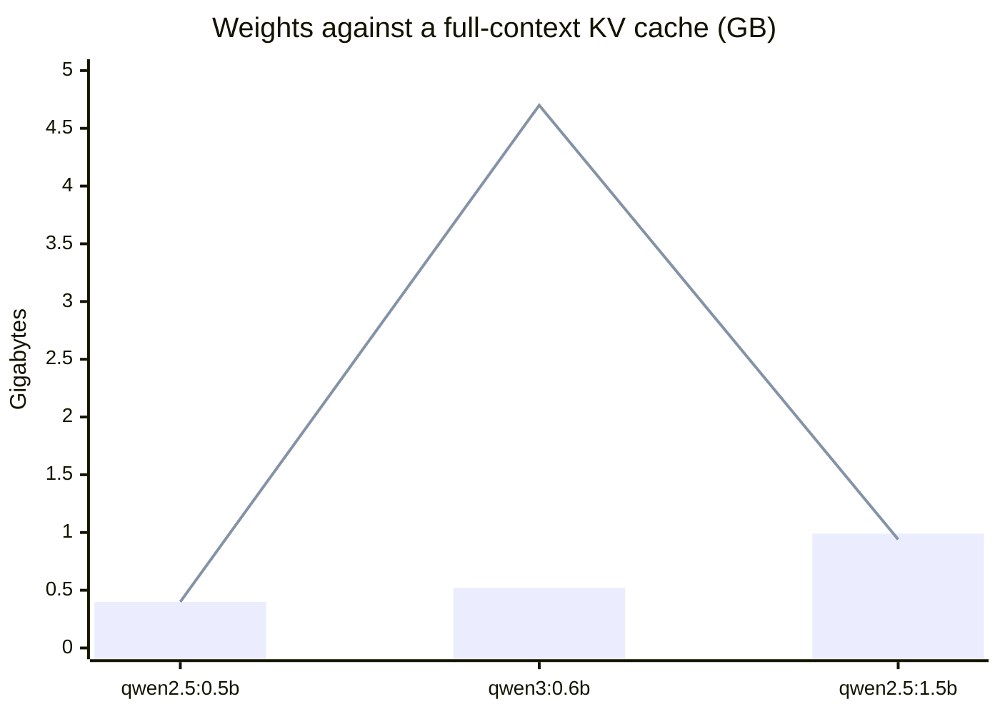
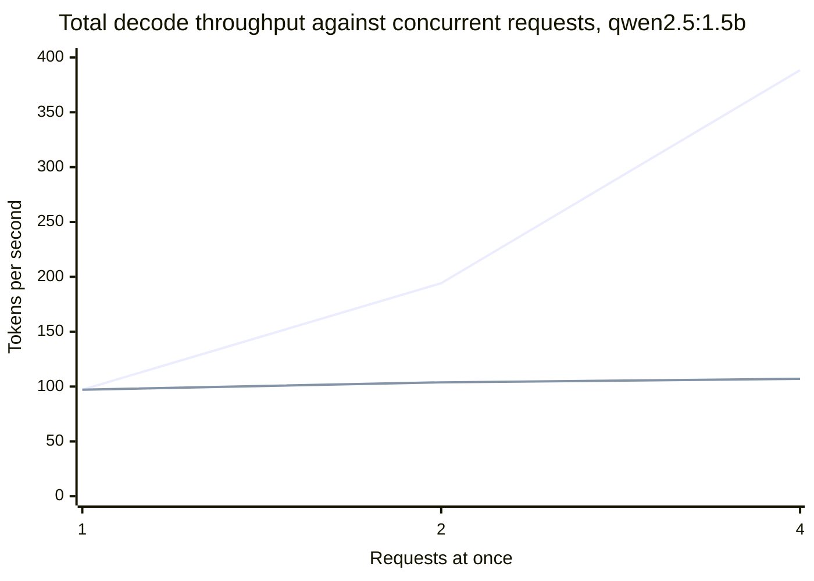
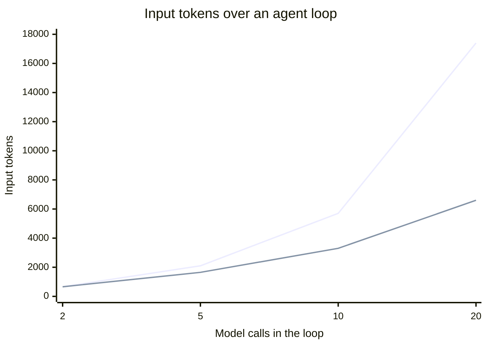
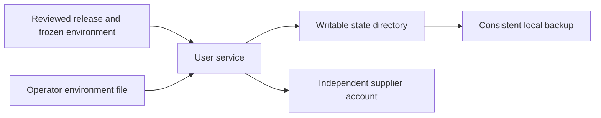
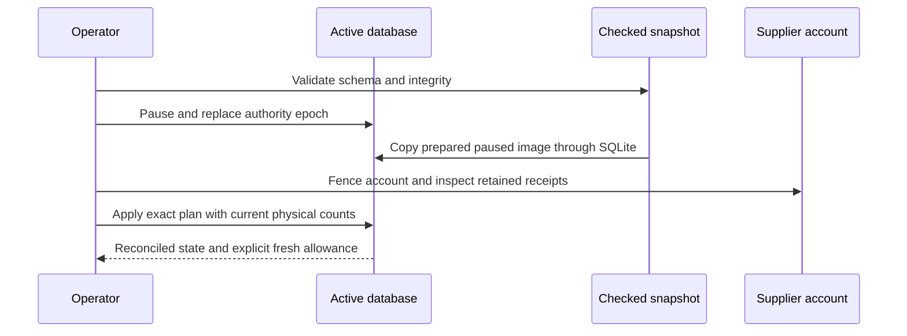
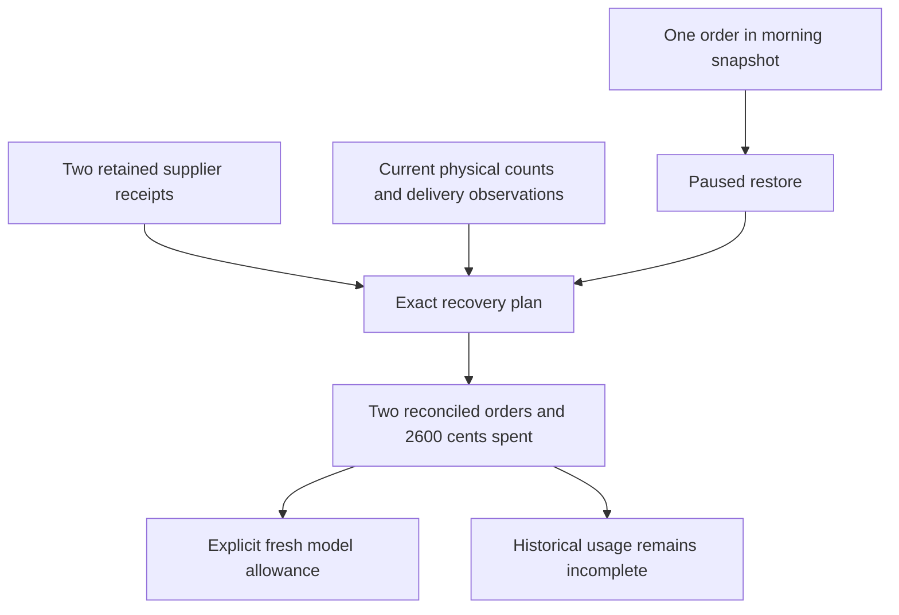

# Chapter 18 — What a model call costs, and a deployment that survives

> **Learn with Prof Rod** — *Build Your Always-On AI Agent From Scratch*.
> **Read the full book and get the latest learning materials:** [https://profrod.ai/book](https://profrod.ai/book).
> **Join the Prof Rod learner community:** [https://profrod.ai/community](https://profrod.ai/community)
> — bring your questions, compare experiments and share what you build.
> **Original source and updates:** [profrodai/sovereign-agent](https://github.com/profrodai/sovereign-agent).

**Status: DRAFT.** Read the [textbook guide](../profrod-sovereign-agent-textbook-start-here.md) for setup and supplied-code boundaries. Practice in [Exercise Book 18](../../exercises/ch18/profrod-sovereign-agent-ch18-deployment-restoration-exercise-guide.md); consult [Solutions 18](../../solutions/ch18/profrod-sovereign-agent-ch18-deployment-restoration-solutions-guide.md) after attempting the work.

Lucy's agent can now receive work, ask for approval and recover an uncertain order. Those abilities are useful only while a host runs the program and preserves its records. Closing a terminal must not silently end the morning routine. Updating the code must not discard yesterday's purchases. Restoring a backup must not persuade the supplier that an old approval is new authority.

Part A first measures what the agent spends. It covers prefill and decode, the memory bandwidth that bounds decode, the key-value cache, batching, latency and cost per task, all derived and measured on local models. Part B then turns our existing bounded worker into an installed Linux service. We keep one writable state directory outside immutable release directories, use the operating system's service manager and distinguish process health from business progress. Then we construct the backup and restore boundary and recover an older local snapshot against a separate supplier account.

The deployment is deliberately modest: one Linux host, one user service for shop work, an optional second service for bounded research, SQLite and operator-owned environment files. A maintained service manager supplies restart behavior. We still own the decisions about work, permissions, receipts and reconciliation. The machine's availability remains a condition of the promise, not something an agent loop can manufacture.

## Learning objectives

Part A treats a model call as a cost. After it you should be able to:

- explain why decode is limited by memory bandwidth and prefill by arithmetic, and estimate a decode-rate ceiling;
- derive the key-value cache's memory from a model's architecture, and explain grouped-query attention;
- explain how batching raises throughput, and apply Little's law to a server that does not batch;
- decompose a request's latency into overhead, prefill and decode, and report percentiles;
- estimate the cost of an agent loop, whose input grows with the square of its length.

Part B deploys and maintains the agent. After it you should be able to construct a systemd unit for the bounded worker; distinguish liveness from progress; inspect work age and uncertain outcomes; create a consistent, protected backup; restore without preserving obsolete authority; preflight an upgrade before stopping services; and verify that a compatible rollback preserves business history.

The portable deliverable is a maintenance checkpoint that creates real SQLite state and a separate loopback supplier process. It restores an older snapshot, rejects stale authority, reconciles later receipts and completes fresh work. The Linux deliverable is an installed service whose release, state, reboot behavior and completed work are recorded separately. Neither a generated unit nor a green portable checkpoint proves that the host started it.

## Part A: what a model call costs

Before deploying the agent, understand what it spends. Every call to a model costs time and money, and the costs follow from a few facts about how a transformer produces text. Those facts decide what an agent can afford to do. They explain why a long transcript is expensive, why output tokens cost more than input tokens, and why serving systems batch requests. This part derives them and measures them on the local models used throughout the book.

The functions live in [the chapter's learner file](../learner/profrod_sovereign_agent_ch18_inference_economics_learner.py), and the measurements in the chapter's receipt.

```python
import json
import runpy
import statistics

econ = runpy.run_path(
    "book/textbook/learner/profrod_sovereign_agent_ch18_inference_economics_learner.py"
)
measured = json.loads(open("docs/evidence/book-ch18/ch18-inference-receipt-v1.json").read())
```

### Two phases: prefill and decode

Generating an answer happens in two phases.

- **Prefill** runs the model over the whole prompt at once. All $P$ prompt tokens pass through each layer together, as one large matrix multiplication per weight matrix, and the pass fills the key-value cache described below.
- **Decode** produces the answer one token at a time. Each new token needs a full forward pass, and that pass cannot start until the previous token is known.

The arithmetic per token is the same in both phases. A weight matrix of $m \times n$ parameters costs $mn$ multiplications and $mn$ additions per token, so a model with $N$ parameters costs about $2N$ floating-point operations per token. What differs is how often the weights are read. In prefill, one read of each weight serves all $P$ tokens. In decode, every step reads every weight to produce a single token.

The experiment reads each phase's duration from the server's own timing fields, with a fresh prefix on every prompt so no cached work is reused:

```bash
uv run python book/textbook/experiments/profrod_sovereign_agent_textbook_ch18_inference_v1.py \
    --out ch18-inference-receipt.json
```

One run, recorded on 2026-09-26 with Ollama 0.32.5 on an Apple M4 Pro, took 67 seconds.

**Listing:** Prefill and decode rates for three local models.

```python
for name, model in measured["models"].items():
    prefill = model["prefill"][1]["tokens_per_second"]
    decode = model["decode_tokens_per_second"]["short_prompt"]
    print(
        f"{name:13} {model['parameters'] / 1e9:.2f}B parameters,"
        f" {model['file_bytes'] / 1e9:.2f} GB: prefill {prefill:6.0f} tok/s,"
        f" decode {decode:5.1f} tok/s, ratio {prefill / decode:4.1f}"
    )
```

```text
qwen2.5:0.5b  0.49B parameters, 0.40 GB: prefill   5590 tok/s, decode 211.1 tok/s, ratio 26.5
qwen3:0.6b    0.75B parameters, 0.52 GB: prefill   4201 tok/s, decode 217.7 tok/s, ratio 19.3
qwen2.5:1.5b  1.54B parameters, 0.99 GB: prefill   1752 tok/s, decode 129.6 tok/s, ratio 13.5
```

Prefill is an order of magnitude faster per token than decode on the same hardware. **Reading a prompt is cheap; writing an answer is expensive.** This is why API providers price output tokens several times higher than input tokens.

### Decode is limited by memory, not arithmetic

A decode step must bring every weight from memory to the processor. If memory delivers $B$ bytes per second and the weights occupy $W$ bytes, no implementation can take more than

$
\text{decode rate} \le \frac{B}{W}
$

steps per second at batch size one. Compare the work with the traffic. A decode step performs $2N$ operations and reads $W = bN$ bytes, where $b$ is the bytes per parameter. The **arithmetic intensity** is therefore $2/b$ operations per byte: about three for these 4-bit models, and one for 16-bit weights. Modern processors can do tens to hundreds of operations in the time it takes to read one byte, so at batch size one the arithmetic units mostly wait for memory.

The measurement gives one more check. If each step reads the weights once, the decode rate times the file size is the bandwidth actually achieved. Apple lists 273 GB/s for the M4 Pro.

**Listing:** Implied bandwidth, and a fit of step time to model size.

```python
for name, model in measured["models"].items():
    print(f"{name:13} implied weight reads {model['implied_weight_read_gb_per_second']} GB/s")
small, large = measured["models"]["qwen2.5:0.5b"], measured["models"]["qwen2.5:1.5b"]
step = {m["file_bytes"]: 1 / m["decode_tokens_per_second"]["short_prompt"] for m in (small, large)}
(w1, t1), (w2, t2) = sorted(step.items())
seconds_per_byte = (t2 - t1) / (w2 - w1)
overhead = t1 - w1 * seconds_per_byte
print(f"step time = {overhead * 1000:.2f} ms + weights / {1 / seconds_per_byte / 1e9:.0f} GB/s")
```

```text
qwen2.5:0.5b  implied weight reads 84.0 GB/s
qwen3:0.6b    implied weight reads 113.8 GB/s
qwen2.5:1.5b  implied weight reads 127.8 GB/s
step time = 2.72 ms + weights / 197 GB/s
```

No model reaches the ceiling, and the smallest is furthest from it. The fit through the two qwen2.5 models explains why. Each step pays a fixed cost of a few milliseconds, for launching work, sampling a token and bookkeeping, plus the weight reads. For a small model the fixed cost is most of the step. The reads alone proceed at close to three-quarters of the published bandwidth. As models grow, the weight term dominates and decode approaches $B/W$. This is why, for large models, doubling the size roughly halves the decode rate.

### The key-value cache

Attention lets each new token look at every earlier token. Recomputing the earlier tokens' keys and values at every step would repeat all of prefill, so the server stores them: the **key-value (KV) cache**. For every layer, every KV head and every token, it keeps one key vector and one value vector of the head dimension $d$:

$
\text{KV bytes} = 2 \times L \times H_{\text{kv}} \times d \times b \times T,
$

for $L$ layers, $H_{\text{kv}}$ KV heads, $b$ bytes per value and $T$ tokens. **Grouped-query attention** (GQA) lets several query heads share one KV head, which divides the cache by the ratio of query heads to KV heads. The experiment reads $L$, the head counts and $d$ from each model file.

**Listing:** The cache, from the architecture, at 16-bit precision.

```python
for name, model in measured["models"].items():
    print(
        f"{name:13} {model['layers']} layers, {model['kv_heads']} of {model['attention_heads']}"
        f" heads for KV, d = {model['head_dim']}: {model['kv_bytes_per_token_f16']:,} B/token;"
        f" full {model['context_length']:,}-token context"
        f" {model['kv_bytes_full_context_f16'] / 1e9:.2f} GB (weights {model['file_bytes'] / 1e9:.2f} GB)"
    )
```

```text
qwen2.5:0.5b  24 layers, 2 of 14 heads for KV, d = 64: 12,288 B/token; full 32,768-token context 0.40 GB (weights 0.40 GB)
qwen3:0.6b    28 layers, 8 of 16 heads for KV, d = 128: 114,688 B/token; full 40,960-token context 4.70 GB (weights 0.52 GB)
qwen2.5:1.5b  28 layers, 2 of 12 heads for KV, d = 128: 28,672 B/token; full 32,768-token context 0.94 GB (weights 0.99 GB)
```



**Figure:** Bars are the weights; the line is one sequence's KV cache at the model's full context. With eight KV heads, `qwen3:0.6b`'s cache dwarfs its weights.

At its full context, `qwen3:0.6b`'s cache would be about nine times the size of its weights. Long contexts are paid for in memory, per sequence. Grouped-query attention is why `qwen2.5:1.5b`'s cache is small: two KV heads instead of twelve divide it by six.

The cache is also read on every decode step, so a long context slows decode. Add the cache to the weights in the step-time fit, and predict the decode rate after a 2,000-token prompt.

**Listing:** Predict the slowdown from reading the cache.

```python
bandwidth = 1 / seconds_per_byte
for name in ("qwen2.5:1.5b", "qwen3:0.6b"):
    model = measured["models"][name]
    tokens = statistics.median(
        run["prompt_eval_count"]
        for run in measured["runs"]
        if run["model"] == name and run["kind"] == "decode-long_prompt"
    )
    short = 1 / model["decode_tokens_per_second"]["short_prompt"]
    predicted = 1 / (short + tokens * model["kv_bytes_per_token_f16"] / bandwidth)
    observed = model["decode_tokens_per_second"]["long_prompt"]
    print(f"{name:13} after {tokens} tokens: predicted {predicted:.1f} tok/s, measured {observed}")
```

```text
qwen2.5:1.5b  after 2010 tokens: predicted 124.9 tok/s, measured 118.8
qwen3:0.6b    after 1998 tokens: predicted 173.8 tok/s, measured 178.1
```

The prediction uses nothing but the architecture, the context length and the bandwidth fitted on other runs, and it lands within 5% of both measurements. The model with four times as many KV heads per layer slows much more.

### Batching, and a server that did not batch

Decode's weakness suggests the remedy. One read of the weights can serve many sequences at once: a batch of $k$ sequences performs $2Nk$ operations for the same $W$ bytes, raising the arithmetic intensity to $2k/b$. Until the arithmetic units are busy, a batch of $k$ produces about $k$ times the tokens in the same step time. This is how serving systems reach their throughput, and why a provider can sell tokens more cheaply than a single user can generate them.

The experiment sent one, two and four simultaneous requests to the local server.

**Listing:** Aggregate throughput under concurrent requests.

```python
for row in measured["concurrency_qwen2.5:1.5b"]:
    print(
        f"{row['concurrent_requests']} at once: {row['wall_seconds']:.2f} s wall,"
        f" {row['aggregate_tokens_per_second']} tok/s total,"
        f" {row['per_request_decode_tokens_per_second']} tok/s per request while decoding"
    )
```

```text
1 at once: 0.66 s wall, 97.1 tok/s total, 131.4 tok/s per request while decoding
2 at once: 1.23 s wall, 103.8 tok/s total, 127.8 tok/s per request while decoding
4 at once: 2.39 s wall, 107.0 tok/s total, 128.1 tok/s per request while decoding
```



**Figure:** Ideal batching (upper line) would multiply throughput by the batch size while the weights are read once per step. This server, as configured, served requests one at a time (lower line).

This server, as configured, did not batch. It served the requests one after another. Total throughput stayed near one request's decode rate, and wall time grew in proportion to the number of requests. Batching is a property of the serving software and its configuration, not of the model. The consequence for an agent is queueing. **Little's law**, from [Chapter 7](../ch07/profrod-sovereign-agent-ch07-durable-inbox-outbox-chapter.md), says the average number of requests in progress equals the arrival rate times the time each spends in the system. A server that handles one request at a time, each taking $W$ seconds, can sustain at most $1/W$ requests per second. Above that rate, the queue grows without bound.

### Latency: where the time goes, and the tail

A request's time is a sum of three terms:

$
T \approx T_0 + \frac{P}{\text{prefill rate}} + \frac{O}{\text{decode rate}},
$

with $P$ prompt tokens, $O$ output tokens and a fixed overhead $T_0$. Averages hide slow requests, so latency is reported by percentiles. The $q$th percentile is the smallest observed value that at least $q\%$ of observations do not exceed.

The experiment ran thirty requests of Chapter 15's request-interpretation task on `qwen2.5:1.5b`.

**Listing:** Percentiles and the split of time.

```python
task = measured["request_task_qwen2.5:1.5b"]
print("mean tokens: prompt", task["mean_prompt_tokens"], "output", task["mean_output_tokens"])
print("seconds:", task["wall_seconds"])
print("share of time:", task["share_of_time"])
walls = [r["wall_seconds"] for r in measured["runs"] if r["kind"] == "request-task"]
print("p50 recomputed:", round(econ["percentile"](walls, 50), 3))
```

```text
mean tokens: prompt 274.4 output 17.9
seconds: {'p50': 0.38, 'p90': 0.402, 'max': 0.41, 'mean': 0.386}
share of time: {'prefill': 0.423, 'decode': 0.342, 'other': 0.235}
p50 recomputed: 0.38
```

For this task the prompt is fifteen times longer than the answer, so reading the prompt takes more time than writing the answer, despite prefill's speed. This is the common shape of agent calls: a long transcript in, a short decision out. It is why providers offer **prompt caching**, which reuses the prefill of a repeated prefix. The spread is narrow on an idle local machine, where p90 is only 6% above the median. A shared service's tail is set by queueing, and must be measured under load.

### Cost per task

A hosted model charges per token, with separate prices for input and output. An agent loop adds a multiplier: each call resends the whole transcript so far. Call $k$ of a loop sends the first prompt $P_0$ plus $k$ additions of about $\Delta$ tokens each, so over $n$ calls the input tokens total

$
\sum_{k=0}^{n-1} (P_0 + k\Delta) = nP_0 + \Delta\,\frac{n(n-1)}{2}.
$

**Input grows with the square of the loop's length.**

**Listing:** An agent loop, priced at illustrative rates.

```python
first, added = 300, 60  # tokens in the first prompt, and added by each tool round trip
input_price, output_price = 0.15, 0.60  # illustrative dollars per million tokens, not a quote
for calls in (2, 5, 10, 20):
    tokens = econ["loop_input_tokens"](calls, first, added)
    cents = econ["cost_cents"](tokens, 20 * calls, input_price, output_price)
    print(f"calls {calls:2}: {tokens:6,} input tokens, {cents:.4f} cents per task")
```

```text
calls  2:    660 input tokens, 0.0123 cents per task
calls  5:  2,100 input tokens, 0.0375 cents per task
calls 10:  5,700 input tokens, 0.0975 cents per task
calls 20: 17,400 input tokens, 0.2850 cents per task
```



**Figure:** Resending the transcript (upper line) grows with the square of the loop's length. The lower line is what the two-call loop would cost if cost grew only in proportion to the number of calls.

Ten times the calls, from two to twenty, costs about twenty-six times the input. Three design rules follow, each already in this book:

- Keep loops short, and put computation in tools, as in [Chapter 3](../ch03/profrod-sovereign-agent-ch03-agent-loop-chapter.md).
- Bound every loop with a budget of calls and cost.
- Keep a stable prefix at the start of the transcript, so that prompt caching can reuse it.

A local model has no per-token price, but not zero cost: the measured task occupies the machine for about 0.4 seconds per call. At one request at a time, the machine caps the whole shop at about two and a half calls per second.

## Part B: deploy and maintain the agent

Part A measured what each call costs. This part keeps the calls running: a host service, backups, restores that do not revive old authority, and upgrades that keep the day's records.

## Put code, state and credentials in deliberate places

An immutable release contains the committed source, lockfile and its virtual environment. A state directory contains the database, authority marker, evaluation records and operator configuration. We choose the release when installing the unit rather than depending on an interactive shell's activated environment. This gives an upgrade a visible target and leaves the previous code available for a reviewed rollback.

For the following commands, choose three absolute paths without spaces or systemd expansion characters. `LUCY_CURRENT` is the release named by the installed unit, `LUCY_TARGET` is the reviewed replacement, and `LUCY_STATE` is the existing writable state directory. For a first installation, there is no current service to uninstall. The commands are a host recipe and are not executed by the portable manuscript checker.

```bash
export LUCY_STATE=/srv/lucy/state
export LUCY_TARGET=/srv/lucy/releases/reviewed-release
cd "$LUCY_TARGET"
uv sync --frozen --no-dev --python 3.14
mkdir -p "$LUCY_STATE"
chmod 700 "$LUCY_STATE"
```

Use the committed lock. A fresh dependency resolution during an urgent maintenance window changes two things at once: the application and the dependency set. The lock does not certify every dependency's behavior, but it makes the environment being installed identifiable. Record the source commit and Python version with the release rather than using a folder name as evidence of its contents.

Create `agent.env` and, if using research, `research.env` locally with mode 0600. The research environment does not need a Telegram token or purchasing configuration. An empty environment file is sufficient for the offline teaching model. A live model and channel require the operator's actual configuration. Do not paste credentials into the manuscript, source tree or proof bundle.

| Location | What belongs there | What a backup must preserve |
| --- | --- | --- |
| Immutable release | Source commit, lockfile, virtual environment | Identity and a reproducible installation path |
| Writable state | SQLite records, authority marker, evaluation artifacts | Consistent database plus retained external artifacts |
| Operator environment | Channel token, allowlist, model configuration | Separately protected configuration and recovery access |
| Supplier account | Accepted orders and current account epoch | Independent discovery; a local copy is insufficient |

The database backup function below snapshots SQLite only. It does not copy skill source files, saved evaluation JSON, environment files or the supplier database. A complete maintenance runbook inventories those separately. Active skill content and versions held in SQLite survive its backup, but an evaluation row pointing to a missing report file is not a complete evidence archive.



**Figure:** The service combines an explicit release with persistent state while the supplier keeps an independent history.

## Construct the host contract

The unit starts the same `agent serve` command we developed earlier. It does not put a second scheduler inside the language model. The process receives signals, runs bounded passes and waits between them. Waiting does not call the model. A failed process can be restarted by systemd; eligible abandoned work is then recovered through the [durable claims from Chapter 12](../ch12/profrod-sovereign-agent-ch12-worker-recovery-chapter.md).

Paths are deliberately restricted. systemd unit files have expansion rules that differ from shell quoting. Accepting arbitrary strings and placing quotation marks around them would create an escaping language inside a teaching installer. Here, an unsupported installation path produces a refusal that the builder can resolve by selecting a supported path.

**Listing:** Construct a service unit with an explicit executable and writable state.

```python
import os
import re
import sqlite3
import subprocess
import sys
import tempfile
import time
import uuid
from pathlib import Path
from typing import Any

from sovereign_agent.database import Database


def unit_text(root: Path, executable: Path, *, research: bool = False) -> str:
    root, executable = root.resolve(), executable.resolve()
    # systemd has expansion rules distinct from shell quoting. Keep the tutorial's
    # installation path deliberately narrow rather than invent an escaping DSL.
    if any(not re.fullmatch(r"/[A-Za-z0-9_./-]+", str(path)) for path in (root, executable)):
        raise ValueError(
            "service paths must be absolute and contain no spaces or expansion characters"
        )
    worker_flag = " --research-worker" if research else ""
    env_file = "research.env" if research else "agent.env"
    return f"""[Unit]
Description=Lucy's always-on teaching agent
After=network-online.target

[Service]
Type=simple
WorkingDirectory={root}
ExecStart={executable} agent serve --root {root}{worker_flag}
EnvironmentFile={root}/{env_file}
Restart=on-failure
RestartSec=10
TimeoutStopSec=90
UMask=0077
NoNewPrivileges=true
PrivateTmp=true
ProtectSystem=strict
ReadWritePaths={root}

[Install]
WantedBy=default.target
"""


unit = unit_text(
    Path("/srv/lucy/state"),
    Path("/srv/lucy/releases/one/.venv/bin/sovereign-agent"),
)
print("Restart on failure:", "Restart=on-failure" in unit)
print("Bounded shutdown:", "TimeoutStopSec=90" in unit)
print(
    "Research uses a separate environment:",
    "research.env"
    in unit_text(Path("/srv/lucy/state"), Path("/usr/bin/sovereign-agent"), research=True),
)
try:
    unit_text(Path("/srv/lucy with spaces"), Path("/usr/bin/sovereign-agent"))
except ValueError:
    print("Unsupported path refused")
```

```text
Restart on failure: True
Bounded shutdown: True
Research uses a separate environment: True
Unsupported path refused
```

`Restart=on-failure` restarts a process after a failure, not after every intentional clean stop. `RestartSec=10` spaces failed starts. `TimeoutStopSec=90` gives the bounded loop time to stop before systemd's final termination policy applies. That timeout does not guarantee an external request has been recalled. The supplier may have accepted a request before the process received its stop signal.

The filesystem settings reduce writable paths and isolate temporary files where the host supports them. They do not transform every host subprocess into the constrained report container from Chapter 14. `NoNewPrivileges` constrains later privilege gain; it does not remove credentials the program already has. Inspect the host's actual unit diagnostics and use the report tool's separate boundary when executing generated code.

The installation function checks the environment file, refuses to overwrite a different unit and uses bounded subprocess calls. Its status result includes systemctl's exit code and reported state. A caller must inspect those values. Returning a dictionary is not itself proof that a unit is active or that Lucy has received a result.

```python
def service(action: str, root: Path, executable: Path, *, research: bool = False) -> dict[str, Any]:
    if sys.platform != "linux":
        raise ValueError("service installation requires Linux and a user systemd manager")
    if action not in {"install", "status", "uninstall"}:
        raise ValueError("invalid service action")
    name = "sovereign-agent-research.service" if research else "sovereign-agent.service"
    path = Path.home() / ".config/systemd/user" / name
    if action == "install":
        env = root.resolve() / ("research.env" if research else "agent.env")
        if not env.is_file() or env.stat().st_mode & 0o077:
            raise ValueError("create the worker environment file with mode 0600 first")
        content = unit_text(root, executable, research=research)
        path.parent.mkdir(parents=True, exist_ok=True)
        if path.exists() and path.read_text() != content:
            raise FileExistsError("different service already installed")
        path.write_text(content)
        subprocess.run(["systemctl", "--user", "daemon-reload"], check=True, timeout=20)
        subprocess.run(["systemctl", "--user", "enable", "--now", name], check=True, timeout=20)
    elif action == "uninstall":
        if path.exists() and path.read_text() != unit_text(root, executable, research=research):
            raise ValueError("refuse to remove another installation")
        subprocess.run(["systemctl", "--user", "disable", "--now", name], check=True, timeout=20)
        path.unlink(missing_ok=True)
        subprocess.run(["systemctl", "--user", "daemon-reload"], check=True, timeout=20)
    result = subprocess.run(
        ["systemctl", "--user", "show", name, "--property=ActiveState,SubState"],
        capture_output=True,
        text=True,
        timeout=20,
    )
    return {
        "action": action,
        "unit": str(path),
        "status": result.stdout.strip(),
        "exit_code": result.returncode,
    }


print("Service function constructed:", callable(service))
print("Host installation requires:", "Linux user systemd manager")
```

```text
Service function constructed: True
Host installation requires: Linux user systemd manager
```

The two fixed unit names deliberately support one teaching shop per Linux user. A second independent shop is an architectural extension, not a reason to overwrite the first unit. `service uninstall` verifies the unit belongs to the requested release and root before removing it. This ownership check makes a mistaken path visible during maintenance.

## Install, then prove useful work

For a first installation, initialize the state with the target release, prepare the environment files and install the main service. Install the research service only if the bounded delegation experiment justifies keeping it. Both commands use the release's actual executable; the source checkout's location on another machine is irrelevant to the host.

```bash
"$LUCY_TARGET/.venv/bin/sovereign-agent" agent init --root "$LUCY_STATE"
"$LUCY_TARGET/.venv/bin/sovereign-agent" agent service install --root "$LUCY_STATE"
systemctl --user show sovereign-agent.service --property=ActiveState,SubState,MainPID,NRestarts
"$LUCY_TARGET/.venv/bin/sovereign-agent" agent ask "Prepare a stock brief." --id deployment-proof-1 --enqueue-only --root "$LUCY_STATE"
"$LUCY_TARGET/.venv/bin/sovereign-agent" agent status --root "$LUCY_STATE"
```

The first observation is an active process. The second is a durable request. The decisive application observation is that this request becomes `DONE` with a grounded result while the service, rather than the invoking terminal, does the work. Inspect the request ID; an older successful item does not prove the newly installed executable handled the test.

An offline model run proves this path without spending tokens or depending on a model provider. A separate live-model run establishes that the configured endpoint works. The phone path adds its own evidence: allowlisted intake, stable session, completed work and observed delivery. These observations answer different questions, so do not substitute one for another.

User services also depend on the lifetime of the user manager. The isolated Linux host used for this chapter had lingering enabled and both services returned after an actual VM reboot. A builder must deliberately configure and verify that behavior on their host. A service running during an open login does not prove it will start unattended after the next boot.

## Observe work age and uncertain outcomes

Process liveness is a narrow fact. A live process may be waiting for a supplier, unable to reach a model, repeatedly failing a tool or holding an approval that Lucy has not answered. We therefore summarize durable business state as well as the host's process state. The health function is read-only and uses the database as its source.

```python
def health(db: Database) -> dict[str, Any]:
    states = {
        row[0]: row[1]
        for row in db.connection.execute(
            "SELECT status,count(*) FROM assistant_work GROUP BY status"
        )
    }
    oldest = db.connection.execute(
        "SELECT min(created) FROM assistant_work WHERE status IN ('READY','RUNNING','BLOCKED')"
    ).fetchone()[0]
    return {
        "paused": bool(
            db.connection.execute("SELECT paused FROM assistant_control WHERE id=1").fetchone()[0]
        ),
        "work": states,
        "oldest_work_seconds": 0 if oldest is None else max(0, time.time() - oldest),
        "uncertain_orders": db.connection.execute(
            "SELECT count(*) FROM assistant_orders WHERE status IN ('UNKNOWN','SENDING')"
        ).fetchone()[0],
        "uncertain_deliveries": db.connection.execute(
            "SELECT count(*) FROM assistant_work WHERE channel LIKE 'telegram:%' "
            "AND delivery IN ('UNKNOWN','SENDING')"
        ).fetchone()[0],
    }


from reference_organizations.store.agent import seed_lucy
from sovereign_agent.assistant_work import enqueue

temporary = tempfile.TemporaryDirectory(prefix="lucy-ch15-")
root = Path(temporary.name)
db = Database(root / "agent.sqlite")
seed_lucy(db)
enqueue(db, "morning", "lucy", "Prepare a stock brief.")
observation = health(db)
print("Paused:", observation["paused"])
print("Ready work:", observation["work"]["READY"])
print("Age is nonnegative:", observation["oldest_work_seconds"] >= 0)
print("Uncertain orders:", observation["uncertain_orders"])
```

```text
Paused: False
Ready work: 1
Age is nonnegative: True
Uncertain orders: 0
```

Oldest work age uses the creation time of ready, running and blocked work. It is a backlog signal, not a precise measure of time since the last useful step. A blocked approval may be correctly waiting for Lucy. Pair the age with the work's status and history before deciding that a worker is broken.

The service logs status and work identity rather than prompts or channel credentials. Read them with the host's journal tool and correlate the work ID with its records. The current service also emits idle statuses; for a long-running installation, inspect journal retention and volume. A small program can produce an unnecessarily large log if it reports every idle pass forever.

| Observation | What it supports | Next investigation when concerning |
| --- | --- | --- |
| ActiveState and MainPID | A service process is active now | Unit definition, last exit and restart count |
| Oldest eligible work age | Work has remained unfinished | Approval, dependency, lease and retry history |
| Uncertain orders | External completion needs discovery | Existing operation IDs and supplier receipts |
| Uncertain deliveries | Outbound communication may have arrived | Delivery records and channel-specific policy |
| Model allowance records | Reserved calls and configured cost estimates | Actual provider billing and incomplete-history markers |

The health dictionary does not include every operating metric. Model usage is stored in daily accounting records, and actual provider charges require the provider's billing evidence. A zero configured estimate does not mean a live model was free. Chapter 15's cost and latency reports remain useful, but they measure particular scenarios rather than the entire host's operating bill.

## Construct a consistent backup

SQLite can keep committed changes in its write-ahead log. Copying only the main database file while the service runs can omit those changes. The backup API asks SQLite to produce a consistent snapshot across its own storage mechanism. It avoids inventing a file-copy protocol for a live database.

The destination is created exclusively with restrictive permissions. A repeated command refuses to replace the earlier snapshot. After copying, we check SQLite integrity and synchronize the file. This is evidence about the resulting database file, not a promise that every storage device or filesystem will survive every power failure. The host backup plan must still account for its own durability and retention requirements.

```python
def backup(db: Database, destination: Path) -> Path:
    if destination.exists() or destination.is_symlink():
        raise FileExistsError("backup destination already exists")
    destination.parent.mkdir(parents=True, exist_ok=True)
    # Exclusive creation makes double runs a refusal, not replacement of evidence.
    descriptor = os.open(destination, os.O_CREAT | os.O_EXCL | os.O_WRONLY, 0o600)
    os.close(descriptor)
    try:
        with sqlite3.connect(destination) as snapshot:
            db.connection.backup(snapshot)
            if snapshot.execute("PRAGMA integrity_check").fetchone()[0] != "ok":
                raise ValueError("backup integrity check failed")
        with destination.open("rb") as stream:
            os.fsync(stream.fileno())
    except BaseException:
        destination.unlink(missing_ok=True)
        raise
    return destination


snapshot = backup(db, root / "before.sqlite")
with sqlite3.connect(snapshot) as saved:
    print("Snapshot integrity:", saved.execute("PRAGMA integrity_check").fetchone()[0])
    print("Snapshot work:", saved.execute("SELECT count(*) FROM assistant_work").fetchone()[0])
try:
    backup(db, snapshot)
except FileExistsError:
    print("Repeated destination refused")
print("Private snapshot permissions:", snapshot.stat().st_mode & 0o077 == 0)
```

```text
Snapshot integrity: ok
Snapshot work: 1
Repeated destination refused
Private snapshot permissions: True
```

Keep the snapshot's source release and schema identity beside it. Retain a copy outside the host whose failure you are preparing for, using an operator-selected storage and access policy. This chapter does not implement a cloud backup service. Its concrete contract is the consistent file, its protected handling and a rehearsed restore path.

A successful backup is incomplete operational evidence until someone has restored it into a controlled environment and inspected its meaning. Byte integrity can coexist with obsolete business facts. Our failure experiment deliberately uses such a snapshot: it is internally consistent and still predates accepted supplier orders.

## Restore records without restoring obsolete authority

Suppose the morning snapshot contains an approved vanilla order. During the day, the supplier accepts it, the delivery arrives and a strawberry order is accepted too. Restoring the morning snapshot loses those later local records. It does not remove the supplier's accepted orders or take the delivered tubs back out of the freezer.

Restore therefore starts paused. It changes the authority epoch, invalidates worker generations and revokes old approvals. It preserves the database inode, using SQLite's backup machinery to replace the contents. Replacing the pathname with a different database file would leave existing connections attached to the old inode and create competing writable histories.



**Figure:** A restored snapshot remains paused until external receipts and current observations establish a new operating state.

If the final SQLite copy fails after the authority marker changes, the active database remains paused and its marker may disagree with its stored epoch. Stop the service, repair the underlying disk or lock problem, then rerun `agent restore` with the same checked snapshot. Restore does not require an active matching epoch and can safely prepare a fresh paused image on retry. Never delete the marker or manually unpause to bypass the mismatch; old holders must remain fenced. Complete the account reconciliation described below after the retry succeeds.

The restore function constructs a prepared image before disturbing active state. It requires the same migration set as the current database. An older snapshot must be migrated as a copy with reviewed current code; preserve the original as evidence. Removing migration stamps to force compatibility would conceal the very fact the precondition is checking.

```python
def restore(db: Database, source: Path) -> None:
    """Pause the active database, invalidate old holders, then copy a checked snapshot.

    Keep the same database inode: replacing the path would strand old connections
    on an independently writable database. SQLite backup replaces its contents
    under SQLite's locks. A process already admitted to the supplier may still
    complete remotely; restoring never claims to recall it.
    """
    if source.resolve() == db.path.resolve() or not source.is_file():
        raise ValueError("a separate existing backup is required")
    with sqlite3.connect(f"{source.resolve().as_uri()}?mode=ro", uri=True) as snapshot:
        if snapshot.execute("PRAGMA integrity_check").fetchone()[0] != "ok":
            raise ValueError("restore source is corrupt")
        versions = {row[0] for row in snapshot.execute("SELECT version FROM schema_migrations")}
        if versions != db.applied_versions():
            raise ValueError("restore requires the same schema version; migrate a copy first")
        # Prepare the restored image before disturbing active state.
        with tempfile.TemporaryDirectory(prefix="sovereign-restore-") as temporary:
            image = Path(temporary) / "restored.sqlite"
            epoch = uuid.uuid4().hex
            with sqlite3.connect(image) as prepared:
                snapshot.backup(prepared)
                prepared.execute(
                    "UPDATE assistant_control SET epoch=?,paused=1 WHERE id=1", (epoch,)
                )
                prepared.execute(
                    "UPDATE assistant_work SET generation=generation+1,owner=NULL,expires=NULL,"
                    "status=CASE WHEN status='RUNNING' THEN 'READY' ELSE status END"
                )
                # Old approvals can be reconciled, but cannot authorize a new send.
                prepared.execute("UPDATE assistant_orders SET revoked=1,approved_until=0")
                prepared.commit()
                with db.immediate() as connection:
                    connection.execute("UPDATE assistant_control SET paused=1 WHERE id=1")
                marker = db.path.with_suffix(".authority")
                replacement = marker.with_name(marker.name + "." + epoch)
                with replacement.open("x") as stream:
                    stream.write(epoch)
                    stream.flush()
                    os.fsync(stream.fileno())
                os.replace(replacement, marker)
                prepared.backup(db.connection)


from sovereign_agent.assistant_work import claim, assert_current

holder = claim(db, "before-restore")
old_connection = Database(db.path)
inode = db.path.stat().st_ino
restore(db, snapshot)
print("Database inode preserved:", db.path.stat().st_ino == inode)
print("Restored state paused:", health(db)["paused"])
print("New worker withheld:", claim(db, "replacement") is None)
try:
    assert_current(old_connection.connection, holder)
except PermissionError:
    print("Old open connection refused")
old_connection.close()
db.close()
temporary.cleanup()
```

```text
Database inode preserved: True
Restored state paused: True
New worker withheld: True
Old open connection refused
```

There is deliberately no automatic resume line. A process that already passed an external write boundary may still complete remotely. Local epoch replacement prevents newly admitted local writes by obsolete holders; it cannot travel backward through a supplier's network request. Account recovery needs the supplier's independent boundary and history.

## Reconcile the account with current observations

The controlled supplier implements an account epoch and a complete retained receipt export. Inspection rotates its write epoch using the restored authority identity. Old supplier clients can no longer submit new orders with their previous epoch. Repeating inspection for the same restored authority does not invent a new account each time.

Inspection returns a plan template with unknown physical counts. That is intentional. A receipt can establish that the supplier accepted six tubs; it cannot establish that the delivery arrived, that no tubs were sold or that the freezer count matches the old snapshot. The operator supplies fresh per-SKU physical counts and explicit delivery observations.

The plan is bound to exact bytes by a digest and has a freshness requirement. Recovery checks the operator, paused authority, account, receipt set, product set, delivery observations and model grants before activating the restored state. A changed plan requires its own digest. Repeating the same accepted plan does not spend again or renew its fresh model allowance.

In the chapter checkpoint, the snapshot contains one order. The independent supplier contains two accepted orders. Vanilla has actually been received, bringing physical stock to eight; four strawberry tubs remain pending. Recovery imports both receipts and records 2600 cents once. The old supplier client is then deliberately used for an attempted order and is refused.



**Figure:** Recovery combines independent receipts and present observations without pretending that lost usage history has been reconstructed.

The fresh allowance is a new authorization. Lost model-call accounting does not become zero simply because the snapshot cannot show later usage. The runtime retains an incomplete-history marker, and repeating the recovery plan cannot refresh an exhausted grant. This distinction lets the shop resume bounded work without claiming to know the unrecorded past.

A supplier without complete discovery or an equivalent write fence needs a different recovery contract. An empty search result does not prove that a previously admitted request cannot arrive later. The educational supplier makes those requirements inspectable; it does not establish that every commercial supplier offers them.

## Upgrade and roll back without erasing the day

Install the target release's frozen environment before stopping the current services. Read its known migration set and compare it with the existing database using SQLite's read-only mode. Do this with the target interpreter, without constructing `Database`, so the preflight cannot accidentally migrate state while deciding whether the target understands it.

The actual Linux experiment first upgraded schema 24 to schema 25 for the approval-basis change. It then attempted the older schema-24 release and received a refusal before either service was stopped. That is the desired failure: leave the known working system available while reporting why the requested downgrade is invalid.

For a compatible upgrade, stop both workers and coordinate any other writers. Preserve a new backup, open the state with the target to apply reviewed forward migrations, install its units and enqueue a unique read-only request. Compare orders, inventory and spending before and after the switch. A new `DONE` result plus unchanged retained business facts is stronger evidence than installation output alone.

```bash
"$LUCY_CURRENT/.venv/bin/sovereign-agent" agent service uninstall --root "$LUCY_STATE"
"$LUCY_CURRENT/.venv/bin/sovereign-agent" agent service uninstall --root "$LUCY_STATE" --research-worker
"$LUCY_CURRENT/.venv/bin/sovereign-agent" agent backup "$LUCY_STATE/before-upgrade.sqlite" --root "$LUCY_STATE"
"$LUCY_TARGET/.venv/bin/sovereign-agent" agent status --root "$LUCY_STATE"
"$LUCY_TARGET/.venv/bin/sovereign-agent" agent service install --root "$LUCY_STATE"
"$LUCY_TARGET/.venv/bin/sovereign-agent" agent service install --root "$LUCY_STATE" --research-worker
```

Only uninstall the research service if it belongs to this installation. The complete preflight and ownership checks are in the [Linux maintenance appendix](../appendices/profrod-sovereign-agent-textbook-linux-maintenance-v1.md). The abbreviated sequence here assumes those checks have already passed. It is not permission to run an arbitrary old executable against current state because the directory still exists.

Code rollback keeps the business state. A prior release must understand the current schema and preserve the authority contract. Matching migration numbers are necessary, but they do not prove that an older implementation enforces a later security repair. Review the actual change before choosing a fallback release.

Restoring an old database to make old code start is a different operation. It can erase local knowledge of orders that still exist remotely and therefore enters the paused reconciliation path. Keep these two operations distinct in the runbook and in the evidence: code replacement preserves history; state recovery reconstructs an authorized present from incomplete local history.

## Failure experiment and learner verification

### Exercise 1: restore the day against retained receipts

Run the portable checkpoint from the repository root. It uses temporary local state, an actual supplier process and authored physical observations. It does not alter installed services or contact a real supplier. Its systemd line is an explicit limit on what this command proves.

```bash
uv run --python 3.14 python book/textbook/checkpoints/profrod_sovereign_agent_ch18_deployment_restoration_checkpoint.py
```

### Expected observations

Expected observations include a preserved database inode, refusal of the old connection and supplier epoch, one local order after restore followed by two reconciled orders, 2600 cents expenditure, eight vanilla tubs on hand, four strawberry tubs pending and fresh work becoming `DONE`. The historical model-usage flag remains incomplete.

### Exercise 2: prove work after the terminal closes

For the host experiment, record the exact release and unit paths, main process identities, restart counters and a unique completed request. Stop the terminal session and verify another scheduled request. Reboot the isolated host and verify the service and fresh work again. Inspect retained business records after the reboot; old successful logs alone cannot establish that the new process handled anything.

The committed Linux receipts distinguish these observations from the portable checkpoint. Earlier host proofs include an actual VM reboot, worker termination, backup, account recovery and compatible code switches. The latest release installation preserves the same two orders, stock and 2600-cents expenditure. Those finite experiments do not establish a month of uptime or an uninterrupted-service guarantee.

### Exercise 3: refuse unsafe maintenance inputs

For an adversarial exercise, attempt to restore the active database onto itself, reuse a backup destination, use an unsupported unit path and supply a changed recovery digest. Each should refuse before it can silently replace evidence or regain authority. Then attempt a downgrade whose code does not know the newest migration; the current service must remain untouched by the preflight refusal.

For an operating exercise, define a useful alert threshold for work age in Lucy's shop. A morning brief waiting five minutes may warrant attention; a large order awaiting an explicit approval may be correctly blocked for hours. State the business reason for the threshold and the record you would inspect before restarting anything. Restarting a healthy process cannot supply missing approval.

### Exercise 4: predict a model you have not measured

Pick a model you have not run, and read its layer count, KV heads and head dimension from its model card or file. Predict its KV cache per token and its decode rate on your machine, from this chapter's fitted step time. Then measure it with the chapter's experiment, and explain the difference.

### Exercise 5: price a loop with caching

A provider charges a tenth of the input price for a cached prefix. Extend `loop_input_tokens` to split each call's input into a cached prefix, the transcript before this call, and new tokens. Compare the cost of the 20-call loop with and without caching.

## Summary

A model call has two phases. Prefill reads the prompt quickly; decode writes the answer one token at a time, limited by how fast the weights can be read. The key-value cache costs memory in proportion to the context, and grouped-query attention reduces it. Batching amortizes each weight read across many sequences, if the server does it. An agent loop that resends its transcript pays for input quadratically. Measure all of these, because the model file and the server's own timings are enough to predict them.

We constructed the host unit and maintenance boundary around the same bounded runtime. Immutable releases make the selected code visible, while persistent state survives process replacement. Health observations distinguish liveness from unfinished work and uncertain effects. SQLite backup produces a consistent local snapshot, and restore invalidates old authority rather than treating old records as permission to repeat the day.

Account recovery requires more than file integrity. The controlled supplier's fence and retained receipts combine with current physical observations and an exact plan. A fresh model allowance permits bounded progress while the incomplete-history marker keeps the lost past visible. A compatible code rollback preserves these records instead of replacing them with a convenient older database.

### Active recall

Why does a decode step read every weight, and a prefill step read each weight once for the whole prompt? Derive the KV cache's size from the architecture. Why does a loop of ten calls cost far more than ten times one call?

Why can copying only the live SQLite file miss committed work? Why preserve the active database inode during restore? What can an accepted supplier receipt establish about physical stock? Why does a matching schema not fully justify a code rollback? Which observation proves the service handled a new request after reboot? Why must replaying a recovery plan avoid granting another model allowance?

### Vocabulary

**Prefill** processes the prompt; **decode** generates one token per step. **Arithmetic intensity** is operations per byte read. The **KV cache** stores each earlier token's keys and values; **grouped-query attention** shares KV heads across query heads. **Batching** serves several sequences with one weight read. A **percentile** is the value below which a given share of observations fall.

A release identifies immutable code and its environment. A user service is managed by the host's user-level service manager. A consistent snapshot reflects SQLite's committed state at a valid point. An authority epoch invalidates prior holders across restore. Account reconciliation combines external receipts with present observations. A code rollback changes the executable while retaining compatible business history.

The next chapter combines the mechanisms into Lucy's accelerated business day. Its final report must distinguish orders, deliveries, approvals, work and expenditure, and every reported result must lead back to the records that support it.

## Keep building with Prof Rod

Found this material through a colleague, classroom or shared download? [Get the complete book at profrod.ai/book](https://profrod.ai/book) and [join the Prof Rod learner community](https://profrod.ai/community). Bring one result, one question or one failure you learned from. Share this resource with another learner and keep its source links with it so they can find the full course and future updates.
